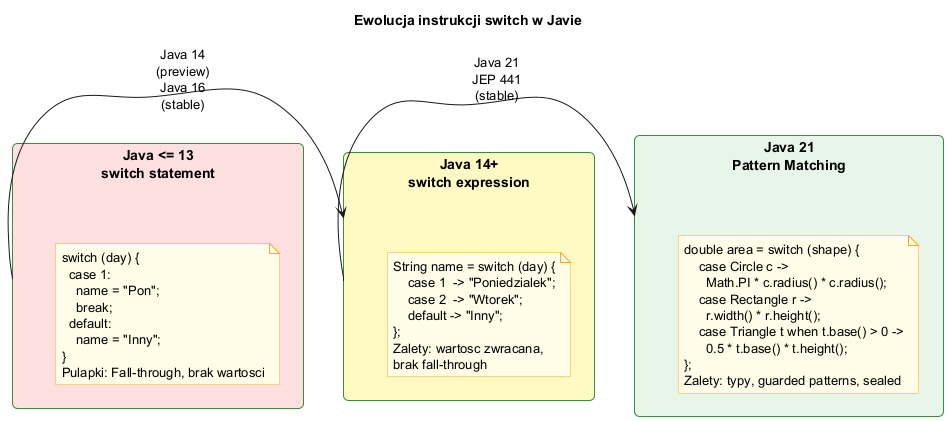

# Instrukcje Sterujące — Java vs C vs Python

## Spis treści

1. [Bloki i nawiasy klamrowe](#1-bloki-i-nawiasy-klamrowe)
2. [Instrukcja if/else](#2-instrukcja-ifelse)
3. [Operator ternary](#3-operator-ternary)
4. [Instrukcja switch — ewolucja](#4-instrukcja-switch--ewolucja)
5. [Pętla for](#5-pętla-for)
6. [Pętla while i do-while](#6-pętla-while-i-do-while)
7. [Pętla for-each](#7-pętla-for-each)
8. [break, continue, labeled break](#8-break-continue-labeled-break)
9. [Pattern Matching w switch (Java 21)](#9-pattern-matching-w-switch-java-21)
10. [Tabela porównawcza Java / C / Python](#10-tabela-porównawcza-java--c--python)
11. [Uruchamianie przykładów](#11-uruchamianie-przykładów)

---

## 1. Bloki i nawiasy klamrowe

Java (jak C) używa **nawiasów klamrowych `{}`** do definiowania bloków kodu.
Python używa **wcięć** (indentacji).

```java
// Java — nawiasy klamrowe
if (x > 0) {
    System.out.println("dodatnie");
    x++;
}
```

```python
# Python — wcięcia
if x > 0:
    print("dodatnie")
    x += 1
```

```c
/* C — nawiasy klamrowe (jak Java) */
if (x > 0) {
    printf("dodatnie\n");
    x++;
}
```

---

## 2. Instrukcja if/else

```java
int temperature = 25;

if (temperature > 30) {
    System.out.println("Upał");
} else if (temperature > 20) {
    System.out.println("Ciepło: " + temperature + "°C");
} else if (temperature > 10) {
    System.out.println("Chłodno");
} else {
    System.out.println("Zimno");
}
```

| Java | C | Python |
|------|---|--------|
| `else if` | `else if` | `elif` (skrócone!) |
| Nawiasy `()` wymagane | Nawiasy `()` wymagane | Nawiasy `()` opcjonalne |
| Klamry `{}` | Klamry `{}` | Wcięcia |

> 📄 Pełny kod: [`examples/ConditionalsDemo.java`](examples/ConditionalsDemo.java)

---

## 3. Operator ternary

Skrócona forma if/else — zwraca wartość:

```java
// Java / C — kolejność: warunek ? wartość_tak : wartość_nie
int age = 20;
String status = (age >= 18) ? "dorosły" : "małoletni";
```

```python
# Python — odwrócona kolejność!
status = "dorosły" if age >= 18 else "małoletni"
```

---

## 4. Instrukcja switch — ewolucja

### Java ≤ 13 — styl klasyczny

```java
// Stary styl — fall-through, break wymagany
switch (day) {
    case 1: dayName = "Poniedziałek"; break;
    case 2: dayName = "Wtorek";       break;
    // Fall-through — brak break → wykonuje się kolejny case!
    case 6:
    case 7: dayName = "Weekend";      break;
    default: dayName = "Nieznany";
}
```

### Java 14+ — switch expression (zalecane)

```java
// Nowy styl — brak fall-through, zwraca wartość
String dayName = switch (day) {
    case 1          -> "Poniedziałek";
    case 2          -> "Wtorek";
    case 6, 7       -> "Weekend";    // wiele wartości w jednym case
    default         -> "Nieznany";
};
```

### Java 14+ — switch expression z blokiem i `yield`

```java
String description = switch (x) {
    case 1, 2, 3 -> "małe";
    case 4, 5, 6 -> {
        String prefix = x % 2 == 0 ? "parzyste" : "nieparzyste";
        yield prefix + " średnie";  // yield zamiast return w switch expression
    }
    default -> "duże";
};
```

### Diagram ewolucji switch



[//]: # (> 📄 Diagram PlantUML: [`diagrams/switch_evolution.puml`]&#40;diagrams/switch_evolution.puml&#41;)

---

## 5. Pętla for

```java
// Java — identyczna składnia jak C!
for (int i = 0; i < 10; i++) {
    System.out.print(i + " ");
}
```

```c
/* C — identyczna jak Java */
for (int i = 0; i < 10; i++) {
    printf("%d ", i);
}
```

```python
# Python — range() zamiast licznika
for i in range(10):
    print(i, end=" ")
```

### Inicjalizator for — wiele zmiennych

```java
for (int i = 0, j = 10; i < j; i++, j--) {
    System.out.println("i=" + i + ", j=" + j);
}
```

> 📄 Pełny kod: [`examples/LoopsDemo.java`](examples/LoopsDemo.java)

---

## 6. Pętla while i do-while

### while — warunek sprawdzany **przed** pętlą

```java
int n = 1;
while (n <= 1024) {
    System.out.print(n + " ");
    n *= 2;
}
// Jeśli warunek fałszywy na starcie — pętla się NIE wykonuje
```

### do-while — warunek sprawdzany **po** pętli

```java
int x = 10;
do {
    System.out.println("Wykonanie: x=" + x);
    x++;
} while (x < 5);
// Ciało wykona się co najmniej RAZ, nawet gdy warunek false!
```

> **Python nie ma do-while!** Ekwiwalent:
> ```python
> while True:
>     # ciało
>     if not warunek:
>         break
> ```

---

## 7. Pętla for-each

```java
// for-each dla tablic
int[] numbers = {10, 20, 30, 40, 50};
for (int num : numbers) {   // "dla każdego num w numbers"
    System.out.print(num + " ");
}

// for-each dla kolekcji (List, Set, ...)
List<String> fruits = Arrays.asList("Jabłko", "Banan", "Wiśnia");
for (String fruit : fruits) {
    System.out.println("- " + fruit);
}
```

```python
# Python — for po kolekcji (naturalna składnia)
fruits = ["Jabłko", "Banan", "Wiśnia"]
for fruit in fruits:
    print(f"- {fruit}")
```

```c
/* C — brak for-each! Ręczna iteracja po indeksie */
int numbers[] = {10, 20, 30, 40, 50};
int n = sizeof(numbers) / sizeof(numbers[0]);
for (int i = 0; i < n; i++) {
    printf("%d ", numbers[i]);
}
```

---

## 8. break, continue, labeled break

### break — wyjście z pętli

```java
for (int i = 0; i < 10; i++) {
    if (i == 5) break;     // wychodzi z pętli gdy i=5
    System.out.print(i);   // wypisuje: 0 1 2 3 4
}
```

### continue — pomiń iterację

```java
for (int i = 0; i < 10; i++) {
    if (i % 2 == 0) continue;  // pomija parzyste
    System.out.print(i);       // wypisuje: 1 3 5 7 9
}
```

### Labeled break — wyjście z zagnieżdżonych pętli

Java zamiast `goto` (które istnieje w C!) używa **etykiet**:

```java
outer:                          // etykieta dla zewnętrznej pętli
for (int i = 0; i < 5; i++) {
    for (int j = 0; j < 5; j++) {
        if (i + j == 6) {
            System.out.println("Znaleziono: i=" + i + ", j=" + j);
            break outer;        // wychodzi z ZEWNĘTRZNEJ pętli!
        }
    }
}
```

| Java | C | Python |
|------|---|--------|
| `break` | `break` | `break` |
| `continue` | `continue` | `continue` |
| `break etykieta` (labeled) | `goto` (odradzane) | Brak (refaktoryzacja) |

---

## 9. Pattern Matching w switch (Java 21)

Java 21 rozszerzyła switch o **wzorce typów** (JEP 441):

```java
// Pattern matching — dopasowanie do TYPE + opcjonalnie guarded when
static String classify(Object obj) {
    return switch (obj) {
        case Integer i when i < 0  -> "ujemna: " + i;
        case Integer i             -> "dodatnia: " + i;
        case String s when s.isEmpty() -> "pusty String";
        case String s              -> "String: " + s;
        case null                  -> "null";
        default                    -> "inny: " + obj.getClass().getSimpleName();
    };
}
```

Z **sealed interfaces** kompilator sprawdza kompletność:

```java
sealed interface Shape permits Circle, Rectangle, Triangle {}

double area(Shape shape) {
    return switch (shape) {
        case Circle c    -> Math.PI * c.radius() * c.radius();
        case Rectangle r -> r.width() * r.height();
        case Triangle t  -> 0.5 * t.base() * t.height();
        // Nie potrzeba default — sealed interface!
    };
}
```

> 📄 Pełny kod: [`examples/SwitchPatternDemo.java`](examples/SwitchPatternDemo.java)

---

## 10. Tabela porównawcza Java / C / Python

Szczegółowa tabela: [`comparison/COMPARISON_TABLE.md`](comparison/COMPARISON_TABLE.md)

### Szybkie porównanie

| Konstrukcja | Java | C | Python |
|-------------|------|---|--------|
| if/else | `if (cond) { }` | `if (cond) { }` | `if cond:` |
| elif | `else if` | `else if` | `elif` |
| ternary | `cond ? a : b` | `cond ? a : b` | `a if cond else b` |
| switch klasyczny | ✅ (z break) | ✅ (z break) | ❌ (`match` od 3.10) |
| switch expression | ✅ (Java 14+) | ❌ | ✅ (`match`) |
| for klasyczne | `for(i=0;i<n;i++)` | `for(i=0;i<n;i++)` | `for i in range(n):` |
| for-each | ✅ | ❌ | ✅ |
| while | ✅ | ✅ | ✅ |
| do-while | ✅ | ✅ | ❌ |
| break/continue | ✅ | ✅ | ✅ |
| labeled break | ✅ | ❌ (`goto`) | ❌ |
| goto | ❌ | ✅ | ❌ |

---

## 11. Uruchamianie przykładów

```powershell
# Korzeń kompilacji = 02_OOP/src/01-introduction
cd 02_OOP\src\01-introduction

# Instrukcje warunkowe
javac -d out control_flow/examples/ConditionalsDemo.java
java -cp out introduction.control_flow.examples.ConditionalsDemo

# Pętle
javac -d out control_flow/examples/LoopsDemo.java
java -cp out introduction.control_flow.examples.LoopsDemo

# Pattern matching (Java 21)
javac -d out control_flow/examples/SwitchPatternDemo.java
java -cp out introduction.control_flow.examples.SwitchPatternDemo
```

```powershell
.\run-controlflow-examples.ps1
```

Pliki porównawcze (tylko do wglądu):

```bash
# Python (z katalogu 01-introduction/)
python control_flow/comparison/examples.py

# C (wymaga gcc, z katalogu 01-introduction/)
gcc -o examples control_flow/comparison/examples.c
./examples
```

