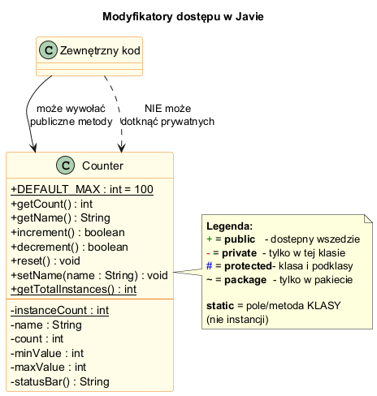
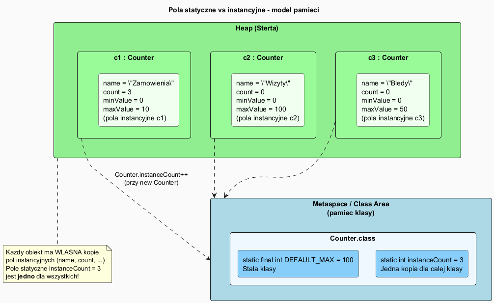
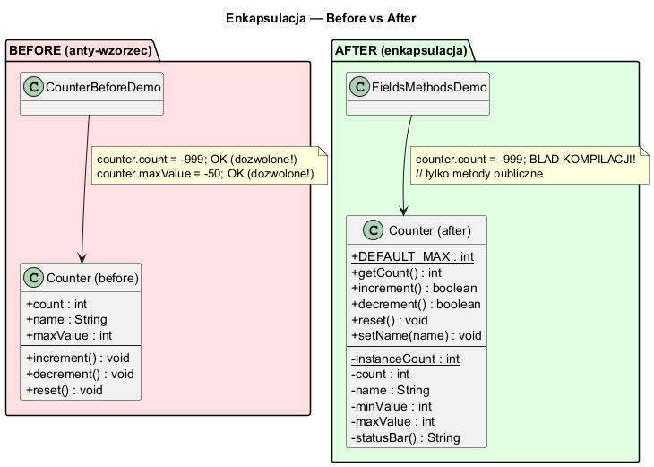

# Pola i Metody — Modyfikatory dostępu, static, enkapsulacja

## Spis treści

1. [Modyfikatory dostępu](#1-modyfikatory-dostępu)
2. [Pola statyczne vs instancyjne](#2-pola-statyczne-vs-instancyjne)
3. [Metody statyczne](#3-metody-statyczne)
4. [Enkapsulacja — przed i po](#4-enkapsulacja--przed-i-po)
5. [Gettery i settery](#5-gettery-i-settery)
6. [Słowo kluczowe `this`](#6-słowo-kluczowe-this)
7. [Typowe pułapki](#7-typowe-pułapki)
8. [Uruchamianie przykładów](#8-uruchamianie-przykładów)

---

## 1. Modyfikatory dostępu

Java oferuje cztery poziomy dostępu do pól i metod:

| Modyfikator | Klasa | Pakiet | Podklasa | Wszędzie |
|-------------|:-----:|:------:|:--------:|:--------:|
| `private`   | ✅ | ❌ | ❌ | ❌ |
| (brak)      | ✅ | ✅ | ❌ | ❌ |
| `protected` | ✅ | ✅ | ✅ | ❌ |
| `public`    | ✅ | ✅ | ✅ | ✅ |

```java
class Access {
    int a;          // package-private (domyślny)
    public int b;   // publiczny — dostępny wszędzie
    private int c;  // prywatny — tylko w tej klasie

    void setC(int i) { c = i * 2; }     // metoda pakietowa
    public int getC() { return c * 2; } // metoda publiczna
}
```

### Diagram modyfikatorów dostępu



> 📄 Diagram PlantUML: [`diagrams/access_modifiers.puml`](diagrams/access_modifiers.puml)

---

## 2. Pola statyczne vs instancyjne

**Pole instancyjne** — każdy obiekt ma własną kopię:

```java
class Counter {
    private int count;  // każdy Counter ma swój własny count
}

Counter c1 = new Counter("A", 0, 10);
Counter c2 = new Counter("B", 0, 10);
// c1.count i c2.count to RÓŻNE zmienne w pamięci!
```

**Pole statyczne** (`static`) — jedna kopia wspólna dla całej klasy:

```java
class Counter {
    private static int instanceCount = 0; // jedna zmienna dla WSZYSTKICH

    public Counter(String name, ...) {
        instanceCount++;  // każde new Counter() zwiększa wspólny licznik
    }

    public static int getTotalInstances() {
        return instanceCount;
    }
}
```

```java
Counter c1 = new Counter("A", 0, 10); // instanceCount = 1
Counter c2 = new Counter("B", 0, 10); // instanceCount = 2
Counter c3 = new Counter("C", 0, 50); // instanceCount = 3

System.out.println(Counter.getTotalInstances()); // 3
```

### Diagram pamięci: static vs instancyjne



> 📄 Diagram PlantUML: [`diagrams/static_vs_instance.puml`](diagrams/static_vs_instance.puml)

---

## 3. Metody statyczne

Metody statyczne:
- Należą do **klasy**, nie do obiektów
- Wywoływane przez `NazwaKlasy.metoda()` (nie przez obiekt)
- **Nie mają dostępu** do `this` ani do pól instancyjnych
- Idealne dla **funkcji użytkowych** niezwiązanych ze stanem

```java
public class MathUtils {
    private MathUtils() {} // prywatny konstruktor — brak instancji

    public static int square(int n) {
        return n * n;
        // return this.count; // BŁĄD! Brak 'this' w metodzie statycznej
    }

    public static long factorial(int n) {
        if (n < 0) throw new IllegalArgumentException("n >= 0");
        if (n <= 1) return 1;
        long result = 1;
        for (int i = 2; i <= n; i++) result *= i;
        return result;
    }

    public static boolean isPrime(int n) { /* ... */ }
}
```

Wywołanie:

```java
// Przez nazwę klasy — bez new!
int x = MathUtils.square(7);       // 49
long f = MathUtils.factorial(5);   // 120
boolean p = MathUtils.isPrime(17); // true
```

> 📄 Pełny kod: [`after/MathUtils.java`](after/MathUtils.java)

**Klasy użytkowe (utility classes)** w bibliotece standardowej Java:
- `java.lang.Math` — operacje matematyczne
- `java.util.Arrays` — sortowanie i przeszukiwanie tablic
- `java.util.Collections` — operacje na kolekcjach

---

## 4. Enkapsulacja — przed i po

### PRZED — anty-wzorzec (publiczne pola)

```java
// before/Counter.java
public class Counter {
    public int count = 0;     // BUG: można ustawić count = -999
    public int maxValue = 100; // BUG: można ustawić maxValue = -50
}
```

```java
Counter c = new Counter();
c.count = -999;    // Możliwe! Brak walidacji.
c.maxValue = -50;  // Możliwe! Stan niekoherentny.
```

### PO — enkapsulacja (prywatne pola + publiczne metody)

```java
// after/Counter.java
public class Counter {
    private int count;    // niedostępne z zewnątrz
    private int maxValue;

    public boolean increment() {
        if (count >= maxValue) {
            System.out.println("Osiągnięto maksimum");
            return false;
        }
        count++;
        return true;
    }
}
```

```java
Counter c = new Counter("Zamówienia", 0, 10);
c.increment();     // OK — przez metodę publiczną
// c.count = -999; // BŁĄD KOMPILACJI! count is private
```

### Diagram enkapsulacji



[//]: # (> 📄 Diagram PlantUML: [`diagrams/encapsulation.puml`]&#40;diagrams/encapsulation.puml&#41;)

> 📄 Kod przed: [`before/Counter.java`](before/Counter.java)
> 📄 Kod po: [`after/Counter.java`](after/Counter.java)

---

## 5. Gettery i settery

Getter — metoda do **odczytu** prywatnego pola:

```java
public int getCount()   { return count; }
public String getName() { return name; }
```

Setter — metoda do **zapisu** prywatnego pola **z walidacją**:

```java
public void setName(String name) {
    if (name == null || name.isBlank()) {
        throw new IllegalArgumentException("Nazwa nie może być pusta");
    }
    this.name = name;  // this.name = pole, name = parametr
}
```

> **Uwaga:** Nie każde pole musi mieć setter. Pola read-only mają tylko getter.

---

## 6. Słowo kluczowe `this`

`this` odnosi się do **bieżącego obiektu** (instancji, na której wywołano metodę).

### Rozróżnianie pola od parametru

```java
public Counter(String name, int minValue, int maxValue) {
    this.name     = name;     // this.name = pole,  name = parametr konstruktora
    this.minValue = minValue;
    this.maxValue = maxValue;
}
```

### `this` w metodach statycznych — niedozwolone!

```java
public static int getTotalInstances() {
    return instanceCount;   // OK — pole statyczne
    // return this.count;   // BŁĄD: cannot use this in static context
}
```

---

## 7. Typowe pułapki

### Pułapka 1: Pole statyczne zmieniane przez instancję

```java
Static21 ob1 = new Static21();
Static21 ob2 = new Static21();
ob1.a = 17;  // UWAGA: a jest statyczne — zmienia się dla WSZYSTKICH!
System.out.println(ob2.a); // 17 — zmienione przez ob1!
```

**Reguła:** Pola statyczne wywołuj przez nazwę klasy: `Static21.a = 17;`

### Pułapka 2: Metoda statyczna wywołana przez referencję null

```java
Counter c = null;
Counter.getTotalInstances(); // OK (static — przez klasę)
c.getTotalInstances();       // działa, ale mylące! Kompilator może ostrzec.
c.getCount();                // NullPointerException!
```

### Pułapka 3: Zacieniowanie pola przez zmienną lokalną

```java
public void setMaxValue(int maxValue) {
    maxValue = maxValue; // BUG! przypisanie parametru do samego siebie
    // this.maxValue = maxValue; // POPRAWNIE
}
```

---

## 8. Uruchamianie przykładów

```powershell
# Korzeń kompilacji = 02_OOP/src/01-introduction
cd 02_OOP\src\01-introduction

# Przykład PRZED (anty-wzorzec)
javac -d out fields_and_methods/before/*.java
java -cp out introduction.fields_and_methods.before.CounterBeforeDemo

# Przykład PO (enkapsulacja)
javac -d out fields_and_methods/after/*.java
java -cp out introduction.fields_and_methods.after.FieldsMethodsDemo
```

Lub skrypt PowerShell:

```powershell
.\run-fields-examples.ps1
```

---

## Podsumowanie

| Pojęcie | Znaczenie |
|---------|-----------|
| `public` | Dostępny wszędzie |
| `private` | Dostępny tylko wewnątrz klasy |
| `protected` | Dostępny w klasie, pakiecie i podklasach |
| `static` field | Jedno pole wspólne dla wszystkich instancji |
| `static` method | Metoda klasy — bez `this`, bez pól instancyjnych |
| Enkapsulacja | Ukrywanie stanu (prywatne pola) + kontrola dostępu (publiczne metody) |
| Getter | Metoda odczytująca prywatne pole |
| Setter | Metoda zapisująca prywatne pole z walidacją |

