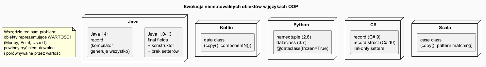
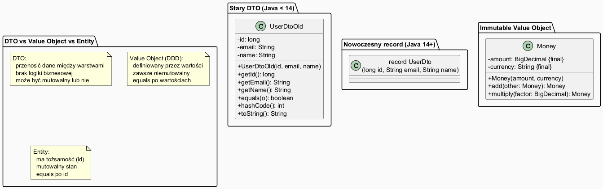

# Record, obiekty niemutowalne, DTO, stałe i wartości read-only

## Spis treści

1. [Geneza problemu — dlaczego powstały te koncepcje?](#1-geneza-problemu)
2. [Stary DTO — boilerplate i jego problemy](#2-stary-dto--boilerplate)
3. [record (Java 14+) — klasa bez boilerplate](#3-record-java-14)
4. [Obiekty niemutowalne — teoria i znaczenie](#4-obiekty-niemutowalne)
5. [Value Object — obiekt definiowany przez wartości](#5-value-object)
6. [DTO — Data Transfer Object](#6-dto--data-transfer-object)
7. [Stałe i read-only w Javie](#7-stałe-i-read-only)
8. [Porównanie z innymi językami OOP](#8-porównanie-z-innymi-językami-oop)
9. [record i Pattern Matching (Java 21)](#9-record-i-pattern-matching-java-21)
10. [Kiedy co stosować?](#10-kiedy-co-stosować)
11. [Uruchamianie przykładów](#11-uruchamianie-przykładów)

---

## 1. Geneza problemu

Programowanie obiektowe od początku zmaga się z pytaniem:

> **Jak reprezentować dane, które nie powinny się zmieniać?**

Klasy takie jak `Point(x, y)`, `Money(amount, currency)`, `UserId(value)` opisują **wartości** — nie encje ze stanem.
Powinny zachowywać się jak liczby: `3 + 4 = 7`, ale `3` dalej jest `3`.

Problemy, które doprowadziły do powstania `record` i niemutowalności:

| Problem | Skutek |
|---------|--------|
| Mutowalny stan współdzielony między wątkami | Warunki wyścigu (*race conditions*), trudne błędy |
| `equals`/`hashCode` niezgodne z semantyką wartości | Kolekcje i mapy działają błędnie |
| Dziesiątki linii boilerplate na klasę danych | Czytelność, maintainability |
| Nieumyślna modyfikacja danych przesyłanych przez warstwy | Nieprzewidywalne zachowanie systemu |



---

## 2. Stary DTO — boilerplate

Przed Java 14 każda klasa przenoszącą dane wymagała ręcznego pisania:

```java
class UserDtoOld {
    private final long id;
    private final String email;
    private final String name;

    public UserDtoOld(long id, String email, String name) {
        this.id    = id;
        this.email = Objects.requireNonNull(email);
        this.name  = Objects.requireNonNull(name);
    }

    public long   getId()    { return id; }
    public String getEmail() { return email; }
    public String getName()  { return name; }

    @Override public boolean equals(Object o) {
        if (this == o) return true;
        if (!(o instanceof UserDtoOld u)) return false;
        return id == u.id && email.equals(u.email) && name.equals(u.name);
    }

    @Override public int hashCode() { return Objects.hash(id, email, name); }

    @Override public String toString() {
        return "UserDtoOld[id=" + id + ", email=" + email + ", name=" + name + "]";
    }
}
```

**~50–60 linii dla 3 pól.** Przy zmianie jednego pola trzeba aktualizować konstruktor, getter, `equals`, `hashCode`, `toString`.

> 📄 Pełny kod: [`code/RecordsAndValuesDemo.java`](code/RecordsAndValuesDemo.java)

---

## 3. record (Java 14+)

`record` to specjalna forma klasy zaprojektowana do **przechowywania niemutowalnych danych**.
Kompilator generuje automatycznie:
- konstruktor kanoniczny (wszystkie pola)
- gettery (`id()`, `email()`, `name()`) — **bez prefiksu `get`**
- `equals()` i `hashCode()` na podstawie wszystkich pól
- `toString()`

```java
record UserDto(long id, String email, String name) { }

// Użycie:
UserDto u = new UserDto(1L, "anna@example.com", "Anna");

u.id();      // → 1
u.email();   // → "anna@example.com"
u.name();    // → "Anna"

System.out.println(u); // UserDto[id=1, email=anna@example.com, name=Anna]

UserDto u2 = new UserDto(1L, "anna@example.com", "Anna");
u.equals(u2); // → true (porównuje pola, nie referencję!)
```

### Diagram — stary DTO vs record



### Kompaktowy konstruktor — walidacja

```java
record UserDto(long id, String email, String name) {
    // Kompaktowy konstruktor: pola są dostępne, ale przypisanie następuje automatycznie po klamrze.
    UserDto {
        Objects.requireNonNull(email, "email must not be null");
        if (id <= 0) throw new IllegalArgumentException("id must be positive");
        email = email.trim().toLowerCase(); // transformacja przed przypisaniem!
    }
}
```

### Ograniczenia record

- Pola są **zawsze `final`** — niemutowalny z definicji.
- Record **nie może rozszerzać** innej klasy (może implementować interfejsy).
- Nie może być klasą abstrakcyjną.
- Nadaje się doskonale do DTO, Value Objects, krotki wynikowych.

---

## 4. Obiekty niemutowalne

**Obiekt niemutowalny** (*immutable object*) raz skonstruowany **nie zmienia swojego stanu**.

Zasady tworzenia niemutowalnej klasy (Joshua Bloch, *Effective Java*, Item 17):

1. Nie udostępniaj metod modyfikujących stan (brak setterów).
2. Zadeklaruj klasę jako `final` (lub uczynij konstruktor prywatnym).
3. Wszystkie pola `private final`.
4. Zapewnij ochronę mutowalnych składowych przez **kopię defensywną**.

```java
final class ImmutablePoint {
    private final double x;
    private final double y;

    public ImmutablePoint(double x, double y) { this.x = x; this.y = y; }

    public double getX() { return x; }
    public double getY() { return y; }

    // Operacje zwracają NOWY obiekt — niezmienialność zachowana
    public ImmutablePoint translate(double dx, double dy) {
        return new ImmutablePoint(x + dx, y + dy);
    }
}

ImmutablePoint p1 = new ImmutablePoint(0, 0);
ImmutablePoint p2 = p1.translate(3, 4);  // p1 nadal (0,0), p2 = (3,4)
```

### Dlaczego niemutowalność jest ważna?

| Zaleta | Wyjaśnienie |
|--------|------------|
| **Thread safety** | Niemutowalny obiekt można współdzielić między wątkami bez synchronizacji |
| **Prostota** | Brak ukrytych zmian stanu — łatwiejsze rozumowanie o programie |
| **Keszowalność** | Wynik `hashCode()` można obliczyć raz i zapamiętać |
| **Bezpieczeństwo** | Niemożliwe nieumyślne modyfikacje przez inny kod |

> **String w Javie jest niemutowalny!** Dlatego `"abc".toUpperCase()` zwraca nowy `String`, nie modyfikuje oryginalnego.

---

## 5. Value Object

**Value Object** (termin z Domain-Driven Design, Eric Evans) to obiekt definiowany przez **wartości swoich pól**, nie przez tożsamość (referencję/id).

```
Dwa banknoty 10 zł są równoważne (value object).
Dwa konta bankowe mogą mieć to samo saldo, ale są różnymi kontami (entity).
```

### Implementacja jako record w Javie

```java
record Money(BigDecimal amount, String currency) {
    Money {
        Objects.requireNonNull(amount, "amount must not be null");
        Objects.requireNonNull(currency, "currency must not be null");
        if (amount.compareTo(BigDecimal.ZERO) < 0)
            throw new IllegalArgumentException("amount cannot be negative");
        currency = currency.toUpperCase();
    }

    public static Money of(String amount, String currency) {
        return new Money(new BigDecimal(amount), currency);
    }

    // Operacje zwracają NOWY obiekt
    public Money add(Money other) {
        if (!this.currency.equals(other.currency))
            throw new IllegalArgumentException("Cannot add different currencies");
        return new Money(this.amount.add(other.amount), this.currency);
    }
}

Money price = Money.of("19.99", "PLN");
Money tax   = Money.of("4.60", "PLN");
Money total = price.add(tax);   // 24.59 PLN — nowy obiekt
// price i tax dalej niezmienione!

Money a = Money.of("10.00", "EUR");
Money b = Money.of("10.00", "EUR");
a.equals(b);  // → true (record equals po wartościach)
```

### Value Object vs Entity

| | Value Object | Entity |
|--|-------------|--------|
| Tożsamość | przez wartości pól | przez unikalne id |
| Mutowalność | niemutowalny | mutowalny stan |
| `equals` | wszystkie pola | tylko id |
| Przykłady | `Money`, `Point`, `Email`, `PhoneNumber` | `Customer`, `Order`, `Product` |

---

## 6. DTO — Data Transfer Object

**DTO** (*Data Transfer Object*) to wzorzec projektowy (Martin Fowler) opisujący obiekty służące **wyłącznie do przenoszenia danych** pomiędzy warstwami aplikacji (np. kontroler→serwis→baza danych).

Cechy DTO:
- Brak logiki biznesowej.
- Zawiera dane potrzebne w danym kontekście (nie cały model domenowy).
- Może być mutowalny lub niemutowalny — zależy od kontekstu.

Typowe warstwy, gdzie DTO jest używane:

```
Warstwa prezentacji (JSON/HTTP)
        ↑↓  ←DTO (np. UserResponse, CreateOrderRequest)
Warstwa serwisu
        ↑↓  ← Domain Model (encje, value objects)
Warstwa danych (baza, JPA)
```

### DTO przed Java 14 vs jako record

```java
// Przed Java 14
class CreateOrderRequest {
    private String productId;
    private int quantity;
    private String customerId;
    // gettery, settery, equals, hashCode, toString...
}

// Java 14+ — record jako DTO (niemutowalny DTO)
record CreateOrderRequest(String productId, int quantity, String customerId) { }
```

> Kiedy DTO **może** być mutowalny? Np. przy automatycznym mapowaniu z JSON (biblioteki Jackson, Gson) — wtedy musi mieć konstruktor bezargumentowy i settery.
> W nowoczesnych projektach używa się `record` z adnotacją `@JsonProperty`.

---

## 7. Stałe i read-only w Javie

### static final — stała klasy

```java
class Constants {
    public static final double PI       = Math.PI;
    public static final int    MAX_SIZE = 100;
    public static final String APP_NAME = "OOP Demo";
}

// Użycie (bez tworzenia obiektu):
System.out.println(Constants.PI);  // 3.14159...
```

Konwencja: `UPPER_SNAKE_CASE`. Pole `static final` jest **inicjalizowane raz** i współdzielone przez wszystkie instancje klasy.

### final — read-only lokalna zmienna / parametr

```java
void process(final String input) {
    // input = "inne";  // błąd kompilacji!

    final int limit = 42;
    // limit = 99;       // błąd kompilacji!

    System.out.println(input + ", limit=" + limit);
}
```

> `final` na zmiennej/parametrze oznacza tylko, że **referencja** jest stała — obiekt, na który wskazuje, może być mutowalny!
>
> ```java
> final List<String> list = new ArrayList<>();
> list.add("element");  // ✅ — modyfikacja zawartości OK
> // list = new ArrayList<>();  // ❌ — zmiana referencji = błąd
> ```

### Tabela: słowo kluczowe final w różnych kontekstach

| Kontekst | Znaczenie |
|----------|-----------|
| `final class` | Klasy nie można dziedziczyć |
| `final method` | Metody nie można nadpisać |
| `final` pole instancji | Pole musi być przypisane raz w konstruktorze |
| `static final` pole | Stała klasowa (compile-time lub runtime) |
| `final` zmienna lokalna | Nie można przypisać ponownie |
| `final` parametr | Nie można ponownie przypisać w ciele metody |

---

## 8. Porównanie z innymi językami OOP

Każdy nowoczesny język OOP rozwiązuje ten sam problem — klasę danych bez boilerplate.

### Kotlin — `data class`

```kotlin
data class UserDto(val id: Long, val email: String, val name: String)

val u = UserDto(1L, "anna@example.com", "Anna")
println(u)           // UserDto(id=1, email=anna@example.com, name=Anna)
u == UserDto(1L, "anna@example.com", "Anna")  // true

// copy() — łatwe tworzenie kopii z modyfikacją jednego pola
val updated = u.copy(name = "Ania")
```

### Python — `@dataclass(frozen=True)` i `NamedTuple`

```python
from dataclasses import dataclass
from typing import NamedTuple

# NamedTuple (Python 3.6+) — niemutowalny
class UserDto(NamedTuple):
    id: int
    email: str
    name: str

# dataclass frozen=True — niemutowalny, haszowany
@dataclass(frozen=True)
class Money:
    amount: float
    currency: str

u = UserDto(1, "anna@example.com", "Anna")
print(u)  # UserDto(id=1, email='anna@example.com', name='Anna')
```

### C# — `record`

```csharp
// C# 9+ — record (niemutowalny przez init setters)
public record UserDto(long Id, string Email, string Name);

var u = new UserDto(1, "anna@example.com", "Anna");
Console.WriteLine(u); // UserDto { Id = 1, Email = anna@example.com, Name = Anna }

// with-expression (odpowiednik Kotlin copy())
var updated = u with { Name = "Ania" };
```

### Scala — `case class`

```scala
case class UserDto(id: Long, email: String, name: String)

val u = UserDto(1L, "anna@example.com", "Anna")
println(u)  // UserDto(1,anna@example.com,Anna)

val updated = u.copy(name = "Ania")

// Pattern matching (oryginalna inspiracja dla Java record patterns)
u match {
  case UserDto(id, email, _) => println(s"id=$id email=$email")
}
```

### Zestawienie

| Język | Konstrukt | Kluczowe cechy |
|-------|-----------|---------------|
| Java 14+ | `record` | kompaktowy konstruktor, brak `get`-prefixu |
| Kotlin | `data class` | `copy()`, `componentN()` |
| Python | `@dataclass(frozen=True)` | `frozen=True` = niemutowalny |
| C# 9+ | `record` | `with`-expression |
| Scala | `case class` | wbudowany pattern matching |

---

## 9. record i Pattern Matching (Java 21)

Java 21 pozwala **dekonstruować record** w wyrażeniu `switch`:

```java
sealed interface Shape permits Circle, Rect {}
record Circle(double radius) implements Shape {}
record Rect(double w, double h) implements Shape {}

Shape s = new Circle(5.0);

// Dekonstrukcja rekordu w switch:
String desc = switch (s) {
    case Circle(double r)         -> "Koło r=%.2f, pole=%.2f".formatted(r, Math.PI * r * r);
    case Rect(double w, double h) -> "Prostokąt %gx%g, pole=%.2f".formatted(w, h, w * h);
};
```

Bez `record` i pattern matching to samo wymagałoby `instanceof` + rzutowanie — więcej kodu, mniej czytelne.

---

## 10. Kiedy co stosować?

```
Potrzebujesz klasy wyłącznie do przenoszenia danych (np. odpowiedź API)?
  → record  (lub @dataclass w Pythonie)

Obiekt reprezentuje wartość z logiki dziedziny (cena, punkt, e-mail)?
  → Value Object jako record lub klasa final z polami final

Obiekt ma tożsamość i mutowalny stan (użytkownik, zamówienie)?
  → zwykła klasa (Entity) — nie używaj record

Potrzebujesz stałej w całym projekcie?
  → public static final w klasie Constants lub enum

Zmienna lokalna nie powinna być ponownie przypisana?
  → final (opcjonalnie, dla czytelności intent)
```

> **Zasada ogólna:** Preferuj niemutowalność wszędzie tam, gdzie to możliwe.
> Mutowalność komplikuje: debugowanie, wielowątkowość, testy.

---

## 11. Uruchamianie przykładów

```powershell
Set-Location "C:\home\gitHub\oop-concepts-java\02_OOP\src\_01_introduction\value_objects"
.\run-examples.ps1
```

---

## 📚 Literatura i materiały dodatkowe

- **Effective Java (3rd ed.)**, Joshua Bloch:
  - Item 17: Minimize mutability
  - Item 50: Make defensive copies when needed
- **JEP 395 — Records (Java 16, finalne):** <https://openjdk.org/jeps/395>
- **JEP 440 — Record Patterns (Java 21):** <https://openjdk.org/jeps/440>
- **Eric Evans, *Domain-Driven Design*** — rozdział o Value Objects
- **Martin Fowler — DTO:** <https://martinfowler.com/eaaCatalog/dataTransferObject.html>
- **Baeldung — Java Records:** <https://www.baeldung.com/java-record-keyword>
- **Baeldung — Immutable Objects in Java:** <https://www.baeldung.com/java-immutable-object>

