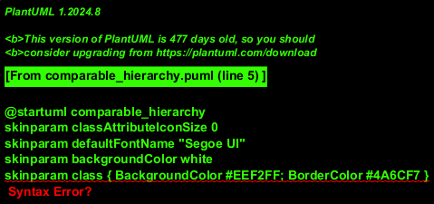
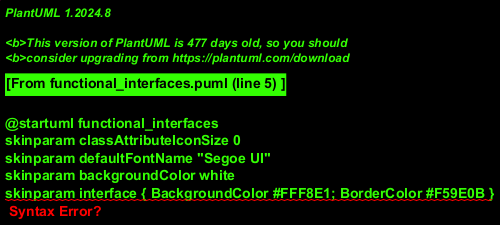
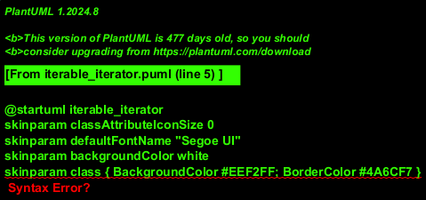

# Moduł 2.3: Zaawansowane wykorzystanie Interfejsów

## Wprowadzenie

W tym module przyjrzymy się interfejsom, które nie są częścią naszego kodu dziedzinowego (jak Kaczka czy Samochód), ale są **wbudowane w Javę** (`java.util.*`) i pełnią kluczową rolę w ekosystemie, w tym w sortowaniu kolekcji, pętlach czy programowaniu funkcyjnym.

---

## 1. Porównywanie i `Comparable` vs `Comparator`

Gdy tworzymy listę obiektów, często chcemy ją posortować. Java dostarcza dwa interfejsy do tego celu:

### `Comparable<T>`
Definiuje **naturalny porządek** sortowania, np. "od A do Z" dla napisów czy rosnąco dla liczb. Obiekt "wie" jak porównać się z innym obiektem tego samego typu.



```java
public class Product implements Comparable<Product> {
    private double price;

    @Override
    public int compareTo(Product other) {
        // Naturalne sortowanie po cenie
        return Double.compare(this.price, other.price);
    }
}
```
Użycie: `Collections.sort(products);`

### `Comparator<T>`
Definiuje **zewnętrzny porządek** sortowania. Pozwala stworzyć wiele różnych strategii sortowania dla tej samej klasy (np. raz po cenie, a raz po nazwie).

```java
// Comparator jako lambda
Comparator<Product> byName = Comparator.comparing(Product::getName);
products.sort(byName);
```
Więcej w [ComparableDemo.java](ComparableDemo.java).

---

## 2. Interfejsy Funkcyjne i Lambdy

Od Javy 8, interfejs, który zawiera **dokładnie jedną metodę abstrakcyjną**, nazywamy **interfejsem funkcyjnym**. Dzięki temu kompilator pozwala użyć wyrażenia **Lambda** jako zwięzłej implementacji tego interfejsu.



### Adnotacja `@FunctionalInterface`
Podpowiada kompilatorowi, że ten interfejs ma być funkcyjny (i generuje błąd w przeciwnym razie).

Java dostarcza gotowe interfejsy funkcyjne w `java.util.function`:
*   `Predicate<T>`: `T -> boolean` (Testowanie warunku)
*   `Function<T, R>`: `T -> R` (Transformacja)
*   `Consumer<T>`: `T -> void` (Konsumpcja, np. wydruk)
*   `Supplier<T>`: `() -> T` (Produkcja, fabryka)

```java
// Lambda w akcji
Predicate<String> isValid = s -> s.length() > 3;
Function<String, String> toUpper = String::toUpperCase; // Method reference
```
Przykłady w [FunctionalDemo.java](FunctionalDemo.java).

---

## 3. Pętle, `Iterable<T>` i `Iterator<T>`

Zastanawialiście się, dlaczego pętla `for-each` działa na tablicach i kolekcjach?

```java
for (String s : list) { ... }
```

Dzieje się tak, ponieważ `Collection` implementuje interfejs `Iterable`.
Interfejs `Iterable<T>` wymusza implementację metody `iterator()`, która zwraca obiekt `Iterator<T>`. To `Iterator` "chodzi" po kolekcji.



Możemy stworzyć własną klasę implementującą `Iterable`, np. zakres liczb [NumberRange.java](NumberRange.java), po którym można iterować w pętli `for`.

```java
public class NumberRange implements Iterable<Integer> {
    // ...
    @Override
    public Iterator<Integer> iterator() { ... }
}

// Użycie:
for (int n : new NumberRange(1, 10)) {
    System.out.println(n);
}
```
Demo w [IterableDemo.java](IterableDemo.java).

---

## Uruchomienie przykładów

```powershell
.\run-examples.ps1
```

