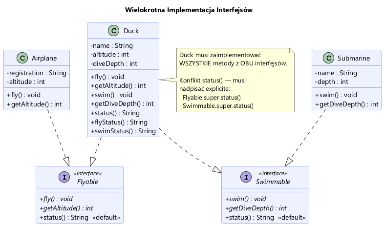

# Moduł 2.2: Implementacja i Wielokrotne Dziedziczenie Interfejsów

## Wprowadzenie

W przeciwieństwie do klas, gdzie w Javie dozwolone jest dziedziczenie tylko po jednej klasie ("Single Inheritance"), **klasa może implementować dowolną liczbę interfejsów**.

Jest to potężne narzędzie, pozwalające modelować obiekty posiadające wiele różnych zdolności, np. `Duck` (kaczka), która potrafi zarówno latać (`Flyable`), jak i pływać (`Swimmable`).

---

## Wielokrotna Implementacja (Multiple Inheritance of Type)

Klasa implementująca wiele interfejsów musi zrealizować metody abstrakcyjne każdego z nich.



```java
// Kaczka potrafi latać i pływać
public class Duck implements Flyable, Swimmable {
    @Override
    public void fly() { ... } // z Flyable

    @Override
    public void swim() { ... } // z Swimmable
}
```
Zobacz implementację w [Duck.java](Duck.java).

### Polimorfizm z wielu perspektyw

Jednego obiektu typu `Duck` możemy używać w różnych kontekstach, w zależności od potrzeb:

```java
Duck duck = new Duck("Kaczor Donald");

Flyable asFlyer = duck;      // Używamy kaczki jako "latacza"
asFlyer.fly();

Swimmable asSwimmer = duck;  // Używamy tej samej kaczki jako "pływaka"
asSwimmer.swim();
```
Przykład w [MultiInterfaceDemo.java](MultiInterfaceDemo.java).

---

## Bezpieczne rzutowanie i `instanceof`

Często mamy do czynienia z ogólnym typem (np. `Object` lub listą różnych obiektów) i chcemy sprawdzić, czy dany obiekt implementuje konkretny interfejs.

Tradycyjnie w Javie używano operatora `instanceof` i rzutowania:

```java
if (obj instanceof Flyable) {
    Flyable flyer = (Flyable) obj; // Rzutowanie
    flyer.fly();
}
```

Od Javy 16, dzięki **Pattern Matching for instanceof**, możemy to zapisać krócej i bezpieczniej:

```java
if (obj instanceof Flyable flyer) {
    flyer.fly(); // zmienna 'flyer' jest już dostępna i zrzutowana
}
```

O tym dlaczego warto zawsze sprawdzać typ przed rzutowaniem (aby uniknąć `ClassCastException`) dowiesz się z przykładu [CastingDemo.java](CastingDemo.java).

---

## Konflikty nazw metod

Co jeśli dwa interfejsy mają metodę o tej samej sygnaturze (`default void status()`)?
Wtedy pojawia się konflikt i klasa implementująca **musi** nadpisać tę metodę, aby go rozwiązać. Może przy tym skorzystać z implementacji domyślnej konkretnego interfejsu używając składni `Interfejs.super.metoda()`.

```java
@Override
public String status() {
    // Jawne rozwiązanie konfliktu:
    return "Status kaczki: " + Flyable.super.status() + ", " + Swimmable.super.status();
}
```
Więcej w komentarzach w [Duck.java](Duck.java).

---

## Uruchomienie przykładów

```powershell
.\run-examples.ps1
```

