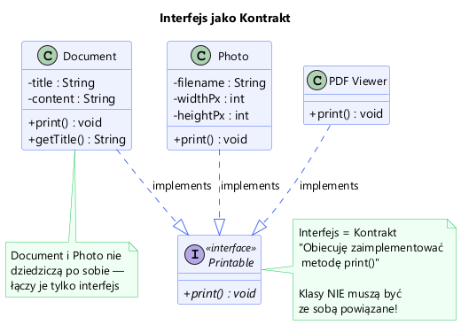
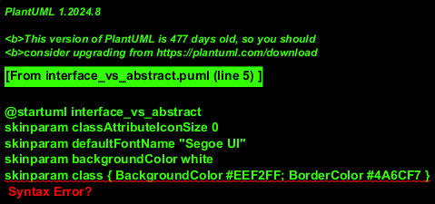

# Moduł 2.1: Pojęcie Interfejsu w Javie

## Wprowadzenie

Interfejs w Javie to fundamentalny mechanizm definiujący **kontrakt**, jaki musi spełnić klasa. Jest to sposób na osiągnięcie abstrakcji i oddzielenie definicji operacji ("co robić") od jej implementacji ("jak to zrobić").

W odróżnieniu od dziedziczenia klas (`extends`), interfejsy pozwalają na zdefiniowanie wspólnych zachowań dla obiektów, które nie muszą należeć do tej samej hierarchii klas.

### Kluczowe cechy interfejsu
*   **Wszystkie metody są domyślnie publiczne i abstrakcyjne** (do Javy 8).
*   Może zawierać **stałe** (`public static final`).
*   Klasa może implementować **wiele interfejsów** (w przeciwieństwie do dziedziczenia po jednej klasie).
*   Od Javy 8 interfejsy mogą zawierać metody domyślne (`default`) i statyczne (`static`).

---

## Interfejs jako Kontrakt

Wyobraź sobie interfejs jako umowę. Jeśli klasa podpisuje tę umowę (używając słowa kluczowego `implements`), zobowiązuje się dostarczyć implementację wszystkich metod wymienionych w interfejsie.



```java
// Kontrakt: "Obiecuję, że potrafię się wydrukować"
public interface Printable {
    void print();
}
```

Dwie zupełnie różne klasy mogą implementować ten sam interfejs:

```java
public class Document implements Printable {
    // ...
    @Override
    public void print() {
        System.out.println("Drukowanie dokumentu...");
    }
}

public class Photo implements Printable {
    // ...
    @Override
    public void print() {
        System.out.println("Drukowanie zdjęcia...");
    }
}
```

Zobacz pełny kod w: [Printable.java](Printable.java), [Document.java](Document.java), [Photo.java](Photo.java).

---

## Polimorfizm

Dzięki interfejsom możemy traktować różne obiekty w jednolity sposób, o ile implementują ten sam interfejs. Pozwala to na pisanie elastycznego kodu, który nie zależy od konkretnych klas, ale od ich możliwości (interfejsów).

```java
List<Printable> queue = new ArrayList<>();
queue.add(new Document("Raport", "Dane..."));
queue.add(new Photo("wakacje.jpg"));

// Nie musimy wiedzieć CZYM jest obiekt, ważne że jest Printable
for (Printable item : queue) {
    item.print();
}
```

Przykład w [IntroDemo.java](IntroDemo.java).

---

## Znaczenie Kontraktu (ContractDemo)

Siła interfejsów objawia się tam, gdzie łączymy klasy z różnych "światów". W [ContractDemo.java](ContractDemo.java) mamy interfejs `Worker` ("potrafi pracować").

Zarówno `Robot` (maszyna) jak i `HumanEmployee` (człowiek) mogą pracować. Nie mają wspólnego przodka w hierarchii dziedziczenia (poza `Object`), ale łączy je wspólna funkcjonalność.

```java
interface Worker {
    void work();
}

class Robot implements Worker { ... }
class HumanEmployee implements Worker { ... }
```

Dzięki temu możemy stworzyć listę pracowników `Worker[]` zawierającą zarówno ludzi, jak i roboty, i zlecić im pracę tą samą metodą `work()`.

---

## Interfejs vs Klasa Abstrakcyjna

Częste pytanie na rekrutacjach: czym różni się interfejs od klasy abstrakcyjnej?



| Cecha | Interfejs | Klasa Abstrakcyjna |
|-------|-----------|--------------------|
| **Stan (pola)** | Tylko stałe (`static final`) | Może mieć dowolne pola (stan obiektu) |
| **Dziedziczenie** | Wielokrotne (`implements A, B`) | Pojedyncze (`extends A`) |
| **Konstruktor** | Brak | Może mieć konstruktor |
| **Zastosowanie** | Definiowanie zdolności ("Can-Do") | Budowanie hierarchii ("Is-A"), wspólny kod bazowy |

Więcej na temat różnic w diagramie powyżej.

---

## Uruchomienie przykładów

```powershell
.\run-examples.ps1
```

