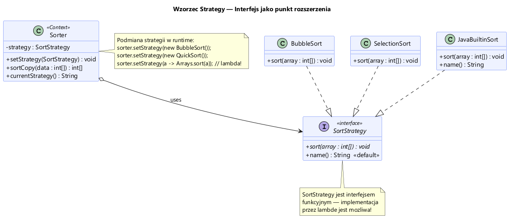
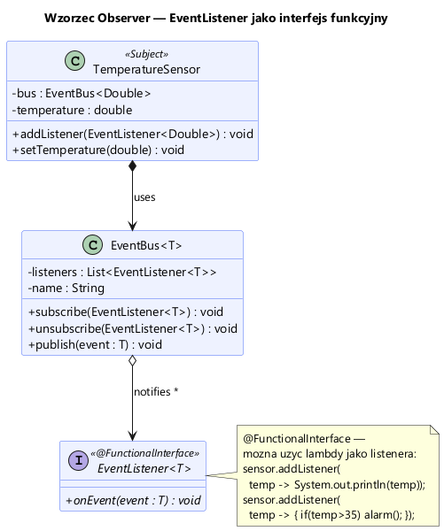
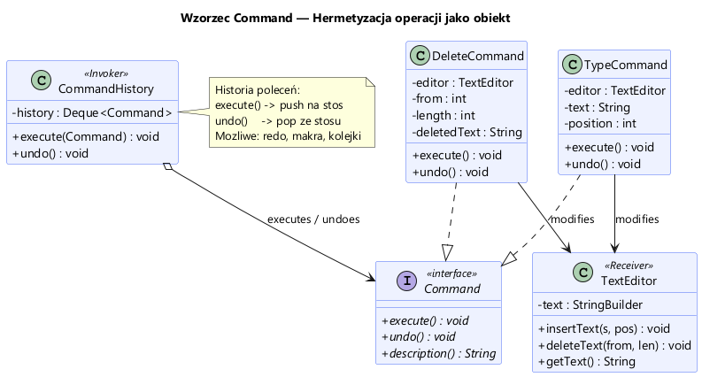
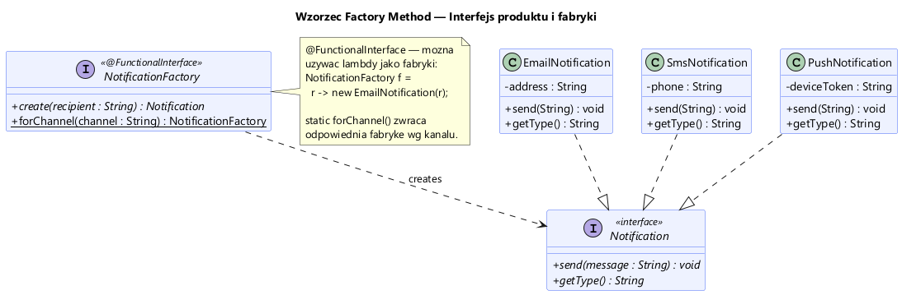

# Moduł 2.5: Wzorce Projektowe z Wykorzystaniem Interfejsów

## Wprowadzenie

### 🎯 Czego się nauczysz w tym module?
*   Jak używać interfejsów jako **abstrakcji** (niezależnych od klas).
*   Jak zaimplementować popularne wzorce: **Strategy**, **Observer**, **Command**.
*   Jak wykorzystać interfejsy funkcyjne (i lambdy) w tych wzorcach.

W świecie projektowania obiektowego, interfejsy odgrywają kluczową rolę. Pozwalają na **luźne powiązanie** (loose coupling) komponentów, co ułatwia testowanie, refaktoryzację i rozszerzanie kodu. Większość wzorców projektowych (z grupy GoF - Gang of Four) opiera się na polimorfizmie przez interfejsy.

W tym module zobaczymy implementację czterech popularnych wzorców behawioralnych i konstrukcyjnych, w nowoczesnej Javie (z użyciem lambd).

---

## 1. Wzorzec Strategia (Strategy)

Pozwala na zdefiniowanie rodziny algorytmów, zamknięcie każdego z nich w osobnej klasie (lub lambdzie) i wymienianie ich w trakcie działania programu. Klient używa interfejsu (strategii), a nie konkretnej implementacji.



### Zastosowanie:
*   Sortowanie różnymi algorytmami
*   Obliczanie rabatów wg różnych reguł
*   Kompresja danych różnymi metodami

Przykład w [StrategyDemo.java](StrategyDemo.java).

---

## 2. Wzorzec Obserwator (Observer)

Definiuje zależność "jeden do wielu". Jeden obiekt (Temat) powiadamia wszystkich swoich Obserwatorów o zmianie stanu.



### Zastosowanie:
*   Powiadomienia w GUI (kliknięcie przycisku)
*   Subskrypcja zdarzeń (np. temperatura przekroczyła próg)
*   Architektura sterowana zdarzeniami

Interfejs `EventListener<T>` jest funkcyjny, więc obserwatorów można definiować jako **wyrażenia lambda**!

Przykład w [ObserverDemo.java](ObserverDemo.java).

---

## 3. Wzorzec Polecenie (Command)

Obiekt "Polecenie" zamyka w sobie żądanie wykonania operacji, wraz ze wszystkimi niezbędnymi danymi. Pozwala to na kolejkowanie poleceń, logowanie ich, a także kluczową funkcjonalność **Undo / Redo**.



### Zastosowanie:
*   Edytory tekstu (Ctrl+Z)
*   Kolejki zadań
*   Transakcje bazodanowe

Przykład edytora tekstu z historią operacji w [CommandDemo.java](CommandDemo.java).

---

## 4. Wzorzec Metoda Wytwórcza (Factory Method)

Separuje kod używający obiektów od kodu tworzącego te obiekty. Zamiast używać `new ConcreteClass()`, używamy metody `create()`, która zwraca obiekt zgodny z interfejsem.



### Zastosowanie:
*   Systemy pluginów
*   Tworzenie obiektów zależnych od konfiguracji
*   Biblioteki, które nie znają typów użytkownika

W Javie 8+ fabryka może być zaimplementowana jako interfejs funkcyjny, przy użyciu **referencji do konstruktora** (`::new`).

Przykład systemu powiadomień w [FactoryDemo.java](FactoryDemo.java).

---

## ⚠️ Najczęstsze błędy początkujących

1.  **Sztywne wiązanie implementacji (`tight coupling`):**
    Tworzenie instancji klasy konkretnej (`new BubbleSort()`) zamiast używania interfejsu (`SortStrategy`). To uniemożliwia łatwą podmianę algorytmu.

2.  **Ignorowanie Lambd:**
    Od Javy 8 wiele wzorców można zapisać w 1-2 linijkach kodu (np. `Observer` czy `Strategy`). Jeśli interfejs ma jedną metodę, użyj lambdy zamiast tworzyć całą nową klasę!

3.  **Nadmiar interfejsów:**
    "Interfejs marker" (pusty interfejs) jest dzisiaj rzadziej stosowany (zastępują go adnotacje). Nie twórz interfejsów "na zapas" — Java to nie C++ z plikami nagłówkowymi.

---

## 📚 Literatura i materiały dodatkowe

*   **Erich Gamma et al.**, *Wzorce projektowe. Elementy oprogramowania obiektowego wielokrotnego użytku* (klasyka "GoF").
*   **Joshua Bloch**, *Effective Java*, Temat 42: "Preferuj lambdy nad klasami anonimowymi".

---

## Uruchomienie przykładów

```powershell
.\run-examples.ps1
```
