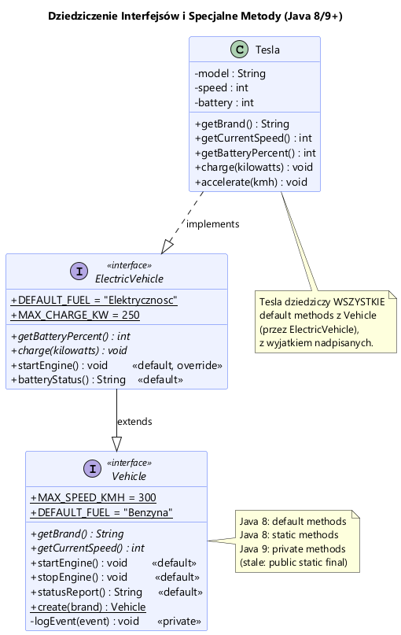
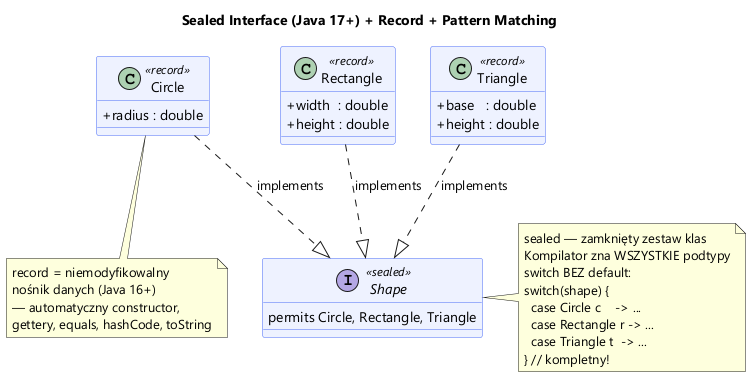

# Moduł 2.4: Szczególne Własności i Innowacje w Interfejsach

## Wprowadzenie

Wraz z ewolucją Javy, interfejsy zyskały nowe możliwości, zmieniając się z prostych definicji metod abstrakcyjnych w potężne narzędzie do projektowania API.

W tym module zobaczysz:
1.  **Metody domyślne (`default`)** – pozwalają dodawać nową funkcjonalność do istniejących interfejsów bez łamania kodu.
2.  **Metody statyczne (`static`)** – umożliwiają tworzenie "fabryk" lub pomocniczych metod w interfejsie.
3.  **Metody prywatne (`private`)** (Java 9+) – służą do refaktoryzacji metod domyślnych.
4.  **Sealed Interfaces (`sealed`)** (Java 17+) – pozwalają zablokować hierarchię dziedziczenia.

---

## Metody Domyślne (`default`)

W Java 8 wprowadzono metody z ciałem (`default`) w interfejsie. Ma to dwie główne zalety:
*   Pozwala rozwijać interfejsy bez psucia istniejących implementacji (kompatybilność wsteczna).
*   Pozwala stworzyć "opcjonalne metody" z domyślnym zachowaniem.



```java
public interface Vehicle {
    void startEngine(); // abstrakcyjna - wymagana

    // Metoda z domyślną implementacją
    default void stopEngine() {
        System.out.println("Zatrzymywanie silnika...");
    }
}
```

Klasa, która implementuje `Vehicle`, **może** skorzystać z domyślnego `stopEngine()`, ale **musi** zaimplementować `startEngine()`.

Zobacz przykład w [Vehicle.java](Vehicle.java) i [ElectricVehicle.java](ElectricVehicle.java), oraz demonstrację w [DefaultMethodDemo.java](DefaultMethodDemo.java).

---

## Metody Statyczne i Prywatne

### Metody statyczne (`static`)
Definiują funkcjonalność, która należy do samego interfejsu (np. metoda fabryczna), a nie do instancji klasy implementującej.

```java
// Wywołanie: Vehicle.create("Ford");
static Vehicle create(String brand) {
    return new Car(brand);
}
```
**Uwaga:** Metody statyczne w interfejsie **nie są dziedziczone** przez klasy implementujące.

### Metody prywatne (`private`)
Jeśli kilka metod domyślnych (lub statycznych) potrzebuje tej samej logiki, możemy ją wydzielić do prywatnej metody wewnątrz interfejsu. Jest ona niewidoczna na zewnątrz.

---

## Sealed Interfaces (`sealed`) + Records

Od Java 17 możemy kontrolować hierarchię dziedziczenia za pomocą słowa kluczowego `sealed`. Interfejs `sealed` (zapieczętowany) jawnie wymienia klasy, które mogą go implementować (`permits`).

Dzięki temu kompilator ma pewność co do wszystkich możliwych wariantów typu, co świetnie współpracuje z **Wzorcami w Switch** (Switch Expressions i Pattern Matching - od Java 21).



```java
// Tylko 3 klasy mogą być Shape: Circle, Rectangle, Triangle
public sealed interface Shape permits Circle, Rectangle, Triangle {}

// Switch expression (Java 21) nie wymaga "default", bo kompilator wie, że pokryliśmy wszystkie przypadki!
return switch(s) {
    case Circle c    -> Math.PI * c.radius() * c.radius();
    case Rectangle r -> r.width() * r.height();
    case Triangle t  -> ...
};
```

Demo "Modern Java" w [SealedDemo.java](SealedDemo.java).

---

## Uruchomienie przykładów

```powershell
.\run-examples.ps1
```

