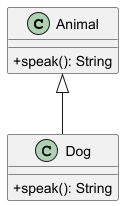

# Moduł 3.1: Pojęcie dziedziczenia i implementacja w Javie

## Wprowadzenie

Dziedziczenie pozwala budować nowy typ na bazie istniejącego typu. W Javie realizujemy to przez `extends`, a główną korzyścią jest wspólny kontrakt `is-a` oraz możliwość ponownego użycia kodu.

### Czego nauczysz się w tym module?
- odróżniania relacji `is-a` od relacji `has-a`,
- projektowania prostych hierarchii klas,
- świadomego użycia `override` w klasie potomnej.

---

## Diagram koncepcji



Diagram PlantUML: [`diagrams/inheritance_intro.puml`](diagrams/inheritance_intro.puml)

---

## Kod i omówienie

Plik z przykładem:
- [`src/inheritance/t01/InheritanceIntroDemo.java`](src/inheritance/t01/InheritanceIntroDemo.java)

Fragment:

```java
Animal animal = new Dog();
System.out.println(animal.speak());
```

Wynik pokazuje, że referencja typu bazowego (`Animal`) może wskazywać na obiekt klasy potomnej (`Dog`).

---

## Najczęstsze błędy

1. Projektowanie dziedziczenia tylko po to, by współdzielić kod (zamiast przemyślanej relacji `is-a`).
2. Brak `@Override` przy nadpisywaniu metod.
3. Nadmiernie głębokie hierarchie klas, utrudniające utrzymanie.

---

## Uruchomienie

Z katalogu `02_OOP/src/_03-dziedziczenie`:

```powershell
.\run-all-examples.ps1
```

---

## Materiały dodatkowe

- Oracle Tutorials: <https://docs.oracle.com/javase/tutorial/java/IandI/subclasses.html>
- Effective Java, rozdział o projektowaniu klas i interfejsów
