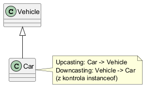

# Modul 3.2: Zgodnosc typow w hierarchii dziedziczenia

## Wprowadzenie

W Javie typ referencji moze byc ogolniejszy niz typ obiektu. To podstawa polimorfizmu i bezpiecznego API. W druga strone (downcasting) potrzebna jest ostroznosc i najczesciej sprawdzenie `instanceof`.

### Czego nauczysz sie w tym module?
- jak dziala upcasting i downcasting,
- kiedy rzutowanie jest bezpieczne,
- jak uzywac `instanceof` z pattern matchingiem.

---

## Diagram koncepcji



Diagram PlantUML: [`diagrams/type_compatibility.puml`](diagrams/type_compatibility.puml)

---

## Kod i omowienie

Plik z przykladem:
- [`src/inheritance/t02/TypeCompatibilityDemo.java`](src/inheritance/t02/TypeCompatibilityDemo.java)

Fragment:

```java
Vehicle upcasted = new Car();
if (upcasted instanceof Car car) {
    car.openTrunk();
}
```

To nowoczesny styl Javy (pattern variable `car`) bez recznego rzutowania.

---

## Najczestsze bledy

1. Rzutowanie bez sprawdzenia typu (`ClassCastException`).
2. Zakladanie, ze typ referencji decyduje o implementacji metody.
3. Naduzywanie `instanceof` zamiast projektowania lepszego API.

---

## Uruchomienie

```powershell
Set-Location "C:\home\gitHub\oop-concepts-java\02_OOP\src\_03-dziedziczenie"
.\run-all-examples.ps1
```

---

## Materialy dodatkowe

- JLS, rozdzial 5 (Conversions and Promotions): <https://docs.oracle.com/javase/specs/jls/se21/html/jls-5.html>
