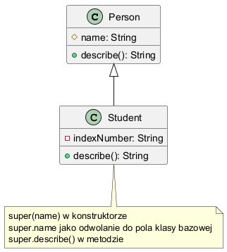

# 03 - Zmienna `super`

`super` pozwala odwolywac sie do klasy bazowej: konstruktora, metod i pol.



## Kod

- `src/inheritance/t03/SuperKeywordDemo.java`

```java
Student(String name, String indexNumber) {
    super(name);
    this.indexNumber = indexNumber;
}
```

