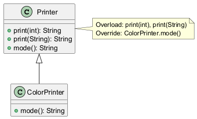

# 04 - Nadpisywanie vs przeciazanie

- Przeciazanie (`overload`) rozroznia metody po sygnaturze.
- Nadpisywanie (`override`) zmienia implementacje metody odziedziczonej.

## Kod

- `src/inheritance/t04/OverrideVsOverloadDemo.java`

