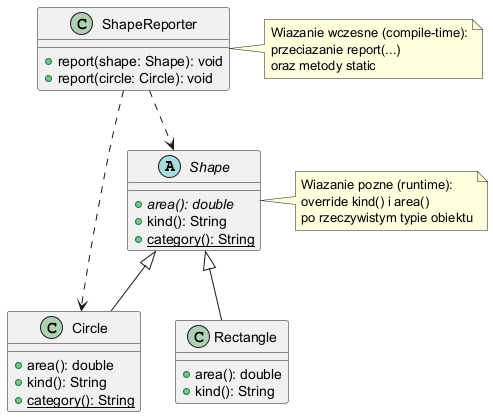

# Moduł 3.5: Dynamiczne wiązanie metod

## Wprowadzenie

W Javie metody instancyjne są wiązane dynamicznie (late binding). Kompilator sprawdza typ referencji, ale konkretna implementacja jest wybierana przez JVM na podstawie rzeczywistego typu obiektu.

### Czego nauczysz się w tym module?
- jak działa dynamic dispatch,
- czym różni się late binding od early binding,
- jakie to ma konsekwencje dla projektowania API.

---

## Diagram koncepcji



Diagram PlantUML: [`diagrams/dynamic_binding.puml`](diagrams/dynamic_binding.puml)

---

## Kod i omówienie

Plik z przykładem:
- [`src/inheritance/t05/DynamicBindingDemo.java`](src/inheritance/t05/DynamicBindingDemo.java)

W przykładzie znajdują się dwie wyraźne sekcje:
- **wiązanie wczesne (compile-time)**: przeciążanie (`report(Shape)` vs `report(Circle)`) i metody `static`,
- **wiązanie późne (runtime)**: nadpisane metody instancyjne (`kind()` i `area()`) wywoływane przez referencję `Shape`.

### Fragment: wiązanie wczesne

```java
Circle circle = new Circle(2);
Shape circleAsShape = circle;

reporter.report(circle);        // report(Circle)
reporter.report(circleAsShape); // report(Shape)

System.out.println(Shape.category());
System.out.println(Circle.category());
System.out.println(circleAsShape.category());
```

Kluczowa obserwacja: kompilator wybiera przeciążoną metodę po **typie referencji**, a nie po rzeczywistym typie obiektu.

### Fragment: wiązanie późne

```java
Shape[] shapes = { new Circle(2), new Rectangle(3, 4) };
for (Shape shape : shapes) {
	System.out.printf("runtimeType=%s kind=%s area=%.2f%n",
			shape.getClass().getSimpleName(),
			shape.kind(),
			shape.area());
}
```

Tutaj JVM wybiera implementację metod instancyjnych na podstawie rzeczywistego typu obiektu (`Circle` / `Rectangle`).

### Co warto podkreślić studentom

1. Przeciążanie (`overload`) to decyzja kompilatora.
2. Nadpisywanie (`override`) to decyzja JVM w runtime.
3. Metody `static` nie są polimorficzne jak metody instancyjne.

---

## Najczęstsze błędy

1. Oczekiwanie, że pola będą działały jak metody (pola nie są polimorficzne).
2. Mylenie przeciążania z dynamicznym wiązaniem.
3. Zakładanie, że `private` i `static` metody są wiązane dynamicznie.

---

## Uruchomienie

```powershell
Set-Location "C:\home\gitHub\oop-concepts-java\02_OOP\src\_03-dziedziczenie"
.\run-all-examples.ps1
```
