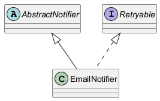

# Modul 3.7: Klasy abstrakcyjne vs interfejsy

## Wprowadzenie

Klasa abstrakcyjna i interfejs rozwiazuja podobny problem (abstrakcja), ale robia to inaczej. Klasa abstrakcyjna nadaje wspolny stan i czesc implementacji, a interfejs definiuje kontrakt i daje wieksza elastycznosc.

### Czego nauczysz sie w tym module?
- kiedy wybrac klase abstrakcyjna,
- kiedy lepszy jest interfejs,
- jak laczyc oba podejscia w jednym projekcie.

---

## Diagram koncepcji



Diagram PlantUML: [`diagrams/abstract_vs_interface.puml`](diagrams/abstract_vs_interface.puml)

---

## Kod i omowienie

Plik z przykladem:
- [`src/inheritance/t07/AbstractVsInterfaceDemo.java`](src/inheritance/t07/AbstractVsInterfaceDemo.java)

W przykladzie porownano:
- wspolny stan i implementacje (klasa abstrakcyjna),
- kontrakt zachowania (interfejs),
- mozliwosc wielokrotnej implementacji interfejsow.

---

## Najczestsze bledy

1. Uzywanie klasy abstrakcyjnej tam, gdzie potrzebny jest tylko kontrakt.
2. Przechowywanie stanu w interfejsie (poza stalymi `public static final`).
3. Projektowanie klas bazowych, ktore wiedza zbyt wiele o potomkach.

---

## Uruchomienie

```powershell
Set-Location "C:\home\gitHub\oop-concepts-java\02_OOP\src\_03-dziedziczenie"
.\run-all-examples.ps1
```
