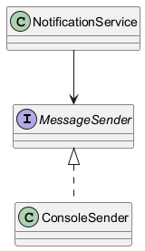

# Moduł 3.8: Abstrakcje, DI i wstrzykiwanie zależności

## Wprowadzenie

Wstrzykiwanie zależności działa najlepiej, gdy moduł wysokiego poziomu zależy od abstrakcji, a nie od konkretnej implementacji. Dziedziczenie i interfejsy są tu narzędziem do budowy luźno powiązanych komponentów.

### Czego nauczysz się w tym module?
- jak abstrakcja wspiera testowalność kodu,
- jak działa ręczne wstrzykiwanie zależności,
- jak przygotować kod pod kontenery DI.

---

## Diagram koncepcji



Diagram PlantUML: [`diagrams/di_abstraction.puml`](diagrams/di_abstraction.puml)

---

## Kod i omówienie

Plik z przykładem:
- [`src/inheritance/t08/DiAbstractionDemo.java`](src/inheritance/t08/DiAbstractionDemo.java)

Przykład pokazuje, jak ten sam komponent klienta może pracować z różną implementacją dostarczoną z zewnątrz.

---

## Najczęstsze błędy

1. Tworzenie zależności (`new`) wewnątrz logiki biznesowej.
2. Wstrzykiwanie konkretnych klas zamiast interfejsów.
3. Brak testów jednostkowych dla komponentów korzystających z DI.

---

## Uruchomienie

```powershell
Set-Location "C:\home\gitHub\oop-concepts-java\02_OOP\src\_03-dziedziczenie"
.\run-all-examples.ps1
```
