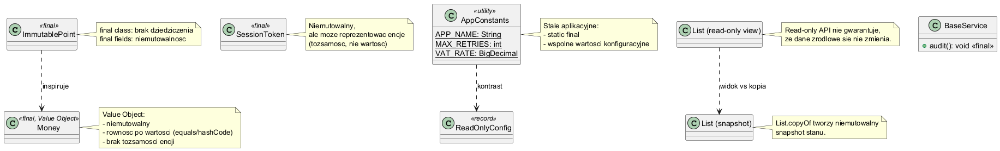

# Moduł 3.9: `final` dla klas, metod i pól

## Wprowadzenie

`final` ogranicza możliwość modyfikacji API i wspiera niemutowalność. Może dotyczyć klasy, metody lub pola i pomaga budować bardziej przewidywalny kod.

### Czego nauczysz się w tym module?
- kiedy stosować `final class`,
- jak `final` na metodzie chroni kontrakt,
- jak `final` na polu wspiera obiekty niemutowalne.

---

## Diagram koncepcji



Diagram PlantUML: [`diagrams/final_usage.puml`](diagrams/final_usage.puml)

---

## Kod i omówienie

Plik z przykładem:
- [`src/inheritance/t09/FinalKeywordDemo.java`](src/inheritance/t09/FinalKeywordDemo.java)

W kodzie zobaczysz, co blokuje `final` i jakie błędy kompilacji pojawiają się przy próbie naruszenia kontraktu.

---

## Najczęstsze błędy

1. Nadmierne oznaczanie wszystkiego jako `final` bez uzasadnienia projektowego.
2. Mylenie `final` referencji z niemutowalnością obiektu.
3. Blokowanie rozszerzalności klasy, która powinna być punktem rozszerzeń.

---

## Uruchomienie

```powershell
Set-Location "C:\home\gitHub\oop-concepts-java\02_OOP\src\_03-dziedziczenie"
.\run-all-examples.ps1
```
