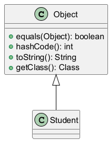

# Moduł 3.10: Klasa `Object` i kontrakty metod bazowych

## Wprowadzenie

Każda klasa w Javie dziedziczy po `Object`. Oznacza to, że wszystkie obiekty dzielą wspólne API, m.in. `equals`, `hashCode`, `toString` oraz `getClass`.

### Czego nauczysz się w tym module?
- jak poprawnie nadpisywać `equals` i `hashCode`,
- po co definiować czytelne `toString`,
- jakie są konsekwencje złamania kontraktów metod bazowych.

---

## Diagram koncepcji



Diagram PlantUML: [`diagrams/object_hierarchy.puml`](diagrams/object_hierarchy.puml)

---

## Kod i omówienie

Plik z przykładem:
- [`src/inheritance/t10/ObjectClassDemo.java`](src/inheritance/t10/ObjectClassDemo.java)

Przykład pokazuje zachowanie obiektów w kolekcjach oraz znaczenie spójności `equals` i `hashCode`.

---

## Najczęstsze błędy

1. Nadpisanie `equals` bez `hashCode`.
2. Używanie zmiennych mutowalnych jako podstawy `hashCode`.
3. Brak testów kontraktowych dla równości obiektów.

---

## Uruchomienie

```powershell
Set-Location "C:\home\gitHub\oop-concepts-java\02_OOP\src\_03-dziedziczenie"
.\run-all-examples.ps1
```
