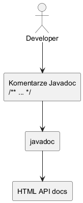

# Modul 3.11: Javadoc i dokumentowanie API

## Wprowadzenie

Javadoc tworzy dokumentacje API bezposrednio z komentarzy `/** ... */`. Dzieki temu dokumentacja jest blisko kodu i moze byc utrzymywana razem z implementacja.

### Czego nauczysz sie w tym module?
- jak pisac komentarze Javadoc dla klas i metod,
- jak generowac dokumentacje HTML,
- jak utrzymac spojny styl opisu API.

---

## Diagram koncepcji



Diagram PlantUML: [`diagrams/javadoc_flow.puml`](diagrams/javadoc_flow.puml)

---

## Kod i omowienie

Plik z przykladem:
- [`src/inheritance/t11/JavadocDemo.java`](src/inheritance/t11/JavadocDemo.java)

W przykladzie zobaczysz opis klasy, metod publicznych i parametrow.

---

## Przykladowe polecenia

```powershell
Set-Location "C:\home\gitHub\oop-concepts-java\02_OOP\src\_03-dziedziczenie"
.\run-all-examples.ps1
```

```powershell
javadoc -d out-docs src\inheritance\t11\JavadocDemo.java
```

---

## Najczestsze bledy

1. Komentarze niezgodne z zachowaniem metody po zmianach kodu.
2. Brak `@param` i `@return` dla metod publicznych.
3. Traktowanie Javadoc jako formalnosci, a nie czesci API.
