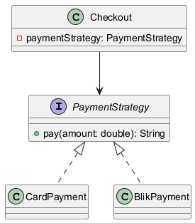

# Moduł 3.6: Polimorfizm i wzorce projektowe

## Wprowadzenie

Polimorfizm pozwala programować do abstrakcji, a nie do konkretnej klasy. To podstawa wielu wzorców projektowych, np. Strategy, gdzie zachowanie można podmieniać bez zmiany kodu klienta.

### Czego nauczysz się w tym module?
- jak wykorzystać polimorfizm do ograniczenia instrukcji warunkowych,
- jak działa wzorzec Strategy w praktyce,
- jak oddzielać kod klienta od implementacji szczegółów.

---

## Diagram koncepcji



Diagram PlantUML: [`diagrams/polymorphism_patterns.puml`](diagrams/polymorphism_patterns.puml)

---

## Kod i omówienie

Plik z przykładem:
- [`code/PolymorphismPatternsDemo.java`](code/PolymorphismPatternsDemo.java)

Fragment:

```java
Checkout checkout = new Checkout(new BlikPayment());
System.out.println(checkout.finalizeOrder(199.99));
```

Klasa `Checkout` nie zna szczegółów płatności. Zależy od abstrakcji, dzięki czemu łatwo dodać nową metodę płatności.

---

## Najczęstsze błędy

1. Tworzenie dużych bloków `if/switch` zamiast polimorfizmu.
2. Łączenie logiki biznesowej i infrastrukturalnej w jednej klasie.
3. Brak testów kontraktowych dla wspólnego interfejsu.

---

## Uruchomienie

```powershell
Set-Location "C:\home\gitHub\oop-concepts-java\02_OOP\src\_03_dziedziczenie"
.\run-all-examples.ps1
```
