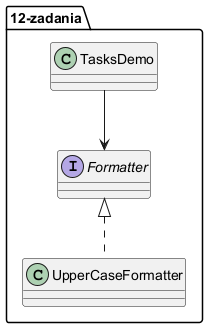

# Moduł 3.12: Zadania do samodzielnego rozwiązania

## Wprowadzenie

Ten temat domyka moduł dziedziczenia. Zadania są nieco trudniejsze od przykładów z poprzednich sekcji, ale możliwe do wykonania na bazie poznanych koncepcji.

### Czego nauczysz się w tym module?
- łączenia wielu mechanizmów (dziedziczenie, `super`, `override`, `final`),
- projektowania hierarchii klas pod testy,
- dokumentowania decyzji projektowych.

---

## Diagram przeglądowy



Diagram PlantUML: [`diagrams/tasks_overview.puml`](diagrams/tasks_overview.puml)

---

## Zadania

1. **Hierarchia pracowników (poziom 1):**
   Zaimplementuj `Employee -> Manager -> Director` i pokaż upcasting oraz `override`.
2. **Raporty i abstrakcja (poziom 2):**
   Dodaj klasę abstrakcyjną `Report` i co najmniej dwie implementacje.
3. **Niemutowalny kontrakt (poziom 3):**
   Użyj `final` tak, aby zabezpieczyć API klasy niemutowalnej.

---

## Pliki w tym temacie

- Przykłady uruchomieniowe: [`code/TasksDemo.java`](code/TasksDemo.java)
- Rozwiązania: [`solutions/InheritanceTaskSolution.java`](solutions/InheritanceTaskSolution.java)
- Testy: [`tests/InheritanceTaskSolutionTest.java`](tests/InheritanceTaskSolutionTest.java)

---

## Kryteria sukcesu

- kompilacja bez ostrzeżeń krytycznych,
- przejście testów jednostkowych,
- poprawne użycie dziedziczenia bez zbędnej duplikacji kodu,
- czytelne nazwy klas, metod i komentarze tam, gdzie to potrzebne.

---

## Uruchomienie

```powershell
Set-Location "C:\home\gitHub\oop-concepts-java\02_OOP\src\_03_dziedziczenie"
.\run-all-examples.ps1
```

```powershell
Set-Location "C:\home\gitHub\oop-concepts-java\02_OOP\src\_03_dziedziczenie"
.\run-tests.ps1
```
