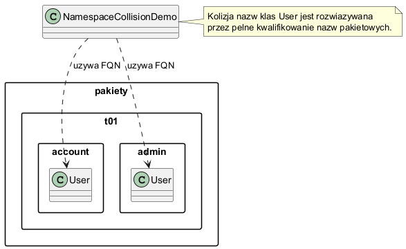

# 4.1 Przestrzenie nazw i pakiety

## Dlaczego pakiety istnieja?

W miare wzrostu projektu pojawiaja sie klasy o takich samych nazwach (`User`, `Order`, `Date`).
Pakiety (`package`) rozwiazuja ten problem przez wprowadzenie przestrzeni nazw oraz logicznej segmentacji kodu.

- `pakiety.t01.account.User` i `pakiety.t01.admin.User` moga wspolistniec,
- pakiet jest tez jednostka hermetyzacji (widocznosc package-private),
- struktura pakietow wspiera publikacje bibliotek (JAR, moduly).

## Geneza i zwiazek z dystrybucja kodu

Pakiety wyewoluowaly jako odpowiedz na:

1. kolizje nazw,
2. potrzebe organizacji kodu,
3. kontrolowanie API udostepnianego na zewnatrz,
4. dostarczanie kodu jako zaleznosci (JAR, Maven/Gradle).

## Diagram



Plik zrodlowy diagramu: `diagrams/namespace_collision.puml`.

## Kod referencyjny

- `src/pakiety/t01/NamespaceCollisionDemo.java`
- `src/pakiety/t01/account/User.java`
- `src/pakiety/t01/admin/User.java`

Fragment kluczowy:

```java
pakiety.t01.account.User accountUser = new pakiety.t01.account.User("anna");
pakiety.t01.admin.User adminUser = new pakiety.t01.admin.User("root");
```

W tym miejscu widac, ze kolizja nazw jest rozwiazywana przez **pelna nazwe kwalifikowana** (FQN).

## Uruchomienie

```powershell
.\run-examples.ps1
```

## Dobre praktyki

- Uzywaj odwroconej nazwy domeny (`pl.uczelnia.modul...`) w realnych projektach.
- Nie tworz pakietow zbyt plaskich (`utils`, `common`) bez jasnej odpowiedzialnosci.
- Ograniczaj API publiczne pakietu; reszte pozostaw package-private.

## Literatura

- JLS 7 (Packages): <https://docs.oracle.com/javase/specs/jls/se21/html/jls-7.html>
- Oracle Tutorial - Creating and Using Packages: <https://docs.oracle.com/javase/tutorial/java/package/createpkgs.html>

