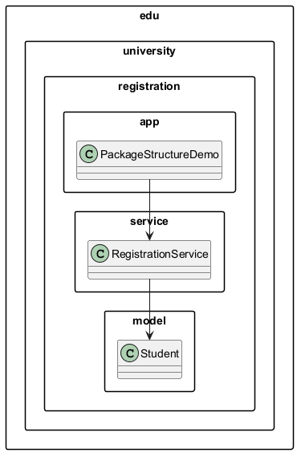

# 4.2 Definiowanie pakietu i struktura fizyczna katalogow

## Koncepcja

W Javie deklaracja `package` musi byc zgodna ze struktura katalogow.

Przyklad:

```java
package edu.university.registration.service;
```

oznacza, ze plik powinien znajdowac sie w katalogu:

`src/edu/university/registration/service/`

## Diagram



## Kod referencyjny

- `src/edu/university/registration/model/Student.java`
- `src/edu/university/registration/service/RegistrationService.java`
- `src/edu/university/registration/app/PackageStructureDemo.java`

Fragment:

```java
import edu.university.registration.model.Student;
import edu.university.registration.service.RegistrationService;
```

## Typowe bledy

1. Niezgodnosc `package` z katalogiem.
2. Kompilacja pojedynczego pliku bez uwzglednienia zaleznosci.
3. Mieszanie klas z roznych pakietow w jednym katalogu.

## Uruchomienie

```powershell
.\run-examples.ps1
```

## Literatura

- Oracle tutorial: <https://docs.oracle.com/javase/tutorial/java/package/packages.html>
- JLS 7.4 Package Declarations: <https://docs.oracle.com/javase/specs/jls/se21/html/jls-7.html#jls-7.4>

