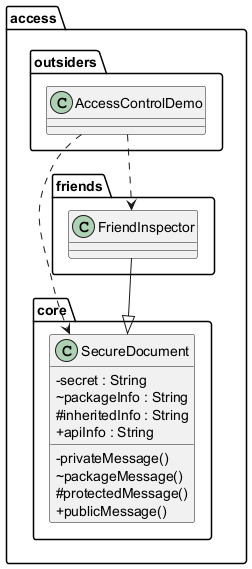

# 4.4 Kontrola dostepu do klas, pol i metod

## Po co to jest?

Pakiet to nie tylko nazwa; to rowniez granica widocznosci.
Modyfikatory dostepu okreslaja, kto moze uzywac elementu API.

- `private` - tylko wewnatrz klasy,
- brak modyfikatora - wewnatrz pakietu (package-private),
- `protected` - pakiet + klasy potomne,
- `public` - wszedzie.

## Diagram



## Kod referencyjny

- `src/access/core/SecureDocument.java`
- `src/access/friends/FriendInspector.java`
- `src/access/outsiders/AccessControlDemo.java`

Fragment (ograniczenia dostepu):

```java
// doc.packageMessage();   // blad: package-private
// doc.protectedMessage(); // blad: protected poza pakietem i bez dziedziczenia
```

## Uruchomienie

```powershell
.\run-examples.ps1
```

## Literatura

- Oracle tutorial: Controlling Access: <https://docs.oracle.com/javase/tutorial/java/javaOO/accesscontrol.html>
- JLS 6.6 Access Control: <https://docs.oracle.com/javase/specs/jls/se21/html/jls-6.html#jls-6.6>

