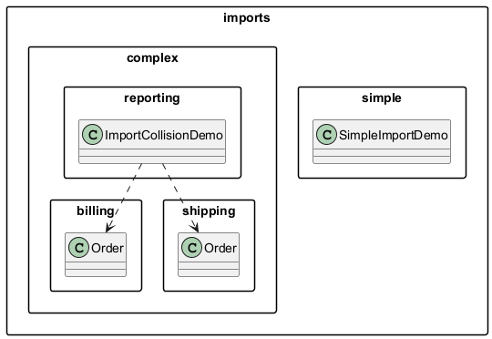

# Moduł 4.5: Importy, static import i kolizje nazw

## Wprowadzenie

### 🎯 Czego się nauczysz w tym module?

- Jak działają deklaracje `import` i jakie są ich warianty.
- Czym jest `import static` i kiedy go używać.
- Jak rozwiązywać **kolizje nazw** między klasami z różnych pakietów.
- Co to jest *class hiding* i jak unikać pułapek z importem wildcard.

---

## Rodzaje deklaracji import

### 1. Import konkretnej klasy (zalecany)

```java
import java.util.ArrayList;
import java.util.List;
```

Jasno widać, z którego pakietu pochodzi każda klasa.

### 2. Import wildcard (gwiazdka)

```java
import java.util.*;   // importuje wszystkie publiczne typy z java.util
```

**Nie jest wolniejszy** — kompilator i JVM nie wczytują niepotrzebnych klas.
Jednak **utrudnia czytanie kodu** — nie wiadomo, skąd pochodzi `Date`, `List`, `Map`.
Google Java Style zakazuje importów wildcard.

### 3. Brak importu — pełna nazwa kwalifikowana (FQN)

```java
java.util.Date d = new java.util.Date();
```

Stosuj wtedy, gdy dwa pakiety zawierają klasy o tej samej nazwie.

### 4. `import static` — importowanie elementów statycznych

```java
import static java.lang.Math.PI;
import static java.lang.Math.sqrt;
import static java.util.Collections.sort;
```

Umożliwia używanie stałych i metod statycznych **bez prefixu klasy**:

```java
double obwod = 2 * PI * r;        // zamiast: 2 * Math.PI * r
double pierwiastek = sqrt(16.0);   // zamiast: Math.sqrt(16.0)
```

Kod przykładowy: [`src/imports/staticdemo/StaticImportDemo.java`](src/imports/staticdemo/StaticImportDemo.java)

---

## Kolizja nazw — rozwiązania

Gdy dwa pakiety mają klasę o tej samej nazwie, `import` może zaimportować **tylko jedną**:

```java
import imports.complex.billing.Order;   // można zaimportować jedną

// drugą trzeba użyć przez FQN:
imports.complex.shipping.Order shippingOrder =
    new imports.complex.shipping.Order("S-01", "Warszawa");
```

Kod: [`src/imports/complex/reporting/ImportCollisionDemo.java`](src/imports/complex/reporting/ImportCollisionDemo.java)

---

## Class Hiding — ukrywanie klas

Poważna pułapka: jeśli zaimportujesz `java.awt.*` i `java.util.*`, kompilator nie wie, o którą `List` chodzi:

```java
import java.util.*;
import java.awt.*;

List<String> list = new List<>();  // błąd: ambiguous — java.util.List? java.awt.List?
```

Rozwiązanie: jawny import konkretnej klasy lub FQN:

```java
import java.util.List;             // jawna preferowana klasa
import java.awt.*;                  // pozostałe z awt

List<String> list = new ArrayList<>();   // OK — java.util.List
java.awt.List awtList = new java.awt.List();  // OK — FQN
```

---

## Diagram



---

## Kod referencyjny

| Plik | Opis |
|------|------|
| [`src/imports/simple/SimpleImportDemo.java`](src/imports/simple/SimpleImportDemo.java) | Prosty import — `ArrayList`, `List` |
| [`src/imports/staticdemo/StaticImportDemo.java`](src/imports/staticdemo/StaticImportDemo.java) | `import static` — Math, Collections |
| [`src/imports/complex/billing/Order.java`](src/imports/complex/billing/Order.java) | Klasa `Order` w pakiecie billing |
| [`src/imports/complex/shipping/Order.java`](src/imports/complex/shipping/Order.java) | Klasa `Order` w pakiecie shipping |
| [`src/imports/complex/reporting/ImportCollisionDemo.java`](src/imports/complex/reporting/ImportCollisionDemo.java) | Użycie obu `Order` przez FQN |

---

## ⚠️ Najczęstsze błędy

1. **Nieświadome użycie wildcard `*`** — utrudnia wyszukiwanie zależności, maskuje kolizje.
2. **`import static` na całą klasę (`import static Math.*`)** — pogarsza czytelność; używaj tylko dla często używanych stałych.
3. **Zapomnienie o FQN przy kolizji** — kompilator wypisze `reference to X is ambiguous`.
4. **Importowanie klasy z domyślnego pakietu** — niemożliwe; to kolejny argument przeciw brakowi `package`.

---

## 📚 Literatura i materiały dodatkowe

- **Oracle Tutorial — Using Package Members:** <https://docs.oracle.com/javase/tutorial/java/package/usepkgs.html>
- **Oracle JLS §7.5 — Import Declarations:** <https://docs.oracle.com/javase/specs/jls/se21/html/jls-7.html#jls-7.5>
- **Google Java Style Guide — Import statements:** <https://google.github.io/styleguide/javaguide.html#s3.3-import-statements>
- **Oracle API — java.util (summary):** <https://docs.oracle.com/en/java/javase/21/docs/api/java.base/java/util/package-summary.html>

---

## Uruchomienie przykładów

```powershell
.\run-examples.ps1
```


