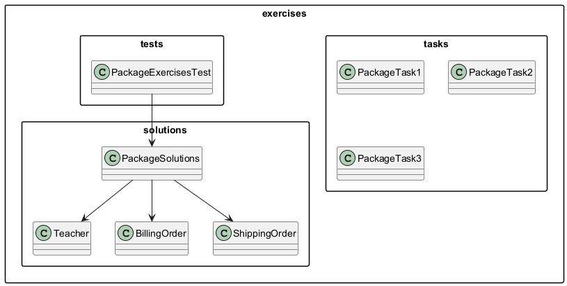

# 4.6 Zadania do samodzielnego rozwiazania

Sekcja utrwala material z tematow 4.1-4.5: pakiety, importy, kontrola dostepu i kompilacja.

## Struktura

- `tasks/` - tresci zadan dla studentow,
- `solutions/` - przykladowe rozwiazania referencyjne,
- `tests/` - proste testy uruchamiane bez frameworka,
- `diagrams/` - diagram mapujacy zadania, rozwiazania i testy.

## Diagram



## Zadania

1. `tasks/PackageTask1.java` - podstawowy import i podzial na pakiety.
2. `tasks/PackageTask2.java` - kolizja nazw (`Order`) i nazwy kwalifikowane.
3. `tasks/PackageTask3.java` - kontrola dostepu (`private`, package-private, `protected`, `public`).

## Rozwiazanie referencyjne

Glowne klasy:

- `solutions/PackageSolutions.java`
- `solutions/Teacher.java`
- `solutions/BillingOrder.java`
- `solutions/ShippingOrder.java`

## Testy

- `tests/PackageExercisesTest.java`

Uruchomienie:

```powershell
.\run-examples.ps1
```

## Wskazowki TDD

- najpierw uruchom test i zobacz blad,
- dopisz minimalny kod aby test przeszedl,
- zrefaktoryzuj nazwy pakietow i importy,
- uruchom test ponownie.

