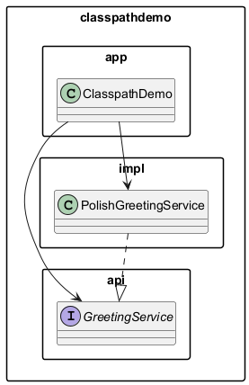

# Moduł 4.3: CLASSPATH, kompilacja, JARy i System Modułów

## Wprowadzenie

### 🎯 Czego się nauczysz w tym module?

- Czym jest `CLASSPATH` i jak JVM go używa do wyszukiwania klas.
- Jak kompilować wielopakietowy projekt za pomocą `javac`.
- Jak tworzyć i uruchamiać archiwa JAR (z plikiem `MANIFEST.MF`).
- Czym jest Java Platform Module System (JPMS) i kiedy go stosować.

---

## Czym jest CLASSPATH?

`CLASSPATH` to lista lokalizacji (katalogów i archiwów `.jar`), w których JVM i kompilator `javac` szukają skompilowanych klas (`*.class`).

Możesz go przekazać na trzy sposoby (w kolejności priorytetu):

| Sposób | Przykład |
|--------|---------|
| Parametr `-cp` / `--class-path` | `java -cp out classpathdemo.app.ClasspathDemo` |
| Zmienna środowiskowa `CLASSPATH` | `$env:CLASSPATH = "out;lib\gson.jar"` |
| Brak (domyślnie) | Tylko katalog bieżący `.` |

> **Zalecenie:** zawsze używaj `-cp` — jest jawny i nie zależy od środowiska.

---

## Jak JVM wyszukuje klasy?

```
java -cp out classpathdemo.app.ClasspathDemo
```

1. JVM prosi **ClassLoader** o klasę `classpathdemo.app.ClasspathDemo`.
2. ClassLoader szuka pliku `classpathdemo/app/ClasspathDemo.class` w każdej lokalizacji z CLASSPATH.
3. Jeśli nie znajdzie — rzuca `ClassNotFoundException` lub `NoClassDefFoundError`.

Różnica:

| Wyjątek | Kiedy |
|---------|-------|
| `ClassNotFoundException` | Jawne ładowanie przez `Class.forName("...")` lub `ClassLoader.loadClass(...)` |
| `NoClassDefFoundError` | Klasa była dostępna podczas kompilacji, ale brakuje jej w czasie wykonania |

---

## Kompilacja z javac

### Opcje podstawowe

```powershell
# -d <katalog>      : dokąd trafiają pliki .class
# --release <n>     : docelowa wersja języka (rekomendowane: 21)
# -sourcepath <dir> : gdzie szukać źródeł (rzadko potrzebne)

javac --release 21 -d out `
  src\classpathdemo\api\GreetingService.java `
  src\classpathdemo\impl\PolishGreetingService.java `
  src\classpathdemo\app\ClasspathDemo.java
```

### Kompilacja całego drzewa źródeł

```powershell
# Powershell: zbierz wszystkie *.java
$sources = Get-ChildItem -Path src -Recurse -Filter *.java |
    ForEach-Object { $_.FullName }
javac --release 21 -d out $sources
```

### Uruchomienie

```powershell
java -cp out classpathdemo.app.ClasspathDemo
```

Diagram przepływu:



---

## Tworzenie archiwum JAR

JAR (*Java ARchive*) to archiwum ZIP zawierające pliki `.class` i zasoby.

### Tworzenie

```powershell
# jar --create --file=nazwa.jar --main-class=FQN_klasy_main -C katalog_klas .
jar --create --file=greeting.jar `
    --main-class=classpathdemo.app.ClasspathDemo `
    -C out .
```

### Uruchomienie bezpośrednie (Executable JAR)

```powershell
java -jar greeting.jar
```

### Użycie JAR jako zależności

```powershell
javac --release 21 -cp greeting.jar -d out_client src\client\Client.java
java -cp "out_client;greeting.jar" client.Client
```

### MANIFEST.MF — metadane archiwum

Plik `META-INF/MANIFEST.MF` generowany automatycznie przez `jar --main-class`:

```
Manifest-Version: 1.0
Main-Class: classpathdemo.app.ClasspathDemo
```

Pełne demo w skrypcie [`run-examples.ps1`](run-examples.ps1) — zawiera etap tworzenia i uruchamiania JAR.

---

## Kod referencyjny

- [`src/classpathdemo/api/GreetingService.java`](code/api/GreetingService.java) — interfejs (kontrakt),
- [`src/classpathdemo/impl/PolishGreetingService.java`](code/impl/PolishGreetingService.java) — implementacja,
- [`src/classpathdemo/app/ClasspathDemo.java`](code/app/ClasspathDemo.java) — klasa główna.

---

## Java Platform Module System (JPMS) — wprowadzenie

Java 9 (JEP 261) wprowadziła system modułów silniejszy niż pakiety:

```java
// module-info.java — deklaracja modułu
module pl.edu.demo.greeting {
    exports classpathdemo.api;      // eksportuje tylko API
    requires java.base;             // zależy od java.base (domyślnie)
}
```

| Cecha | Pakiet | Moduł (JPMS) |
|-------|--------|--------------|
| Kontrola dostępu | `public` widoczne wszędzie | `public` widoczne tylko w eksportowanych pakietach |
| Izolacja | Brak izolacji między JARami | Silna izolacja — refleksja też jest ograniczona |
| Zastosowanie | Każdy projekt | Duże platformy, JDK, biblioteki platformowe |

> Na kursach wprowadzających korzystamy z CLASSPATH. JPMS jest tematem kursów zaawansowanych.

---

## ⚠️ Najczęstsze błędy

1. **`Error: Could not find or load main class`** — niepoprawna FQN lub zły katalog w `-cp`.
2. **`package X does not exist`** przy kompilacji — brak `-cp` wskazującego na zależność.
3. **Użycie `CLASSPATH` zmiennej środowiskowej** zamiast `-cp` — trudno debugować, zależy od środowiska.
4. **Brak `-d`** w `javac` — pliki `.class` lądują obok `.java`, bałagan.

---

## 📚 Literatura i materiały dodatkowe

- **Oracle — javac reference:** <https://docs.oracle.com/en/java/javase/21/docs/specs/man/javac.html>
- **Oracle — java reference:** <https://docs.oracle.com/en/java/javase/21/docs/specs/man/java.html>
- **Oracle — jar reference:** <https://docs.oracle.com/en/java/javase/21/docs/specs/man/jar.html>
- **JEP 261 — Module System:** <https://openjdk.org/jeps/261>
- **Oracle Tutorial — Understanding the CLASSPATH:** <https://docs.oracle.com/javase/tutorial/essential/environment/paths.html>

---

## Uruchomienie przykładów

```powershell
.\run-examples.ps1
```


