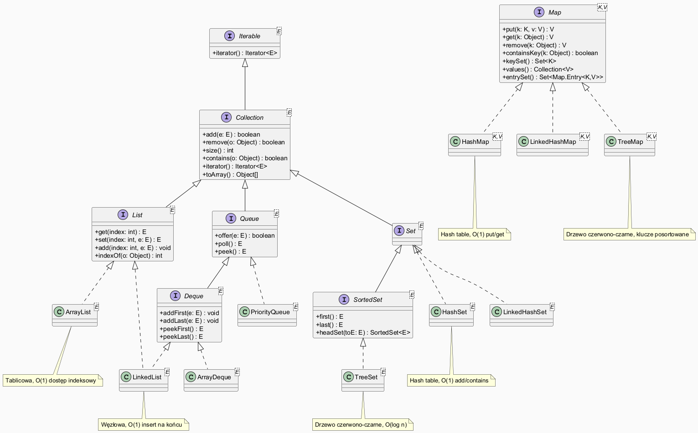

# Moduł 5.1: Pojęcie kolekcji — geneza, hierarchia JCF

## Wprowadzenie

### 🎯 Czego nauczysz się w tym module?

- Zrozumiesz, **dlaczego w Javie powstały kolekcje** i jakie problemy rozwiązują.
- Poznasz **hierarchię interfejsów** Java Collections Framework: `Iterable`, `Collection`, `List`, `Set`, `Queue`, `Deque`, `Map`.
- Zobaczysz **różnicę między starym API** (`Vector`, `Hashtable`) a nowoczesnym JCF (Java 1.2+).
- Nauczysz się stosować **programowanie przez interfejsy**: `List<String> list = new ArrayList<>()`.
- Poznasz klasę narzędziową `Collections` i jej metody pomocnicze.

---

## Geneza — dlaczego kolekcje?

### Java 1.0 (1996) — brak spójnych kolekcji

Pierwsze wersje Javy oferowały tylko:
- `Vector` — dynamiczna tablica, **synchronizowana** (wolna),
- `Hashtable` — mapa z synchronizacją,
- `Stack` (dziedziczy po `Vector`),
- tablice — statyczne, bez operacji dodawania/usuwania.

Programiści musieli każdorazowo pisać własne struktury danych lub korzystać z niespójnych klas.

### Java 1.2 (1998) — Java Collections Framework

Joshua Bloch zaprojektował **Java Collections Framework (JCF)**, który wprowadził:

| Cel | Rozwiązanie |
|-----|-------------|
| Spójny interfejs | `Collection`, `List`, `Set`, `Queue`, `Map` |
| Wiele implementacji | `ArrayList`, `LinkedList`, `HashSet`, `TreeSet`, ... |
| Algorytmy | `Collections.sort()`, `Collections.binarySearch()`, ... |
| Typy generyczne (Java 5) | `List<String>` zamiast `List` (bezpieczeństwo typów) |

---

## Hierarchia interfejsów JCF



*Źródło: `diagrams/collections_hierarchy.puml`*

Kluczowe punkty hierarchii:

| Interfejs | Charakterystyka |
|-----------|----------------|
| `Iterable<E>` | Można iterować (`for-each`) |
| `Collection<E>` | Podstawowe operacje: `add`, `remove`, `size`, `contains` |
| `List<E>` | Zachowuje kolejność, dopuszcza duplikaty, dostęp przez indeks |
| `Set<E>` | Brak duplikatów, kolejność zależy od implementacji |
| `Queue<E>` | FIFO — wstawianie na końcu, pobieranie z początku |
| `Deque<E>` | Kolejka dwukierunkowa (FIFO i LIFO) |
| `Map<K,V>` | Słownik klucz→wartość, **nie rozszerza Collection** |

> **Uwaga:** `Map` celowo nie rozszerza `Collection` — kolekcja par (klucz, wartość) nie jest typową kolekcją elementów.

---

## Programowanie przez interfejsy

Zapisuj typ zmiennej jako interfejs, nie jako klasę konkretną:

```java
// ✅ Dobrze — zależność przez interfejs
List<String> names = new ArrayList<>();

// ❌ Unikaj — zależność przez implementację
ArrayList<String> names = new ArrayList<>();
```

Dzięki temu możesz zmienić implementację (np. `LinkedList`) bez zmiany reszty kodu.

Pełny przykład: [`code/CollectionsIntroDemo.java`](code/CollectionsIntroDemo.java)

### Fragment kodu — różne kolekcje przez interfejs

```java
Collection<String> names = new ArrayList<>();
names.add("Alicja"); names.add("Bob"); names.add("Cezary");
System.out.println("Rozmiar: " + names.size());        // 3
System.out.println("Zawiera 'Bob': " + names.contains("Bob")); // true
```

---

## List — lista z dostępem indeksowym

```java
List<Integer> numbers = new ArrayList<>(List.of(5, 3, 8, 3, 1));
System.out.println(numbers.get(2));        // 8
System.out.println(numbers.indexOf(3));    // 1 (pierwsze wystąpienie)
numbers.sort(Comparator.naturalOrder());
System.out.println(numbers);              // [1, 3, 3, 5, 8]
```

---

## Set — zbiór bez duplikatów

```java
Set<String> fruits = new HashSet<>(Arrays.asList("jabłko", "gruszka", "jabłko", "śliwka"));
System.out.println(fruits.size());           // 3 — duplikat usunięty
Set<String> sorted = new TreeSet<>(fruits);
System.out.println(sorted);                  // [gruszka, jabłko, śliwka] — alfabetycznie
```

---

## Queue — kolejka FIFO

```java
Queue<String> queue = new LinkedList<>();
queue.offer("zadanie-1");
queue.offer("zadanie-2");
System.out.println(queue.peek());     // "zadanie-1" (podgląd bez usunięcia)
System.out.println(queue.poll());     // "zadanie-1" (pobranie + usunięcie)
```

---

## Klasa narzędziowa Collections

```java
List<Integer> nums = new ArrayList<>(List.of(4, 1, 9, 2, 7));
Collections.sort(nums);                           // [1, 2, 4, 7, 9]
Collections.reverse(nums);                        // [9, 7, 4, 2, 1]
System.out.println(Collections.min(nums));         // 1
System.out.println(Collections.max(nums));         // 9

List<Integer> unmod = Collections.unmodifiableList(nums);
unmod.add(99);  // → UnsupportedOperationException
```

---

## Stare API — Vector i Hashtable

```java
// Java 1.0 — synchronizowany, wolniejszy
Vector<String> vector = new Vector<>();

// Java 1.2+ — niesynchronizowany, szybszy (single-threaded)
List<String> modern = new ArrayList<>();
```

> W nowym kodzie **zawsze używaj** `ArrayList`, `HashMap` itp. `Vector` i `Hashtable` istnieją tylko dla kompatybilności wstecznej.
> Jeśli potrzebujesz synchronizacji, użyj `Collections.synchronizedList(new ArrayList<>())` lub kolekcji z pakietu `java.util.concurrent`.

---

## ⚠️ Najczęstsze błędy

1. **Używanie `new ArrayList` bez typu generycznego** — `List list = new ArrayList()` powoduje "unchecked" warning i brak bezpieczeństwa typów w runtime.
2. **Modyfikacja kolekcji podczas iteracji pętlą `for`** — rzuca `ConcurrentModificationException`. Zamiast tego użyj `Iterator.remove()` lub `removeIf`.
3. **Mylenie `Collection` z `Collections`** — `Collection` to interfejs, `Collections` to klasa narzędziowa (użytkowa, bez instancji).

---

## Uruchomienie przykładów

```powershell
Set-Location "C:\home\gitHub\oop-concepts-java\02_OOP\src\_05_kolekcje\_01_kolekcje_intro"
.\run-examples.ps1
```

---

## 📚 Literatura i materiały dodatkowe

- **Oracle Tutorial — Collections Overview:** <https://docs.oracle.com/javase/tutorial/collections/intro/index.html>
- **Oracle API — java.util.Collection:** <https://docs.oracle.com/en/java/docs/api/java.base/java/util/Collection.html>
- **Effective Java (3rd ed.)**, Joshua Bloch — Item 64: Refer to objects by their interfaces
- **Baeldung — Introduction to Java Collections:** <https://www.baeldung.com/java-collections>

