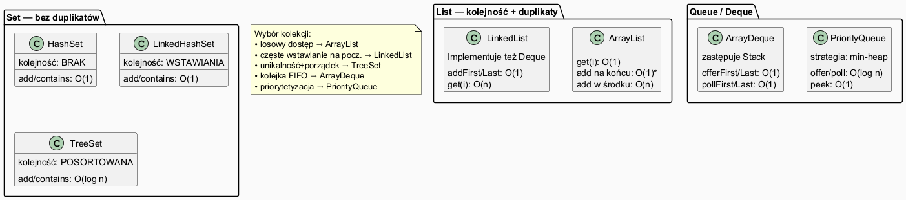

# Moduł 5.2: Typy kolekcji — kiedy używać której

## Wprowadzenie

### 🎯 Czego nauczysz się w tym module?

- Poznasz **wszystkie główne typy kolekcji** dostępne w JCF.
- Zrozumiesz **złożoność czasową** podstawowych operacji i jej praktyczne skutki.
- Nauczysz się **dobierać kolekcję** do konkretnego problemu na podstawie wymagań.
- Zobaczysz **porównanie** `ArrayList` vs `LinkedList`, `HashSet` vs `TreeSet`, `PriorityQueue` vs `ArrayDeque`.

---

## Diagram — przegląd implementacji



*Źródło: `diagrams/collection_types.puml`*

---

## Implementacje List

### ArrayList

Wewnętrznie — tablica dynamiczna. Gdy pojemność zostaje wyczerpana, kopiuje elementy do tablicy 1,5× większej.

```java
List<String> list = new ArrayList<>();
list.add("a");        // O(1) amortyzowane
list.get(2);          // O(1) — losowy dostęp
list.add(1, "X");     // O(n) — przesuwa elementy
list.remove(3);       // O(n) — przesuwa elementy
```

**Kiedy używać:** gdy często czytasz elementy po indeksie lub dodajesz na końcu. **Domyślny wybór dla List.**

### LinkedList

Wewnętrznie — lista dwukierunkowa.

```java
LinkedList<String> linked = new LinkedList<>();
linked.addFirst("FIRST");   // O(1) — brak przesunięć
linked.addLast("LAST");     // O(1)
linked.get(3);              // O(n) — przechodzi węzeł po węźle
```

**Kiedy używać:** gdy często wstawiasz/usuwasz na początku lub implementujesz stos/kolejkę.

### Tabela porównawcza List

| Operacja | ArrayList | LinkedList |
|----------|-----------|-----------|
| `get(i)` | O(1) | O(n) |
| `add` na końcu | O(1)* | O(1) |
| `add(i, e)` | O(n) | O(n) |
| `remove(i)` | O(n) | O(n) |
| `addFirst` | O(n) | O(1) |
| Pamięć | mniej (tablica) | więcej (wskaźniki) |

*O(1) amortyzowane — sporadycznie O(n) przy powiększaniu

---

## Implementacje Set

```java
List<String> input = List.of("banan", "jabłko", "banan", "gruszka", "jabłko", "wiśnia");

Set<String> hash   = new HashSet<>(input);       // kolejność losowa, O(1)
Set<String> linked = new LinkedHashSet<>(input); // kolejność wstawiania, O(1)
Set<String> tree   = new TreeSet<>(input);       // posortowany, O(log n)
```

Pełny przykład: [`code/CollectionTypesDemo.java`](code/CollectionTypesDemo.java)

### Tabela porównawcza Set

| | HashSet | LinkedHashSet | TreeSet |
|--|---------|--------------|---------|
| `add`/`contains` | O(1) | O(1) | O(log n) |
| Porządek | losowy | wstawiania | naturalny/Comparator |
| Wymaga | `equals`+`hashCode` | `equals`+`hashCode` | `Comparable` lub `Comparator` |
| Typowe użycie | unikalność | unikalność + historia | zawsze posortowany zbiór |

---

## PriorityQueue — kolejka priorytetowa

Implementowana jako **min-heap** — element o najmniejszej wartości trafia na szczyt.

```java
PriorityQueue<Integer> pq = new PriorityQueue<>();
pq.offer(30); pq.offer(10); pq.offer(5);
System.out.println(pq.poll()); // 5 — minimum
System.out.println(pq.poll()); // 10
```

Max-heap (odwrócenie porządku):
```java
PriorityQueue<Integer> max = new PriorityQueue<>(Comparator.reverseOrder());
```

**Kiedy używać:** przetwarzanie zadań według ważności, algorytm Dijkstry, harmonogramy.

---

## ArrayDeque — stos i kolejka

`ArrayDeque` jest **zalecaną implementacją** zarówno stosu, jak i kolejki (szybsza od `Stack` i `LinkedList`).

```java
// Jako stos (LIFO)
Deque<String> stack = new ArrayDeque<>();
stack.push("a"); stack.push("b"); stack.push("c");
stack.pop();  // "c"

// Jako kolejka (FIFO)
Deque<String> queue = new ArrayDeque<>();
queue.offer("żądanie-1");
queue.poll();  // "żądanie-1"
```

---

## Większy przykład: system ticketów

System wsparcia technicznego przetwarza zgłoszenia wg priorytetu i śledzi kolejność obsługi:

```java
PriorityQueue<Ticket> tickets = new PriorityQueue<>();
tickets.offer(new Ticket(2, 1, "Awaria produkcyjna!"));  // priorytet 1 = najwyższy
tickets.offer(new Ticket(1, 3, "Resetowanie hasła"));    // priorytet 3 = niski

Set<Integer> processed = new LinkedHashSet<>();  // zachowa kolejność przetwarzania

while (!tickets.isEmpty()) {
    Ticket t = tickets.poll();    // zawsze daje ticket z najniższym numerem priorytetu
    processed.add(t.id());
}
```

Pełny kod: [`code/CollectionTypesDemo.java`](code/CollectionTypesDemo.java)

---

## Przewodnik wyboru kolekcji

```
Czy potrzebujesz par klucz→wartość?  →  Map (patrz moduł 6)
│
Czy elementy muszą być unikalne?
├── Tak → Set
│   ├── Czy potrzebujesz posortowanego zbioru?   → TreeSet
│   ├── Czy ważna jest kolejność wstawiania?      → LinkedHashSet
│   └── Tylko unikalność, szybkość?               → HashSet
│
└── Nie → List lub Queue
    ├── Dostęp po indeksie / szybkie czytanie?    → ArrayList
    ├── Częste wstawianie na początku?             → LinkedList
    ├── Stos lub kolejka FIFO?                     → ArrayDeque
    └── Priorytetyzacja elementów?                 → PriorityQueue
```

---

## ⚠️ Najczęstsze błędy

1. **Używanie `LinkedList` zamiast `ArrayList`** — w większości przypadków `ArrayList` jest szybsza (lepsza lokalność pamięci).
2. **Używanie `Stack` (legacy)** — zamiast tego użyj `ArrayDeque` jako stosu.
3. **PriorityQueue ignoruje porządek wstawiania** — iteracja po `PriorityQueue` nie gwarantuje porządku; użyj `poll()` aby pobierać po kolei.

---

## Uruchomienie przykładów

```powershell
Set-Location "C:\home\gitHub\oop-concepts-java\02_OOP\src\_05_kolekcje\_02_typy_kolekcji"
.\run-examples.ps1
```

---

## 📚 Literatura i materiały dodatkowe

- **Oracle Tutorial — Collections Implementations:** <https://docs.oracle.com/javase/tutorial/collections/implementations/index.html>
- **Oracle API — ArrayList:** <https://docs.oracle.com/en/java/docs/api/java.base/java/util/ArrayList.html>
- **Oracle API — PriorityQueue:** <https://docs.oracle.com/en/java/docs/api/java.base/java/util/PriorityQueue.html>
- **Effective Java (3rd ed.)**, Joshua Bloch — Item 54: Return empty collections or arrays, not nulls
- **Baeldung — Java ArrayList vs LinkedList:** <https://www.baeldung.com/java-arraylist-linkedlist>

