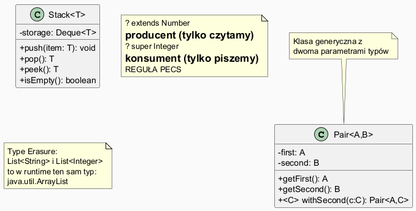

# Moduł 5.3: Typy generyczne — historia i zastosowanie

## Wprowadzenie

### 🎯 Czego nauczysz się w tym module?

- Zrozumiesz, **dlaczego typy generyczne** zostały wprowadzone do Javy (Java 5, 2004).
- Nauczysz się **pisać klasy i metody generyczne**.
- Poznasz **wildcard** (`?`) i regułę **PECS** (*Producer Extends, Consumer Super*).
- Zrozumiesz **type erasure** — jak JVM obsługuje generyki w runtime.
- Zobaczysz praktyczne zastosowanie generyków do kolekcji.

---

## Kontekst historyczny

| Wersja | Rok | Zmiana |
|--------|-----|--------|
| Java 1.0 | 1996 | Brak generyków; kolekcje operują na `Object` |
| Java 1.2 | 1998 | JCF (bez generyków) — wymaga rzutów przy każdym pobraniu |
| Java 5 | 2004 | **Typy generyczne** — bezpieczeństwo typów w compile time |
| Java 7 | 2011 | Operator diamond `<>` — `new ArrayList<>()` |

```java
// Java 1.4 — stary styl (raw types)
List list = new ArrayList();
list.add("tekst");
String s = (String) list.get(0);   // wymaga rzutu, ryzyko ClassCastException

// Java 5+ — z generykami
List<String> list = new ArrayList<>();
list.add("tekst");
String s = list.get(0);            // bez rzutu, bezpiecznie
```

Pełny przykład: [`code/GenericsDemo.java`](code/GenericsDemo.java)

---

## Diagram — klasy generyczne i reguła PECS



*Źródło: `diagrams/generics.puml`*

---

## Klasa generyczna

```java
class Pair<A, B> {
    private final A first;
    private final B second;

    Pair(A first, B second) { this.first = first; this.second = second; }

    A getFirst()  { return first; }
    B getSecond() { return second; }

    // Metoda generyczna wewnątrz klasy generycznej
    <C> Pair<A, C> withSecond(C newSecond) {
        return new Pair<>(this.first, newSecond);
    }
}

// Użycie:
Pair<String, Integer> p1 = new Pair<>("klucz", 42);
Pair<String, Double>  p2 = p1.withSecond(3.14);
```

Parametry typów mogą mieć dowolne nazwy, ale konwencja:
- `T` — Type (ogólny)
- `E` — Element (kolekcje)
- `K`, `V` — Key, Value (mapy)
- `N` — Number

---

## Metoda generyczna

```java
static <T extends Comparable<T>> T max(T a, T b) {
    return a.compareTo(b) >= 0 ? a : b;
}

max(3, 7)               // → 7 (Integer)
max("jabłko", "gruszka")// → "jabłko" (String, alfabetycznie)
```

Parametr `<T extends Comparable<T>>` to **ograniczenie górne** — `T` musi implementować `Comparable<T>`.

---

## Wildcard i reguła PECS

### `? extends T` — *Producer Extends*

Odczytujemy elementy z kolekcji (kolekcja **produkuje** elementy):

```java
static double sumNumbers(List<? extends Number> numbers) {
    double sum = 0;
    for (Number n : numbers) sum += n.doubleValue();  // OK
    return sum;
}

sumNumbers(new ArrayList<Integer>());   // ✅
sumNumbers(new ArrayList<Double>());    // ✅
sumNumbers(new ArrayList<Number>());    // ✅
// numbers.add(1.0);  // ← błąd kompilacji — nie wiadomo jaki konkretny typ
```

### `? super T` — *Consumer Super*

Zapisujemy elementy do kolekcji (kolekcja **konsumuje** elementy):

```java
static void addNumbers(List<? super Integer> target, int count) {
    for (int i = 1; i <= count; i++) target.add(i);  // OK
}

addNumbers(new ArrayList<Integer>(), 5);  // ✅
addNumbers(new ArrayList<Number>(), 5);   // ✅
addNumbers(new ArrayList<Object>(), 5);   // ✅
```

### Reguła PECS w skrócie

```
Używasz kolekcji jako źródła danych (czytasz)?  → ? extends T
Używasz kolekcji jako celu danych (piszesz)?    → ? super T
Robisz i jedno, i drugie?                       → użyj T
```

---

## Type Erasure — jak JVM obsługuje generyki

Kompilator **usuwa** parametry typów w bytecode:

```java
List<String> strings = new ArrayList<>();
List<Integer> ints   = new ArrayList<>();

// W runtime to ten sam typ!
strings.getClass() == ints.getClass()  // → true
strings.getClass().getName()           // → "java.util.ArrayList"
```

Konsekwencje:
- Nie można tworzyć tablic generyków: `new T[]` — błąd
- Nie można używać `instanceof` z konkretnym parametrem: `obj instanceof List<String>` — błąd
- Można: `obj instanceof List<?>` — OK (unbounded wildcard)

---

## Generyczny Stack — praktyczny przykład

```java
class Stack<T> {
    private final Deque<T> storage = new ArrayDeque<>();

    void push(T item) { storage.push(item); }
    T pop()          { return storage.pop(); }
    T peek()         { return storage.peek(); }
    boolean isEmpty() { return storage.isEmpty(); }
}

Stack<String> stack = new Stack<>();
stack.push("Java"); stack.push("Generics");
System.out.println(stack.pop());   // "Generics"
```

---

## ⚠️ Najczęstsze błędy

1. **Raw types** — `List list = new ArrayList()` zamiast `List<String>`. Wyłącza sprawdzanie typów i generuje ostrzeżenia.
2. **Heap pollution** — mieszanie raw types i generyków może spowodować `ClassCastException` w nieoczekiwanym miejscu.
3. **Brak operatora diamond** — `new ArrayList<String>()` zamiast `new ArrayList<>()` (Java 7+) — zbędna redundancja.

---

## Uruchomienie przykładów

```powershell
Set-Location "C:\home\gitHub\oop-concepts-java\02_OOP\src\_05_kolekcje\_03_typy_generyczne"
.\run-examples.ps1
```

---

## 📚 Literatura i materiały dodatkowe

- **Oracle Tutorial — Generics:** <https://docs.oracle.com/javase/tutorial/java/generics/index.html>
- **Effective Java (3rd ed.)**, Joshua Bloch — Items 26–33 (Generics)
- **JEP 218 — Generics over primitive types (Project Valhalla):** <https://openjdk.org/jeps/218>
- **Baeldung — Java Generics:** <https://www.baeldung.com/java-generics>
- **Angelika Langer — Java Generics FAQ:** <http://www.angelikalanger.com/GenericsFAQ/JavaGenericsFAQ.html>

