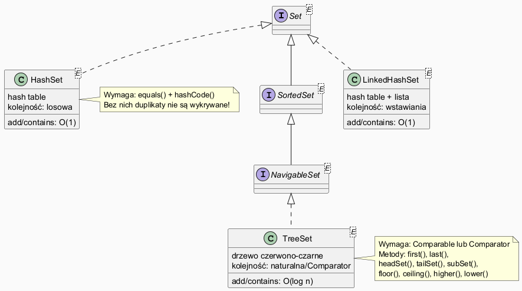

# Moduł 5.4: HashSet i TreeSet — porównanie

## Wprowadzenie

### 🎯 Czego nauczysz się w tym module?

- Zrozumiesz kontrakt **`equals()` i `hashCode()`** i dlaczego jest niezbędny dla `HashSet`.
- Nauczysz się kiedy wybrać **`HashSet`**, a kiedy **`TreeSet`**.
- Poznasz rozbudowane API **`SortedSet`/`NavigableSet`**: `headSet`, `tailSet`, `floor`, `ceiling`.
- Zobaczysz jak definiować własny **`Comparator`** dla `TreeSet`.

---

## Diagram — hierarchia Set



*Źródło: `diagrams/set_hierarchy.puml`*

---

## Kontrakt equals/hashCode

`HashSet` wewnętrznie używa tablicy skrzynek (buckets). Dla każdego elementu:
1. Wywołuje `hashCode()` → wyznacza skrzynkę,
2. W skrzynce porównuje przez `equals()` → sprawdza duplikat.

**Jeśli nie nadpiszesz `equals`/`hashCode`** — dwa obiekty o tych samych danych trafią do różnych skrzynek!

```java
class Point {
    int x, y;
    // BEZ @Override equals/hashCode
}

Set<Point> bad = new HashSet<>();
bad.add(new Point(1, 2));
bad.add(new Point(1, 2));   // nowy obiekt — inny hash!
bad.size();  // → 2 (błąd! oczekiwano 1)
```

```java
class PointCorrect {
    int x, y;

    @Override
    public boolean equals(Object o) {
        if (!(o instanceof PointCorrect p)) return false;
        return x == p.x && y == p.y;
    }

    @Override
    public int hashCode() { return Objects.hash(x, y); }
}

Set<PointCorrect> good = new HashSet<>();
good.add(new PointCorrect(1, 2));
good.add(new PointCorrect(1, 2));
good.size();  // → 1 (poprawnie)
```

> **Zasada:** `equals` i `hashCode` muszą być **spójne**: jeśli `a.equals(b)`, to `a.hashCode() == b.hashCode()`.

Pełny przykład: [`code/SetComparisonDemo.java`](code/SetComparisonDemo.java)

---

## HashSet vs TreeSet

```java
List<String> words = List.of("banan", "jabłko", "banan", "gruszka", "ananas", "jabłko");

Set<String> hash = new HashSet<>(words);
Set<String> tree = new TreeSet<>(words);

System.out.println(hash);  // [banan, gruszka, jabłko, ananas] — kolejność losowa
System.out.println(tree);  // [ananas, banan, gruszka, jabłko] — zawsze posortowane
```

### Tabela porównawcza

| | HashSet | TreeSet |
|--|---------|---------|
| Złożoność `add`/`contains` | O(1) | O(log n) |
| Wymaga | `equals` + `hashCode` | `Comparable` lub `Comparator` |
| Porządek | losowy | posortowany |
| `null` | dozwolony (1 element) | niedozwolony (NullPointerException) |
| Najlepsze użycie | szybka unikalność | zawsze posortowany zbiór |

---

## SortedSet / NavigableSet — operacje na zakresach

`TreeSet` implementuje `NavigableSet`, który rozszerza `SortedSet` o metody nawigacji:

```java
TreeSet<Integer> ts = new TreeSet<>(List.of(10, 20, 30, 40, 50, 60, 70));

ts.headSet(40)        // [10, 20, 30] — elementy < 40
ts.tailSet(40)        // [40, 50, 60, 70] — elementy >= 40
ts.subSet(20, 60)     // [20, 30, 40, 50] — [20, 60)
ts.floor(35)          // 30 — największy <= 35
ts.ceiling(35)        // 40 — najmniejszy >= 35
ts.higher(30)         // 40 — ściśle > 30
ts.lower(30)          // 20 — ściśle < 30
ts.first()            // 10
ts.last()             // 70
```

---

## TreeSet z własnym Comparatorem

```java
TreeSet<String> byLength = new TreeSet<>(
    Comparator.comparingInt(String::length)
              .thenComparing(Comparator.naturalOrder())
);
byLength.addAll(List.of("banan", "jabłko", "kiwi", "fig", "mango", "gruszka"));
// [fig, kiwi, banan, mango, jabłko, gruszka]
```

---

## Kiedy wybrać HashSet, a kiedy TreeSet?

```
Potrzebujesz zawsze posortowanego zbioru?        → TreeSet
Potrzebujesz operacji na zakresach (headSet)?    → TreeSet
Zależy ci tylko na unikalności, szybkość?        → HashSet
Chcesz zachować kolejność wstawiania?            → LinkedHashSet
```

---

## ⚠️ Najczęstsze błędy

1. **Brak `hashCode` przy nadpisanym `equals`** — `HashSet` nie wykrywa duplikatów.
2. **Niespójne `equals` i `hashCode`** — np. `hashCode` ignoruje pole, które `equals` bierze pod uwagę — sporadyczne błędy.
3. **Mutowanie obiektu po dodaniu do `HashSet`** — zmiana pól wpływających na `hashCode` może „zgubić" element w zbiorze.

---

## Uruchomienie przykładów

```powershell
Set-Location "C:\home\gitHub\oop-concepts-java\02_OOP\src\_05_kolekcje\_04_set_hashset_treeset"
.\run-examples.ps1
```

---

## 📚 Literatura i materiały dodatkowe

- **Oracle Tutorial — Set Implementations:** <https://docs.oracle.com/javase/tutorial/collections/implementations/set.html>
- **Effective Java (3rd ed.)**, Joshua Bloch — Item 11: Always override hashCode when you override equals
- **Oracle API — TreeSet:** <https://docs.oracle.com/en/java/docs/api/java.base/java/util/TreeSet.html>
- **Baeldung — HashSet vs TreeSet:** <https://www.baeldung.com/java-hashset-vs-treeset>

