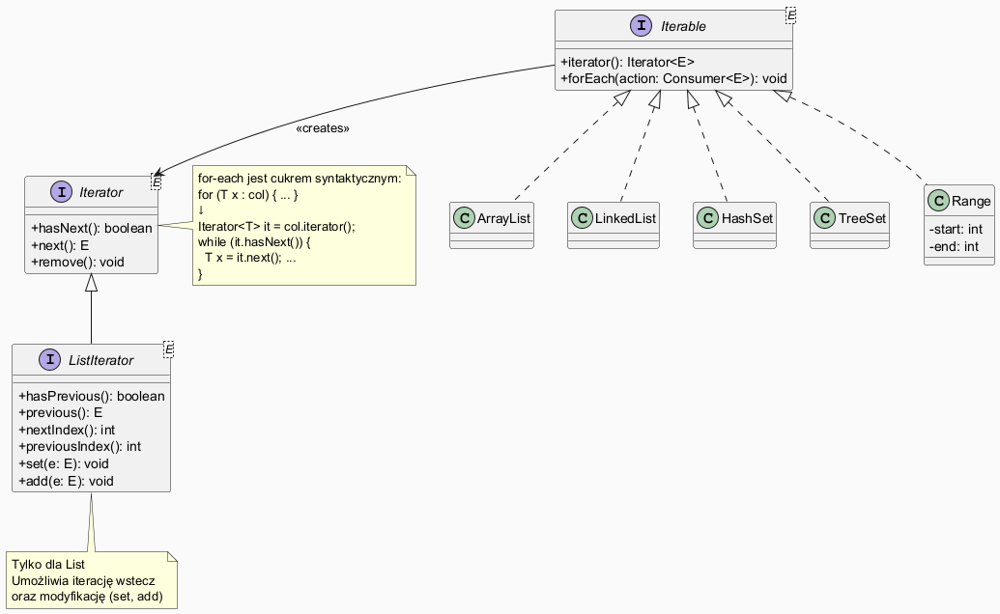

# Moduł 5.5: Iteratory i pętle foreach

## Wprowadzenie

### 🎯 Czego nauczysz się w tym module?

- Zrozumiesz **wzorzec Iterator** i interfejsy `Iterable<E>`, `Iterator<E>`.
- Nauczysz się używać **iteratora jawnego** (`it.hasNext()`, `it.next()`, `it.remove()`).
- Zobaczysz jak **for-each** jest tłumaczone na kod z iteratorem.
- Poznasz **`ListIterator`** — dwukierunkowy iterator z możliwością modyfikacji.
- Napiszesz **własną klasę** implementującą `Iterable`.
- Dowiesz się jak unikać **`ConcurrentModificationException`**.

---

## Diagram — wzorzec Iterator



*Źródło: `diagrams/iterator_pattern.puml`*

---

## Wzorzec Iterator — po co?

Wzorzec Iterator (GoF) oddziela **algorytm przechodzenia** od **struktury danych**.
Dzięki niemu możemy pisać kod niezależny od konkretnej kolekcji:

```java
void printAll(Iterable<String> items) {
    for (String item : items) {  // działa dla List, Set, Queue, i własnych klas!
        System.out.println(item);
    }
}
```

---

## Iterator jawny

```java
List<String> names = new ArrayList<>(List.of("Alicja", "Bob", "Cezary", "Diana"));
Iterator<String> it = names.iterator();

while (it.hasNext()) {
    String name = it.next();
    if (name.startsWith("B")) {
        it.remove();  // ← jedyny bezpieczny sposób usunięcia podczas iteracji
    }
}
System.out.println(names);  // [Alicja, Cezary, Diana]
```

Pełny przykład: [`code/IteratorDemo.java`](code/IteratorDemo.java)

---

## Pętla for-each — cukier syntaktyczny

Pętla for-each jest **cukrem syntaktycznym** — kompilator tłumaczy ją na iterator jawny:

```java
// Kod źródłowy:
for (String s : list) {
    System.out.println(s);
}

// Bytecode (uproszczony):
Iterator<String> it = list.iterator();
while (it.hasNext()) {
    String s = it.next();
    System.out.println(s);
}
```

> **Uwaga:** for-each działa dla każdej klasy implementującej `Iterable<E>` — nie tylko kolekcji!

---

## ListIterator — dwukierunkowy iterator

```java
List<String> words = new ArrayList<>(List.of("raz", "dwa", "trzy", "cztery"));

// Iteracja wstecz
ListIterator<String> lit = words.listIterator(words.size());
while (lit.hasPrevious()) {
    System.out.print(lit.previous() + " ");
}
// → cztery trzy dwa raz

// Modyfikacja elementów in-place
ListIterator<String> lit2 = words.listIterator();
while (lit2.hasNext()) {
    lit2.set(lit2.next().toUpperCase());
}
// [RAZ, DWA, TRZY, CZTERY]
```

---

## Własna klasa implementująca Iterable

```java
class Range implements Iterable<Integer> {
    private final int start, end;

    Range(int start, int end) { this.start = start; this.end = end; }

    @Override
    public Iterator<Integer> iterator() {
        return new Iterator<>() {
            int current = start;

            @Override public boolean hasNext() { return current < end; }
            @Override public Integer next() {
                if (!hasNext()) throw new NoSuchElementException();
                return current++;
            }
        };
    }
}

// Użycie — for-each działa!
for (int i : new Range(1, 6)) {
    System.out.print(i + " ");   // 1 2 3 4 5
}
```

---

## ConcurrentModificationException — jak unikać

```java
List<Integer> list = new ArrayList<>(List.of(1, 2, 3, 4, 5));

// ❌ BŁĄD — modyfikacja podczas for-each
for (int n : list) {
    if (n % 2 == 0) list.remove(Integer.valueOf(n));  // ConcurrentModificationException!
}

// ✅ POPRAWNIE — Iterator.remove()
Iterator<Integer> it = list.iterator();
while (it.hasNext()) {
    if (it.next() % 2 == 0) it.remove();
}

// ✅ POPRAWNIE — removeIf (Java 8+)
list.removeIf(n -> n % 2 == 0);
```

---

## forEach z lambdą

```java
List<String> cities = List.of("Kraków", "Warszawa", "Gdańsk");

// Lambda
cities.forEach(city -> System.out.println("Miasto: " + city));

// Referencja do metody (method reference)
cities.forEach(System.out::println);
```

---

## ⚠️ Najczęstsze błędy

1. **Modyfikacja listy podczas for-each** — zawsze prowadzi do `ConcurrentModificationException`. Użyj `Iterator.remove()` lub `removeIf()`.
2. **Wywołanie `it.next()` bez `hasNext()`** — rzuca `NoSuchElementException`.
3. **Ignorowanie `Iterator.remove()`** — jedyny poprawny sposób usunięcia bieżącego elementu podczas iteracji iterator-jawnej.

---

## Uruchomienie przykładów

```powershell
Set-Location "C:\home\gitHub\oop-concepts-java\02_OOP\src\_05_kolekcje\_05_iteratory"
.\run-examples.ps1
```

---

## 📚 Literatura i materiały dodatkowe

- **Oracle Tutorial — Iterator:** <https://docs.oracle.com/javase/tutorial/collections/interfaces/collection.html>
- **Oracle API — Iterator:** <https://docs.oracle.com/en/java/docs/api/java.base/java/util/Iterator.html>
- **Effective Java (3rd ed.)**, Joshua Bloch — Item 58: Prefer for-each loops over traditional for loops
- **Baeldung — Java Iterator:** <https://www.baeldung.com/java-iterator>

