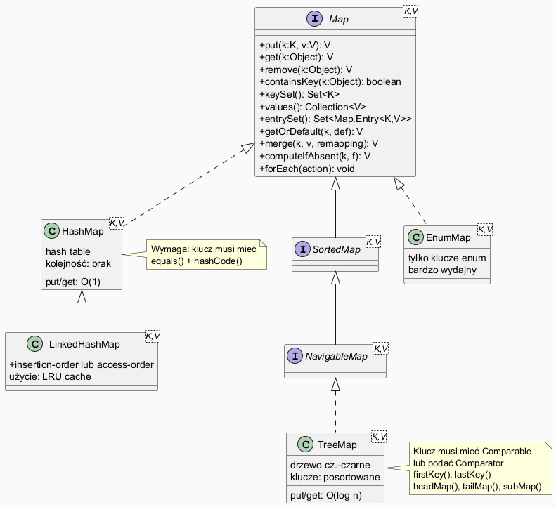

# Moduł 5.6: Mapy — interfejs Map i implementacje

## Wprowadzenie

### 🎯 Czego nauczysz się w tym module?

- Zrozumiesz koncepcję **słownika** (mapa klucz→wartość) i kiedy jej używać.
- Poznasz interfejs `Map<K,V>` i jego kluczowe metody.
- Nauczysz się korzystać z `HashMap`, `LinkedHashMap` i `TreeMap`.
- Zobaczysz wzorce: **licznik częstości**, **grupowanie**, **LRU cache**.
- Poznasz nowoczesne metody Java 8+: `merge`, `computeIfAbsent`, `forEach`.

---

## Map a Collection — kluczowa różnica

`Map<K,V>` **nie dziedziczy** po `Collection`. Przechowuje pary (klucz, wartość) a nie pojedyncze elementy:

| Aspekt | Collection | Map |
|--------|-----------|-----|
| Podstawowy element | einzelnes Element | para klucz→wartość |
| Klucze | — | unikalne |
| Wartości | mogą być duplikaty | mogą być duplikaty |
| Dostęp | iteracja lub indeks | przez klucz |

---

## Diagram — hierarchia Map



*Źródło: `diagrams/map_hierarchy.puml`*

---

## Podstawy HashMap

```java
Map<String, Integer> scores = new HashMap<>();
scores.put("Alicja", 95);
scores.put("Bob", 82);
scores.put("Alicja", 99);   // nadpisuje poprzednią wartość!

scores.get("Bob");                      // → 82
scores.get("Diana");                    // → null (brak klucza)
scores.getOrDefault("Diana", 0);        // → 0 (bezpiecznie)
scores.containsKey("Bob");              // → true
scores.containsValue(99);               // → true
scores.remove("Bob");                   // usuwa wpis
```

Pełny przykład: [`code/MapDemo.java`](code/MapDemo.java)

---

## Iteracja po mapie

```java
Map<String, Integer> ages = Map.of("Jan", 30, "Anna", 25, "Piotr", 35);

// 1. Iteracja po kluczach
for (String key : ages.keySet()) { ... }

// 2. Iteracja po wartościach
for (int age : ages.values()) { ... }

// 3. Iteracja po parach — najpopularniejsze
for (Map.Entry<String, Integer> entry : ages.entrySet()) {
    System.out.println(entry.getKey() + " → " + entry.getValue());
}

// 4. forEach z lambdą (Java 8+)
ages.forEach((name, age) -> System.out.println(name + " lat " + age));
```

---

## Wzorzec: licznik częstości słów

```java
String text = "kot pies kot ryba pies kot ptak ryba";
Map<String, Integer> freq = new HashMap<>();

for (String word : text.split(" ")) {
    freq.merge(word, 1, Integer::sum);
    // Równoważne: freq.put(word, freq.getOrDefault(word, 0) + 1);
}
// {kot=3, pies=2, ryba=2, ptak=1}
```

`merge(key, value, remappingFunction)` — jeśli klucz nie istnieje, wstawia wartość; jeśli istnieje, łączy przez funkcję.

---

## LinkedHashMap — porządek i LRU cache

```java
// Zachowuje kolejność wstawiania
Map<String, String> capitals = new LinkedHashMap<>();
capitals.put("Polska", "Warszawa");
capitals.put("Niemcy", "Berlin");
// Klucze zawsze w kolejności: Polska, Niemcy

// LRU Cache (accessOrder=true)
Map<Integer, String> lru = new LinkedHashMap<>(16, 0.75f, true) {
    @Override
    protected boolean removeEldestEntry(Map.Entry<Integer, String> eldest) {
        return size() > 3;   // usuwaj najdawniej używany gdy > 3 elementów
    }
};
```

---

## TreeMap — posortowane klucze

```java
TreeMap<String, Integer> pop = new TreeMap<>();
pop.put("Kraków", 780_000);
pop.put("Warszawa", 1_800_000);
pop.put("Gdańsk", 470_000);

pop.firstKey()           // "Gdańsk"
pop.lastKey()            // "Warszawa"
pop.headMap("Kraków")    // {Gdańsk=470000}   klucze < Kraków
pop.tailMap("Kraków")    // {Kraków=780000, Warszawa=1800000}
```

---

## computeIfAbsent — grupowanie

```java
Map<Character, List<String>> byInitial = new TreeMap<>();
for (String name : names) {
    char initial = name.charAt(0);
    byInitial.computeIfAbsent(initial, k -> new ArrayList<>()).add(name);
}
// A: [Anna, Adam]
// B: [Bartek, Beata]
```

---

## Tabela porównawcza implementacji Map

| | HashMap | LinkedHashMap | TreeMap | EnumMap |
|--|---------|--------------|---------|---------|
| `put`/`get` | O(1) | O(1) | O(log n) | O(1) |
| Porządek kluczy | brak | wstawiania/dostępu | posortowany | enum ordinal |
| Null klucze | 1 | 1 | ❌ | ❌ |
| Zastosowanie | szybkilookup | LRU, kolejność | posortowany słownik | enum→wartość |

---

## ⚠️ Najczęstsze błędy

1. **`NullPointerException` z `get()`** — jeśli wartość jest `null` lub klucz nie istnieje. Zawsze używaj `getOrDefault()` lub `containsKey()` przed `get()`.
2. **Mutitowalny klucz w `HashMap`** — zmiana klucza po wstawieniu „gubi" element (podobny problem jak w `HashSet`).
3. **Porównywanie `null` z `TreeMap`** — `TreeMap` nie akceptuje `null` jako klucza (rzuca `NullPointerException`).

---

## Uruchomienie przykładów

```powershell
Set-Location "C:\home\gitHub\oop-concepts-java\02_OOP\src\_05_kolekcje\_06_mapy"
.\run-examples.ps1
```

---

## 📚 Literatura i materiały dodatkowe

- **Oracle Tutorial — Map Implementations:** <https://docs.oracle.com/javase/tutorial/collections/implementations/map.html>
- **Oracle API — HashMap:** <https://docs.oracle.com/en/java/docs/api/java.base/java/util/HashMap.html>
- **Oracle API — TreeMap:** <https://docs.oracle.com/en/java/docs/api/java.base/java/util/TreeMap.html>
- **Effective Java (3rd ed.)**, Joshua Bloch — Item 57: Minimize the scope of local variables
- **Baeldung — HashMap in Java:** <https://www.baeldung.com/java-hashmap>
- **Baeldung — LinkedHashMap:** <https://www.baeldung.com/java-linked-hashmap>

