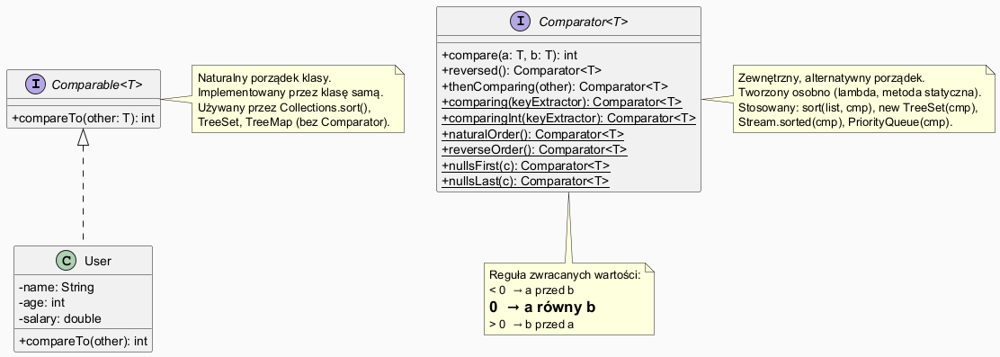

# Moduł 5.7: Komparatory i Comparable

## Wprowadzenie

### 🎯 Czego nauczysz się w tym module?

- Zrozumiesz różnicę między **`Comparable`** (porządek naturalny) a **`Comparator`** (porządek zewnętrzny).
- Nauczysz się pisać porównania z użyciem **`Comparator.comparing`**, **`thenComparing`**, **`reversed`**.
- Zobaczysz jak komparatory działają z **TreeSet**, **TreeMap**, **PriorityQueue** i **Stream**.
- Poznasz metody pomocnicze: **`nullsFirst`**, **`nullsLast`**.

---

## Diagram — Comparable vs Comparator



*Źródło: `diagrams/comparator_comparable.puml`*

---

## Comparable — porządek naturalny

`Comparable<T>` jest **implementowany przez samą klasę** i definiuje jej **naturalny porządek**.

```java
record User(String name, int age, double salary) implements Comparable<User> {
    @Override
    public int compareTo(User other) {
        return this.name.compareTo(other.name); // naturalny = alfabetycznie po imieniu
    }
}

List<User> users = new ArrayList<>(List.of(
    new User("Zofia", 30, 8000),
    new User("Adam", 25, 5000)
));

Collections.sort(users);    // używa Comparable.compareTo
TreeSet<User> byName = new TreeSet<>(users);  // TreeSet też używa compareTo
```

Pełny przykład: [`code/ComparatorDemo.java`](code/ComparatorDemo.java)

### Reguła zwracanych wartości

```
a.compareTo(b) < 0   → a "mniejszy" niż b (a przed b przy sortowaniu rosnącym)
a.compareTo(b) = 0   → a "równy" b
a.compareTo(b) > 0   → a "większy" niż b (b przed a przy sortowaniu rosnącym)
```

---

## Comparator — porządek zewnętrzny

`Comparator<T>` jest **obiektem zewnętrznym** — definiujemy go osobno (np. lambda).
Pozwala na **wiele różnych porządków** bez modyfikowania klasy.

```java
// Wg wieku (rosnąco)
Comparator<User> byAge = Comparator.comparingInt(User::age);
users.sort(byAge);

// Wg wynagrodzenia (malejąco)
Comparator<User> bySalaryDesc = Comparator.comparingDouble(User::salary).reversed();
users.sort(bySalaryDesc);

// Własna lambda
Comparator<User> custom = (a, b) -> Integer.compare(a.age(), b.age());
```

---

## Łańcuchowanie komparatorów — thenComparing

```java
// Sortuj wg długości imienia, a przy równej długości alfabetycznie
words.sort(
    Comparator.comparingInt(String::length)
              .thenComparing(Comparator.naturalOrder())
);

// Wiele kryteriów dla obiektów
Comparator<User> byAgeThenName = Comparator
        .comparingInt(User::age)
        .thenComparing(User::name);
```

---

## Komparatory w kolekcjach

```java
// TreeMap z odwróconym porządkiem kluczy
TreeMap<String, Integer> reverseMap = new TreeMap<>(Comparator.reverseOrder());

// PriorityQueue z komparatorem
PriorityQueue<User> byAge = new PriorityQueue<>(Comparator.comparingInt(User::age));

// TreeSet z komparatorem
TreeSet<String> byLength = new TreeSet<>(
    Comparator.comparingInt(String::length).thenComparing(Comparator.naturalOrder())
);
```

---

## Obsługa null — nullsFirst i nullsLast

```java
List<String> withNulls = Arrays.asList("banana", null, "apple", null, "cherry");

withNulls.sort(Comparator.nullsFirst(Comparator.naturalOrder()));
// [null, null, apple, banana, cherry]

withNulls.sort(Comparator.nullsLast(Comparator.naturalOrder()));
// [apple, banana, cherry, null, null]
```

---

## Comparable vs Comparator — kiedy co wybrać?

| | `Comparable` | `Comparator` |
|--|-------------|-------------|
| Gdzie się implementuje | w klasie | na zewnątrz |
| Ile porządków | 1 (naturalny) | wiele |
| Modyfikacja klasy | wymagana | nie, jest oddzielony |
| Typowe użycie | wartości z oczywistym porządkiem (String, Integer) | sortowanie wg różnych kryteriów |
| `Collections.sort(list)` | ✅ | `sort(list, comparator)` |
| `TreeSet()`/`TreeMap()` | ✅ bez arg | `TreeSet(comparator)` |

---

## ⚠️ Najczęstsze błędy

1. **Niespójny `compareTo`** — `compareTo` musi być spójny z `equals`: jeśli `a.compareTo(b) == 0`, to `a.equals(b) == true` (nie jest to wymuszone przez kompilator, ale kolekcje na tym polegają).
2. **Overflow przy odejmowaniu w `compare`** — `return a - b` może powodować overflow dla dużych liczb. Używaj `Integer.compare(a, b)`.
3. **Modyfikacja pola użytego w `compareTo` po umieszczeniu w `TreeSet`** — element "ginie" w zbiorze.

---

## Uruchomienie przykładów

```powershell
Set-Location "C:\home\gitHub\oop-concepts-java\02_OOP\src\_05_kolekcje\_07_komparatory"
.\run-examples.ps1
```

---

## 📚 Literatura i materiały dodatkowe

- **Oracle API — Comparable:** <https://docs.oracle.com/en/java/docs/api/java.base/java/lang/Comparable.html>
- **Oracle API — Comparator:** <https://docs.oracle.com/en/java/docs/api/java.base/java/util/Comparator.html>
- **Effective Java (3rd ed.)**, Joshua Bloch — Item 14: Consider implementing Comparable
- **Baeldung — Java Comparator and Comparable:** <https://www.baeldung.com/java-comparator-comparable>

