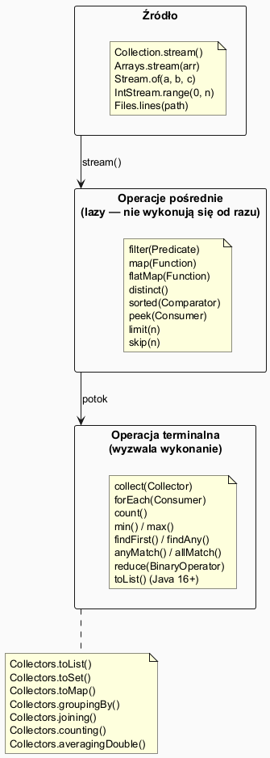

# Moduł 5.8: Strumienie — Stream API

## Wprowadzenie

### 🎯 Czego nauczysz się w tym module?

- Zrozumiesz koncepcję **strumienia** jako potoku transformacji danych (nie kolekcja!).
- Poznasz podział na **operacje pośrednie** (lazy) i **terminalne** (eager).
- Nauczysz się korzystać z: `filter`, `map`, `flatMap`, `sorted`, `distinct`, `reduce`, `collect`.
- Opanujesz **`Collectors`**: `groupingBy`, `toMap`, `joining`, `counting`, `averagingDouble`.
- Zobaczysz **strumienie prymitywów**: `IntStream`, `DoubleStream`.
- Dowiesz się kiedy używać **strumieni równoległych**.

---

## Kontekst historyczny

| Wersja | Rok | Zmiana |
|--------|-----|--------|
| Java 8 | 2014 | **Stream API** — przetwarzanie kolekcji w stylu funkcyjnym |
| Java 9 | 2017 | `Stream.iterate`, `takeWhile`, `dropWhile` |
| Java 16 | 2021 | `Stream.toList()` — skrót dla `collect(Collectors.toList())` |

---

## Diagram — potok strumienia



*Źródło: `diagrams/streams_pipeline.puml`*

---

## Kluczowa różnica: Stream ≠ Collection

| Aspekt | Collection | Stream |
|--------|-----------|--------|
| Przechowuje dane? | ✅ | ❌ (tylko opisuje transformacje) |
| Wielokrotne użycie? | ✅ | ❌ (po operacji terminalnej zużyty) |
| Rozmiar | o skończony | może być nieskończony |
| Kalkulacja | gorliwa (eager) | leniwa (lazy) |

---

## Podstawowy potok: filter → map → collect

```java
List<String> expensiveElectronics = products.stream()
        .filter(p -> p.category().equals("elektronika"))  // operacja pośrednia
        .filter(p -> p.price() > 500)                     // operacja pośrednia
        .map(Product::name)                               // operacja pośrednia
        .sorted()                                         // operacja pośrednia
        .collect(Collectors.toList());                    // operacja terminalna
```

Pełny przykład: [`code/StreamsDemo.java`](code/StreamsDemo.java)

---

## Operacje pośrednie (lazy)

Nie są wykonywane dopóki nie zostanie wywołana operacja terminalna:

| Operacja | Opis |
|----------|------|
| `filter(Predicate)` | Filtruje elementy |
| `map(Function)` | Transformuje każdy element |
| `flatMap(Function)` | Transformuje i spłaszcza (Stream strumieni → Stream) |
| `distinct()` | Usuwa duplikaty |
| `sorted()` / `sorted(Comparator)` | Sortuje |
| `limit(n)` | Bierze co najwyżej n elementów |
| `skip(n)` | Pomija pierwsze n elementów |
| `peek(Consumer)` | Efekt uboczny (debugging) |

---

## Operacje terminalne (eager)

Wyzwalają rzeczywiste obliczenia:

```java
long count = products.stream().filter(...).count();

double total = products.stream()
        .mapToDouble(p -> p.price() * p.quantity())
        .sum();

Optional<Product> cheapest = products.stream()
        .min(Comparator.comparingDouble(Product::price));

boolean anyExpensive = products.stream().anyMatch(p -> p.price() > 3000);
boolean allPositive  = products.stream().allMatch(p -> p.price() > 0);
```

---

## Collectors — zbieranie wyników

```java
// Grupowanie po kategorii
Map<String, List<Product>> byCategory = products.stream()
        .collect(Collectors.groupingBy(Product::category));

// Zliczanie w grupach
Map<String, Long> counts = products.stream()
        .collect(Collectors.groupingBy(Product::category, Collectors.counting()));

// Średnia cena w grupach
Map<String, Double> avgPrice = products.stream()
        .collect(Collectors.groupingBy(Product::category,
                 Collectors.averagingDouble(Product::price)));

// Łączenie w napis
String joined = products.stream()
        .map(Product::name)
        .collect(Collectors.joining(", ", "[", "]"));

// Konwersja do mapy
Map<String, Double> priceMap = products.stream()
        .collect(Collectors.toMap(Product::name, Product::price));
```

---

## flatMap — spłaszczanie zagnieżdżonych struktur

```java
List<List<Integer>> nested = List.of(List.of(1,2,3), List.of(4,5), List.of(6,7));

List<Integer> flat = nested.stream()
        .flatMap(Collection::stream)  // zamienia każdą listę na stream, potem łączy
        .collect(Collectors.toList()); // [1, 2, 3, 4, 5, 6, 7]

// Praktyczne: słowa ze zdań
List<String> sentences = List.of("Kolekcje w Java", "Stream API jest potężne");
List<String> words = sentences.stream()
        .flatMap(s -> Arrays.stream(s.split(" ")))
        .distinct().sorted().toList();
```

---

## reduce — własna agregacja

```java
List<Integer> nums = List.of(1, 2, 3, 4, 5);

int sum     = nums.stream().reduce(0, Integer::sum);        // 15
int product = nums.stream().reduce(1, (a, b) -> a * b);     // 120
Optional<Integer> max = nums.stream().reduce(Integer::max); // Optional[5]
```

---

## IntStream — strumienie prymitywów (bez autoboxing)

```java
// range (exclusive) i rangeClosed (inclusive)
IntStream.range(0, 5).forEach(i -> System.out.print(i + " "));     // 0 1 2 3 4
IntStream.rangeClosed(1, 5).forEach(i -> System.out.print(i + " ")); // 1 2 3 4 5

int sumOfSquares = IntStream.rangeClosed(1, 10).map(i -> i * i).sum(); // 385

// boxing: IntStream → Stream<Integer>
List<Integer> squares = IntStream.rangeClosed(1, 5).boxed().toList();
```

---

## Strumienie równoległe

```java
long count = products.parallelStream()
        .filter(p -> p.price() > 300)
        .count();
```

**Kiedy równoległe strumienie pomagają?**
- Duże kolekcje (setki tysięcy elementów)
- Operacje CPU-bound (ciężkie obliczenia, nie I/O)
- Kolejność wyników nie ma znaczenia

**Kiedy szkodzą?**
- Małe kolekcje (narzut na fork/join pool)
- Operacje z efektami ubocznymi (mutowanie stanu)
- Operacje I/O-bound

---

## ⚠️ Najczęstsze błędy

1. **Ponowne użycie strumienia** — `stream()` po operacji terminalnej rzuca `IllegalStateException`. Zawsze twórz nowy strumień.
2. **Efekty uboczne w `map`** — `map` powinno być czystą funkcją. Efekty uboczne (zapis, mutowanie stanu) daj do `forEach`.
3. **`collect(Collectors.toList())` vs `toList()`** — `Stream.toList()` (Java 16+) zwraca niemutowalną listę; `Collectors.toList()` zwraca mutowalną. Pamiętaj o różnicy!

---

## Uruchomienie przykładów

```powershell
Set-Location "C:\home\gitHub\oop-concepts-java\02_OOP\src\_05_kolekcje\_08_strumienie"
.\run-examples.ps1
```

---

## 📚 Literatura i materiały dodatkowe

- **Oracle Tutorial — Aggregate Operations:** <https://docs.oracle.com/javase/tutorial/collections/streams/index.html>
- **Oracle API — java.util.stream:** <https://docs.oracle.com/en/java/docs/api/java.base/java/util/stream/package-summary.html>
- **Effective Java (3rd ed.)**, Joshua Bloch — Items 45–48 (Streams)
- **Baeldung — Java 8 Streams:** <https://www.baeldung.com/java-8-streams>
- **Baeldung — Java Collectors:** <https://www.baeldung.com/java-8-collectors>

