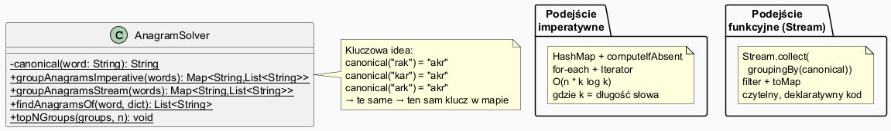

# Moduł 5.9: Projekt — Solver Anagramów

## Wprowadzenie

Ten moduł integruje wszystkie wcześniej poznane koncepcje (kolekcje, mapy, iteratory, komparatory, strumienie) w jednym, praktycznym programie.

### 🎯 Czego nauczysz się w tym projekcie?

- Jak stosować **kolekcje i mapy** do rozwiązania realnego problemu.
- Jak **porównać podejście imperatywne** (pętle, computeIfAbsent) z **funkcyjnym** (Stream API).
- Jak budować **algorytm grupowania** oparty na kluczach kanonikach.
- Jak używać **wielu kolekcji razem** (HashMap, List, TreeMap, PriorityQueue).

---

## Opis problemu

**Anagramy** to słowa zbudowane z tych samych liter w różnej kolejności.
Przykłady: `rak`, `kar`, `ark` — wszystkie zawierają litery {a, k, r}.

**Zadanie:** dla podanej listy słów, znajdź wszystkie grupy anagramów.

---

## Diagram — architektura rozwiązania



*Źródło: `diagrams/anagram_design.puml`*

---

## Kluczowa idea: klucz kanoniczny

Każde słowo sprowadzamy do postaci kanonicznej: **posortowane litery**.

```java
static String canonical(String word) {
    char[] chars = word.toLowerCase().toCharArray();
    Arrays.sort(chars);
    return new String(chars);
}

canonical("rak")  // → "akr"
canonical("kar")  // → "akr"
canonical("ark")  // → "akr"
canonical("kat")  // → "akt"
canonical("tak")  // → "akt"
```

Słowa o tym samym kluczu kanonicznym to anagramy. To sprawia, że mogą być pogrupowane przez `HashMap`.

---

## Podejście 1: Imperatywne (pętle + computeIfAbsent)

```java
static Map<String, List<String>> groupAnagramsImperative(List<String> words) {
    Map<String, List<String>> groups = new HashMap<>();

    for (String word : words) {
        String key = canonical(word);
        // computeIfAbsent — jeśli klucza nie ma, utwórz nową listę
        groups.computeIfAbsent(key, k -> new ArrayList<>()).add(word);
    }

    groups.entrySet().removeIf(e -> e.getValue().size() < 2);
    return groups;
}
```

**Złożoność:** O(n × k log k), gdzie n = liczba słów, k = max długość słowa.

Pełny przykład: [`code/AnagramSolver.java`](code/AnagramSolver.java)

---

## Podejście 2: Stream API (Collectors.groupingBy)

```java
static Map<String, List<String>> groupAnagramsStream(List<String> words) {
    return words.stream()
            .collect(Collectors.groupingBy(AnagramSolver::canonical))  // klucz = canonical
            .entrySet().stream()
            .filter(e -> e.getValue().size() >= 2)   // tylko grupy z co najmniej 2 słowami
            .collect(Collectors.toMap(Map.Entry::getKey, Map.Entry::getValue));
}
```

**Oba podejścia dają ten sam wynik** — wybór zależy od preferencji i czytelności.

---

## Top N grup i wyszukiwanie anagramów konkretnego słowa

```java
// Top N grup wg rozmiaru
groups.entrySet().stream()
    .sorted(Comparator.comparingInt((Map.Entry<String, List<String>> e) ->
        e.getValue().size()).reversed())
    .limit(3)
    .forEach(e -> System.out.println(e.getValue()));

// Anagramy konkretnego słowa
static List<String> findAnagramsOf(String word, List<String> dictionary) {
    String key = canonical(word);
    return dictionary.stream()
            .filter(w -> !w.equalsIgnoreCase(word))
            .filter(w -> canonical(w).equals(key))
            .sorted()
            .collect(Collectors.toList());
}

findAnagramsOf("rak", allWords);  // [ark, kar]
```

---

## Przykładowe wyjście programu

```
=== Demo: grupowanie anagramów ===
Słów wejściowych: 30

--- Podejście imperatywne (pętle + computeIfAbsent) ---
  [akr] → [ark, kar, rak]
  [akt] → [akt, kat, tak]
  [akt] → [akt, kat, tak]
  [akrt] → [karta, ratka, tarka]
  ...

=== Top 3 grup (wg rozmiaru) ===
  [ark, kar, rak] (klucz: akr)
  [akt, kat, tak] (klucz: akt)
  [karta, ratka, tarka] (klucz: aakrt)

=== Anagramy słowa 'rak' ===
[ark, kar]
```

---

## Przegląd użytych kolekcji i technik

| Problem | Użyta technika |
|---------|----------------|
| Grupowanie słów | `HashMap<String, List<String>>` + `computeIfAbsent` |
| Deklaratywne grupowanie | `Collectors.groupingBy` |
| Sortowanie grup | `Comparator.comparingInt().reversed()` |
| Top N | `Stream.limit(n)` |
| Usuwanie grup z 1 słowem | `removeIf` |
| Szukanie anagramów | `Stream.filter()` |

---

## Rozszerzenia dla zaawansowanych

1. **Wczytaj słownik z pliku** — użyj `Files.lines(Path.of("slownik.txt"))` zamiast wbudowanej listy.
2. **Filtr minimalnej długości** — pokaż tylko anagramy słów o długości ≥ 4.
3. **Porównanie wydajności** — zmierz czas dla listy 50 000 słów (imperatywne vs stream).
4. **Palindromy w grupach** — czy w grupie anagramów są palindromy?

---

## Uruchomienie

```powershell
Set-Location "C:\home\gitHub\oop-concepts-java\02_OOP\src\_05_kolekcje\_09_projekt"
.\run-examples.ps1
```

---

## 📚 Literatura i materiały dodatkowe

- **Effective Java (3rd ed.)**, Joshua Bloch — Item 47: Prefer Collection to Stream as a return type
- **Baeldung — Java groupingBy Collector:** <https://www.baeldung.com/java-groupingby-collector>
- **Algorytm anagramów** opisany w: Sedgewick & Wayne, *Algorithms* (4th ed.), Chapter 5

