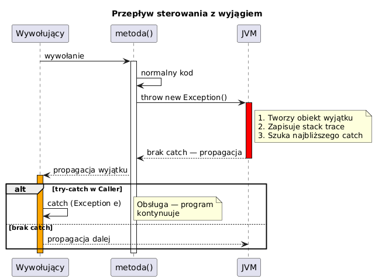

# 01 — Wprowadzenie do wyjątków

## Cel modułu

Zrozumienie czym są wyjątki, dlaczego powstały i jak zmieniają sposób pisania kodu w porównaniu do tradycyjnych mechanizmów obsługi błędów (kody błędów, flagi, `errno`).

---

## 1. Geneza — problem z kodami błędów

### Historyczny kontekst

W językach C i starszych bibliotekach błędy sygnalizowane były przez **wartości zwracane**:

```c
// Styl C — przesłanie informacji o błędzie przez return
FILE *f = fopen("data.txt", "r");
if (f == NULL) {
    perror("fopen failed");      // errno zawiera kod błędu
    return -1;
}
```

**Problemy tego podejścia:**

| Problem | Opis |
|---------|------|
| Łatwo pominąć | Programista może nie sprawdzić wartości zwracanej |
| Miesza logikę | Kod biznesowy przeplata się z obsługą błędów |
| Niejednoznaczność | -1 znaczy błąd? Czy poprawna wartość? |
| Propagacja | Każda warstwa musi sprawdzać i przekazywać kod dalej |

### Stary styl Java — symulacja (anty-wzorzec)

```java
// Styl C przeniesiony do Java — nie rób tego!
static int parseLengthC(String s) {
    if (s == null || s.isBlank()) return -1;   // kod błędu
    try { return Integer.parseInt(s.trim()); }
    catch (NumberFormatException e) { return -2; }
}

// Użycie — łatwo zapomnieć sprawdzić wynik
int result = parseLengthC("abc");
// Jeśli nie sprawdzimy: result = -2, program działa z błędną wartością!
```

---

## 2. Wyjątek — definicja i idea

**Wyjątek** to zdarzenie, które zakłóca normalny przepływ programu i jest sygnalizowane przez obiekt klasy `Throwable`.

Kluczowe właściwości:
- Jest **obiektem** — niesie pole informacje: komunikat, stack trace, przyczynę
- **Przerywa** wykonanie bieżącego bloku
- **Propaguje** w górę stosu wywołań aż do obsłużenia
- **Wymusza** obsługę (w przypadku checked exceptions)

### Diagram przepływu



---

## 3. Podstawowa składnia try-catch

```java
try {
    // Blok chroniony — kod, który może rzucić wyjątek
    int d = 0;
    int a = 42 / d;                      // rzuca ArithmeticException
    System.out.println("Tego nie ma");   // nigdy nie wykona się po wyjątku
} catch (ArithmeticException e) {
    // Obsługa — program kontynuuje
    System.out.println("Przechwycono: " + e.getMessage());
}
System.out.println("Program działa dalej.");
```

**Ważne:** po przechwyceniu wyjątku w `catch`, wykonanie kontynuuje się **po** całym bloku `try-catch`, nie wewnątrz `try`.

---

## 4. Informacje niesione przez wyjątek

```java
try {
    methodA();    // methodA → methodB → methodC → NullPointerException
} catch (NullPointerException e) {
    System.out.println("Typ:       " + e.getClass().getName());
    System.out.println("Komunikat: " + e.getMessage());
    e.printStackTrace();   // pełny stack trace na stderr
}
```

### Stack trace — przykład wyjścia

```
java.lang.NullPointerException
    at ExceptionIntroDemo.methodC(ExceptionIntroDemo.java:42)
    at ExceptionIntroDemo.methodB(ExceptionIntroDemo.java:39)
    at ExceptionIntroDemo.methodA(ExceptionIntroDemo.java:37)
    at ExceptionIntroDemo.main(ExceptionIntroDemo.java:60)
```

Stack trace czytamy **od dołu do góry** — najniższy frame to `main`, najwyższy to miejsce rzucenia wyjątku.

---

## 5. Styl Java vs. styl C

```java
// ✗ Styl C w Javie — kody błędów
static int parseLengthC(String s) {
    if (s == null || s.isBlank()) return -1;
    try { return Integer.parseInt(s.trim()); }
    catch (NumberFormatException e) { return -2; }
}

// ✓ Styl Java — wyjätki
static int parseLengthJava(String s) {
    if (s == null || s.isBlank())
        throw new IllegalArgumentException("Pusty ciąg znaków");
    return Integer.parseInt(s.trim());   // NumberFormatException propaguje naturalnie
}
```

**Zalety podejścia wyjątkowego:**
- Oddzielenie logiki biznesowej od obsługi błędów
- Niemożność cichego pominięcia (checked exceptions)
- Bogata informacja diagnostyczna
- Naturalna propagacja przez warstwy

---

## 6. Kiedy nie używać wyjątków

Wyjątki to kosztowna operacja (tworzenie obiektu, zapis stack trace). **Nie** używaj ich do:

```java
// ✗ Anty-wzorzec: wyjątek jako przepływ sterowania
try {
    int i = 0;
    while (true) {
        System.out.println(array[i++]);
    }
} catch (ArrayIndexOutOfBoundsException e) {
    // koniec tablicy
}

// ✓ Poprawne — warunek pętli
for (int i = 0; i < array.length; i++) {
    System.out.println(array[i]);
}
```

---

## 7. Alternatywy i uzupełnienia

| Mechanizm | Kiedy używać |
|-----------|-------------|
| `Optional<T>` | Brak wartości to normalny przypadek (nie błąd) |
| `Result<T, E>` (biblioteki) | Funkcyjny styl obsługi błędów (Vavr, Result4j) |
| Kody błędów | Wydajność krytyczna, brak OOP (sterowniki, kernel) |
| Wyjätki | Sytuacje wyjątkowe, błędy walidacji, problemy I/O |

---

## Kod demonstracyjny

📄 [`code/ExceptionIntroDemo.java`](code/ExceptionIntroDemo.java)

Części:
1. Błąd bez obsługi (komentarz z wyjaśnieniem)
2. Podstawowy `try-catch` — program kontynuuje
3. Stack trace i informacje diagnostyczne
4. Porównanie styli: kody błędów vs wyjątki
5. Przerwanie przepływu przez wyjątek

### Uruchomienie

```powershell
cd C:\home\gitHub\oop-concepts-java\02_OOP\src
javac -d out _06_wyjatki/_01_wprowadzenie/code/ExceptionIntroDemo.java
java  -cp out _06_wyjatki._01_wprowadzenie.code.ExceptionIntroDemo
```

---

## Literatura i źródła

- [The Java Tutorials — Exceptions](https://docs.oracle.com/javase/tutorial/essential/exceptions/)
- Joshua Bloch, *Effective Java*, 3rd ed., Item 69: Use exceptions only for exceptional conditions
- Joshua Bloch, *Effective Java*, 3rd ed., Item 70: Use checked exceptions for recoverable conditions
- [JEP 358: Helpful NullPointerExceptions (Java 14)](https://openjdk.org/jeps/358)

