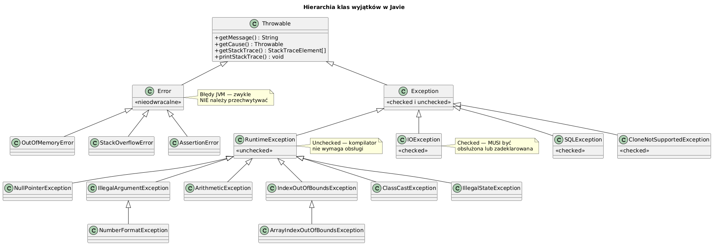

# 02 — Hierarchia klas wyjątków

## Cel modułu

Zrozumienie struktury klasy `Throwable` i jej podrzędnych klas. Rozróżnienie między `Error`, `Exception` i `RuntimeException`. Poznanie najważniejszych wbudowanych wyjątków Javy.

---

## 1. Klasa Throwable — korzeń hierarchii

Każdy obiekt, który może być **rzucony** (instrukcją `throw`) lub **przechwycony** (klauzulą `catch`), musi być instancją klasy `Throwable`.

```java
public class Throwable {
    private String  detailMessage;  // komunikat
    private Throwable cause;        // przyczyna (exception chaining)
    private StackTraceElement[] stackTrace;  // stack trace w momencie tworzenia

    public String    getMessage()    { ... }
    public Throwable getCause()      { ... }
    public void      printStackTrace() { ... }
    public StackTraceElement[] getStackTrace() { ... }
}
```

---

## 2. Drzewo klas — diagram



---

## 3. Error — błędy JVM

Klasa `Error` reprezentuje **nieodwracalne** błędy środowiska JVM. Aplikacje **nie powinny** ich przechwytywać.

| Klasa | Opis | Kiedy |
|-------|------|-------|
| `OutOfMemoryError` | Brak pamięci na stercie | `new Object[Integer.MAX_VALUE]` |
| `StackOverflowError` | Zbyt głęboka rekursja | nieskończona rekursja |
| `AssertionError` | Naruszenie asercji | flaga `-ea`, `assert false` |
| `VirtualMachineError` | Błąd wewnętrzny JVM | awaria sprzętu |

```java
// StackOverflowError — można przechwycić, ale rzadko ma sens
try {
    infinity();
} catch (StackOverflowError e) {
    System.out.println("Stos przepełniony!");
    // Co dalej? JVM jest w niestabilnym stanie — lepiej zakończyć
}
```

---

## 4. Exception — wyjątki aplikacji

Klasa `Exception` dzieli się na dwie gałęzie:

### 4.1 Checked exceptions (sprawdzane)

Podklasy `Exception` **inne niż** `RuntimeException`. Kompilator **wymaga** ich obsługi lub deklaracji w `throws`.

```java
// IOException jest checked — kompilator ODMÓWI kompilacji bez obsługi
static String readFile(String path) throws IOException {  // ← deklaracja
    return Files.readString(Path.of(path));
}

// lub obsługa w miejscu użycia:
try {
    String content = readFile("data.txt");
} catch (IOException e) {
    System.out.println("Błąd odczytu: " + e.getMessage());
}
```

**Zasada:** Checked exception oznacza, że **wywołujący może coś z tym zrobić** — powtórzyć próbę, użyć wartości domyślnej, wyświetlić komunikat użytkownikowi.

### 4.2 RuntimeException (unchecked)

Podklasy `RuntimeException` — kompilator **nie wymaga** obsługi.

```java
// Brak throws, brak try-catch — kod się skompiluje
static int divide(int a, int b) {
    return a / b;   // ArithmeticException jeśli b == 0
}
```

**Zasada:** RuntimeException oznacza **błąd programisty** — wadliwe wywołanie, błąd logiki, nieprzewidywane dane wejściowe.

---

## 5. Najważniejsze wbudowane wyjątki

### Unchecked (RuntimeException)

| Klasa | Kiedy |
|-------|-------|
| `NullPointerException` | Wywołanie metody / dostęp do pola na `null` |
| `ArrayIndexOutOfBoundsException` | Indeks tablicy < 0 lub ≥ length |
| `ClassCastException` | Nieprawidłowe rzutowanie referencji |
| `NumberFormatException` | `Integer.parseInt("abc")` |
| `IllegalArgumentException` | Nieprawidłowy argument do metody |
| `IllegalStateException` | Wywołanie metody w złym stanie obiektu |
| `ArithmeticException` | Dzielenie liczby całkowitej przez zero |
| `StackOverflowError` | Zbyt głęboka rekursja |

### Checked

| Klasa | Kiedy |
|-------|-------|
| `IOException` | Błąd wejścia/wyjścia (pliki, sieć) |
| `FileNotFoundException` | Plik nie istnieje (podklasa IOException) |
| `SQLException` | Błąd bazy danych |
| `ParseException` | Błąd parsowania formatu (daty, itd.) |
| `InterruptedException` | Wątek przerwany podczas oczekiwania |
| `CloneNotSupportedException` | Klonowanie bez implementacji Cloneable |

---

## 6. Multi-catch — jeden handler dla wielu typów (Java 7+)

```java
try {
    riskyOperation();
} catch (NumberFormatException | ArrayIndexOutOfBoundsException | ClassCastException e) {
    // Zmienna e jest de facto final — nie można jej przypisać
    System.out.println("Jeden z trzech wyjątków: " + e.getClass().getSimpleName());
}
```

**Ograniczenie:** Typy w multi-catch nie mogą być ze sobą w relacji dziedziczenia (kompilator to wykryje).

---

## 7. Sprawdzanie hierarchii — instanceof

```java
Exception e = new NumberFormatException("bad");

e instanceof NumberFormatException   // true
e instanceof IllegalArgumentException // true (nadklasa)
e instanceof RuntimeException         // true
e instanceof Exception                // true
e instanceof Throwable                // true
e instanceof Error                    // false — inna gałąź
```

To pozwala pisać bardziej ogólne bloki `catch`:

```java
try { ... }
catch (IllegalArgumentException e) {
    // Obsługuje zarówno IllegalArgumentException jak i NumberFormatException
}
```

---

## 8. Zasady dobrego kodu

```java
// ✗ Anty-wzorzec: przechwytywanie Throwable
catch (Throwable t) { /* niebezpieczne — pochłania Error */ }

// ✗ Anty-wzorzec: puste catch
catch (Exception e) { /* nic */ }

// ✓ Minimalny zestaw obsługi
catch (SpecificException e) {
    log.error("Błąd: " + e.getMessage(), e);
    throw e;   // lub rzuć wyjątek wyższego poziomu
}
```

---

## Kod demonstracyjny

📄 [`code/ExceptionHierarchyDemo.java`](code/ExceptionHierarchyDemo.java)

### Uruchomienie

```powershell
cd C:\home\gitHub\oop-concepts-java\02_OOP\src
javac -d out _06_wyjatki/_02_hierarchia_klas/code/ExceptionHierarchyDemo.java
java  -cp out _06_wyjatki._02_hierarchia_klas.code.ExceptionHierarchyDemo
```

---

## Literatura i źródła

- [Java SE 21 API — java.lang.Throwable](https://docs.oracle.com/en/java/docs/api/java.base/java/lang/Throwable.html)
- [Java SE 21 API — java.lang.Exception](https://docs.oracle.com/en/java/docs/api/java.base/java/lang/Exception.html)
- Joshua Bloch, *Effective Java*, 3rd ed., Items 69–77 (rozdział o wyjątkach)
- [The Java Tutorials — The Catch or Specify Requirement](https://docs.oracle.com/javase/tutorial/essential/exceptions/catchOrDeclare.html)

