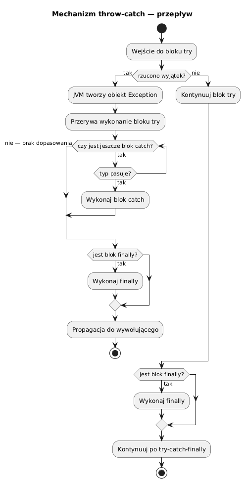

# 03 — Mechanizm throw i catch

## Cel modułu

Opanowanie wszystkich wariantów składniowych `try-catch`: jeden typ, łańcuch catchów, multi-catch, catch ogólny. Zrozumienie kolejności dopasowania i typowych pułapek.

---

## 1. Diagram przepływu



---

## 2. Struktura bloku try-catch

```java
try {
    // instrukcje chronione
    // jeśli rzucono wyjątek → JVM szuka zgodnego catch
    // jeśli nie → catch jest pomijany
} catch (TypWyjatku1 e) {
    // obsługa wyjątku typu TypWyjatku1 lub jego podklas
} catch (TypWyjatku2 e) {
    // obsługa wyjątku typu TypWyjatku2 lub jego podklas
} finally {
    // opcjonalnie: zawsze się wykonuje
}
```

**JVM szuka catchów od góry do dołu** i wybiera **pierwszy pasujący** typ.

---

## 3. Kolejność catchów ma znaczenie

```java
// ✗ BŁĄD KOMPILACJI — NumberFormatException jest podklasą IllegalArgumentException
try {
    Integer.parseInt("x");
} catch (IllegalArgumentException e) {   // ← zbyt ogólny na pierwszym miejscu
    // ...
} catch (NumberFormatException e) {      // ← NIEOSIĄGALNY — kompilator zgłosi błąd
    // ...
}

// ✓ Poprawna kolejność: szczegółowe PRZED ogólnymi
try {
    Integer.parseInt("x");
} catch (NumberFormatException e) {       // najpierw szczegółowy
    System.out.println("Zły format: " + e.getMessage());
} catch (IllegalArgumentException e) {   // potem ogólniejszy
    System.out.println("Zły argument: " + e.getMessage());
}
```

**Zasada:** Typy w kolejnych `catch` powinny iść **od bardziej szczegółowych do ogólnych**.

---

## 4. Łańcuch catch — przykład

```java
static void parse(String s) {
    if (s == null)    throw new NullPointerException("s == null");
    if (s.isBlank())  throw new IllegalArgumentException("Pusty ciąg");
    System.out.println("Wynik: " + Integer.parseInt(s)); // może: NumberFormatException
}

// Wywołanie z pełnym łańcuchem catch:
try {
    parse(input);
} catch (NumberFormatException e) {
    System.out.println("Zły format: " + e.getMessage());
} catch (IllegalArgumentException e) {
    // Obejmuje również NumberFormatException — ale nie wykona się,
    // bo bardziej szczegółowy catch wyżej już obsłużył ten typ.
    System.out.println("Nieprawidłowy argument: " + e.getMessage());
} catch (NullPointerException e) {
    System.out.println("Null: " + e.getMessage());
}
```

---

## 5. Multi-catch (Java 7+)

```java
try {
    riskOperation(mode);
} catch (ArithmeticException | ArrayIndexOutOfBoundsException | ClassCastException e) {
    // Jeden blok dla trzech różnych typów
    // e jest de facto final — nie można przypisać nowej wartości
    System.out.println("Jeden z trzech: " + e.getClass().getSimpleName());
}
```

**Kiedy używać:** Gdy obsługa jest identyczna dla wielu typów, które nie są ze sobą powiązane dziedziczeniem.

---

## 6. Catch(Exception e) — pułapka nadmiernej ogólności

```java
// ✗ Nadmiernie ogólny — ukrywa konkretny typ błędu
try {
    // ...
} catch (Exception e) {
    System.out.println("Coś poszło nie tak: " + e.getMessage());
    // Nie wiemy co! NumberFormat? IO? NullPointer?
}

// ✓ Dopuszczalne tylko na najwyższym poziomie (np. główna pętla aplikacji)
try {
    // ...
} catch (Exception e) {
    logger.error("Nieoczekiwany błąd", e);   // logowanie z pełnym wyjątkiem
    showErrorDialog(e.getMessage());
}
```

---

## 7. Blok catch nie może być pusty

```java
// ✗ Najbardziej niebezpieczny anty-wzorzec w Javie
try {
    Files.readString(Path.of("config.txt"));
} catch (IOException e) {
    // silent! błąd zmilczony — program działa z wadliwym stanem
}

// ✓ Minimum: log + rethrow lub obsługa
} catch (IOException e) {
    logger.warn("Nie wczytano konfiguracji: {}", e.getMessage());
    throw new RuntimeException("Brak konfiguracji", e);
}
```

---

## 8. Wyjątek a typ zwracany

```java
// Kompilator wie, że po throw nic nie zostanie zwrócone
static int safeDivide(int a, int b) {
    if (b == 0) {
        throw new ArithmeticException("Dzielnik zero");
        // Nie potrzeba return — kompilator rozumie, że throw kończy metodę
    }
    return a / b;
}
```

---

## Kod demonstracyjny

📄 [`code/ThrowCatchDemo.java`](code/ThrowCatchDemo.java)

### Uruchomienie

```powershell
cd C:\home\gitHub\oop-concepts-java\02_OOP\src
javac -d out _06_wyjatki/_03_throw_catch/code/ThrowCatchDemo.java
java  -cp out _06_wyjatki._03_throw_catch.code.ThrowCatchDemo
```

---

## Literatura i źródła

- [The Java Tutorials — Catching and Handling Exceptions](https://docs.oracle.com/javase/tutorial/essential/exceptions/handling.html)
- Joshua Bloch, *Effective Java*, 3rd ed., Item 77: Don't ignore exceptions
- [JEP 334: JVM Constants API](https://openjdk.org/jeps/334)

