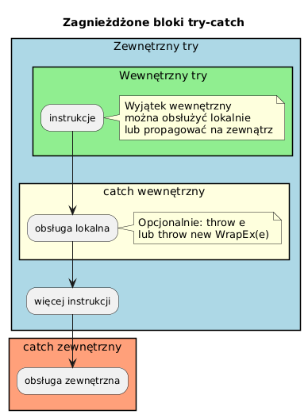

# 04 — Zagnieżdżony try

## Cel modułu

Zrozumienie konsekwencji zagnieżdżania bloków `try-catch` oraz nauka refaktoryzacji prowadzącej do czystszego kodu.

---

## 1. Schemat zagnieżdżenia



---

## 2. Kiedy wewnętrzny catch obsługuje wyjątek

```java
try {                                       // zewnętrzny
    int b = 42 / a;                         // ArithmeticException jeśli a == 0

    try {                                   // wewnętrzny
        int[] arr = {1, 2, 3};
        System.out.println(arr[b]);         // AIOOBE jeśli b >= 3
    } catch (ArrayIndexOutOfBoundsException e) {
        System.out.println("Poza zakresem: " + e.getMessage());
        // Obsłużone lokalnie — zewnętrzny try NIC o tym nie wie
    }

    System.out.println("Kontynuacja z b=" + b);

} catch (ArithmeticException e) {
    System.out.println("Dzielenie przez zero");
}
```

**Reguła:** Jeśli wewnętrzny `catch` obsłuży wyjątek i **nie rzuci ponownie**, zewnętrzny blok **nie widzi** tego wyjątku.

---

## 3. Kiedy wewnętrzny catch re-rzuca

```java
try {                           // zewnętrzny
    try {                       // wewnętrzny
        if (a == 0)
            throw new ArithmeticException("zero");
    } catch (ArithmeticException e) {
        System.out.println("Wewnętrzny: " + e.getMessage());
        throw e;                // ← propaguje do zewnętrznego!
    }
} catch (ArithmeticException e) {
    System.out.println("Zewnętrzny: " + e.getMessage());
}
```

---

## 4. Trzy poziomy — śledzenie przepływu

```java
try {                                               // L1
    try {                                           // L2
        try {                                       // L3
            throw new NullPointerException("NPE");
        } catch (ArrayIndexOutOfBoundsException e) {
            // Nie pasuje — pominięty
        }
        // NPE propaguje z L3 do L2
    } catch (NullPointerException e) {
        System.out.println("L2 złapał NPE: " + e.getMessage());
        throw new IllegalStateException("Wrap", e); // ← nowy wyjątek do L1
    }
} catch (IllegalStateException e) {
    System.out.println("L1 złapał ISE: " + e.getMessage());
    System.out.println("Przyczyna: " + e.getCause().getClass().getSimpleName());
}
```

**Wynik:**
```
L2 złapał NPE: NPE
L1 złapał ISE: Wrap
Przyczyna: NullPointerException
```

---

## 5. Refaktoryzacja — wydzielenie metody

Głębokie zagnieżdżenie `try-catch` jest sygnałem, że kod należy zrefaktoryzować:

```java
// ✗ Zagnieżdżone try — trudne do czytania
try {
    int idx = 100 / divisor;     // ArithmeticException
    try {
        int val = data[idx];     // AIOOBE
        System.out.println(val);
    } catch (ArrayIndexOutOfBoundsException e) {
        System.out.println("Poza zakresem");
    }
} catch (ArithmeticException e) {
    System.out.println("Dzielenie przez zero");
}

// ✓ Wydzielona metoda — czytelniejsze
static int safeGet(int[] arr, int index) {
    try {
        return arr[index];
    } catch (ArrayIndexOutOfBoundsException e) {
        return -1;
    }
}

try {
    int idx = 100 / divisor;
    int val = safeGet(data, idx);   // bez drugiego try!
    System.out.println(val == -1 ? "(poza zakresem)" : val);
} catch (ArithmeticException e) {
    System.out.println("Dzielenie przez zero");
}
```

---

## 6. Kiedy zagnieżdżanie jest uzasadnione

- Wewnętrzna operacja ma **lokalną** obsługę błędu niezwiązaną z zewnętrzną
- Próba ponowna (`retry`) — wewnętrzny try obsługuje jedno wywołanie w pętli
- Operacje kompensacyjne w `catch` są same podatne na wyjątki

```java
// Uzasadnione zagnieżdżenie — retry w pętli
for (int attempt = 1; attempt <= 3; attempt++) {
    try {
        return fetch(url);         // może rzucić IOExcetption
    } catch (IOException e) {
        if (attempt == 3) throw e; // ostatnia próba — propaguj
        Thread.sleep(1000 * attempt);
    }
}
```

---

## Kod demonstracyjny

📄 [`code/NestedTryDemo.java`](code/NestedTryDemo.java)

### Uruchomienie

```powershell
cd C:\home\gitHub\oop-concepts-java\02_OOP\src
javac -d out _06_wyjatki/_04_zagniezdzony_try/code/NestedTryDemo.java
java  -cp out _06_wyjatki._04_zagniezdzony_try.code.NestedTryDemo
```

---

## Literatura i źródła

- [The Java Tutorials — Nesting try blocks](https://docs.oracle.com/javase/tutorial/essential/exceptions/handling.html)
- Robert C. Martin, *Clean Code*, rozdz. 7: Error Handling
- Joshua Bloch, *Effective Java*, 3rd ed., Item 76: Strive for failure atomicity

