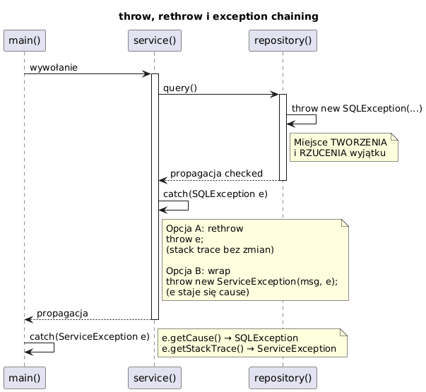

# 05 — Instrukcja throw i propagacja wyjątków

## Cel modułu

Opanowanie jawnego rzucania wyjątków (`throw new …`), re-rzucania (`throw e`) i zawijania wyjątków (exception chaining). Zrozumienie różnicy między miejscem tworzenia a miejscem rzucania wyjątku.

---

## 1. Diagram — throw, rethrow, chaining



---

## 2. Jawne rzucanie — `throw new WyjątekException()`

```java
// Tworzenie i rzucanie to jeden krok
throw new IllegalArgumentException("Nieprawidłowy argument: " + value);

// Lub dwa osobne kroki — rzadziej, ale możliwe
IllegalArgumentException ex =
    new IllegalArgumentException("Nieprawidłowy argument: " + value);
throw ex;
// Po throw — zmienna ex istnieje, ale program już jej nie używa
```

### Zasady dobrego rzucania

```java
static double squareRoot(double x) {
    if (x < 0) {
        // ✓ Komunikat zawiera konkretną wartość — ułatwia debugowanie
        throw new IllegalArgumentException("Pierwiastek z liczby ujemnej: " + x);
    }
    return Math.sqrt(x);
}
```

**Co powinien zawierać komunikat wyjątku:**
- Co poszło nie tak
- Jaką wartość miał parametr
- Jaki był oczekiwany zakres/format

---

## 3. Re-rzucanie — `throw e`

```java
static void process(String s) {
    try {
        int v = Integer.parseInt(s);
    } catch (NumberFormatException e) {
        System.out.println("Loguję błąd...");
        throw e;   // re-throw — stack trace NIEZMIENIONY (Java 7+)
    }
}

// W Javie 7+ kompilator śledzi, że 'e' jest NumberFormatException
// Dzięki temu wywołujący widzi konkretny typ, nie tylko Exception:
try {
    process("abc");
} catch (NumberFormatException e) {  // ← konkretny typ, mimo rzucenia przez Exception e
    System.out.println("Złapano: " + e.getMessage());
}
```

---

## 4. Exception chaining — zawinięcie w inny wyjątek

```java
static int loadConfig(String key) {
    try {
        String raw = fetchRaw(key);            // może: NumberFormatException
        return Integer.parseInt(raw);
    } catch (NumberFormatException e) {
        // Zawijamy: zachowujemy przyczynę (cause), dodajemy kontekst
        throw new IllegalStateException(
            "Błędna konfiguracja klucza '" + key + "'", e);
        //                                                ↑ cause
    }
}

// Odczyt:
try {
    loadConfig("timeout");
} catch (IllegalStateException e) {
    System.out.println("Błąd wysokiego poziomu: " + e.getMessage());
    System.out.println("Przyczyna: " + e.getCause().getMessage());
    // getCause() → NumberFormatException
}
```

**Zasada:** Zawsze przekazuj `cause` — bez niego tracimy cenny stack trace niższej warstwy.

```java
// ✗ Traci przyczynę!
throw new ServiceException("Błąd serwisu");

// ✓ Zachowuje przyczynę
throw new ServiceException("Błąd serwisu", e);
```

---

## 5. Niezależne miejsce tworzenia i rzucania

Obiekt wyjątku można stworzyć w **jednym miejscu** i rzucić w **innym**:

```java
static IllegalArgumentException buildException(String param) {
    // Tworzenie tutaj — stack trace wskazuje na TĘ metodę
    return new IllegalArgumentException("Błędny param: " + param);
}

static void validate(String param) {
    if (param == null || param.isBlank()) {
        IllegalArgumentException ex = buildException(param);
        // W stack trace: [0] = buildException, [1] = validate
        throw ex;   // rzucenie TUTAJ, ale tworzenie było w buildException!
    }
}
```

W praktyce jest to rzadkie — zazwyczaj tworzymy i rzucamy w tym samym miejscu. Przydatne gdy wyjątek jest tworzony fabrycznie.

---

## 6. Throw w wyrażeniu (Java 14+ — switch expression)

```java
String label = switch (status) {
    case 1 -> "aktywny";
    case 2 -> "nieaktywny";
    default -> throw new IllegalArgumentException("Nieznany status: " + status);
};
```

---

## 7. Przekształcanie checked → unchecked (wzorzec)

```java
// Popularne w lambdach i Stream API, gdzie checked exceptions są problematyczne
List<String> paths = List.of("a.txt", "b.txt");

paths.forEach(path -> {
    try {
        process(path);   // throws IOException
    } catch (IOException e) {
        throw new UncheckedIOException(e);  // java.io.UncheckedIOException wraps IOException
    }
});
```

---

## Kod demonstracyjny

📄 [`code/ThrowRethrowDemo.java`](code/ThrowRethrowDemo.java)

### Uruchomienie

```powershell
cd C:\home\gitHub\oop-concepts-java\02_OOP\src
javac -d out _06_wyjatki/_05_throw_rethrow/code/ThrowRethrowDemo.java
java  -cp out _06_wyjatki._05_throw_rethrow.code.ThrowRethrowDemo
```

---

## Literatura i źródła

- [The Java Tutorials — How to Throw Exceptions](https://docs.oracle.com/javase/tutorial/essential/exceptions/throwing.html)
- Joshua Bloch, *Effective Java*, 3rd ed., Item 73: Throw exceptions appropriate to the abstraction
- Joshua Bloch, *Effective Java*, 3rd ed., Item 75: Include failure-capture information in detail messages

