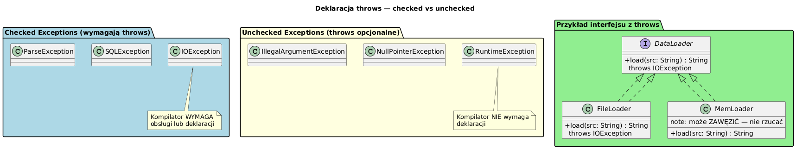

# 06 — Deklaracja throws

## Cel modułu

Zrozumienie kiedy i dlaczego musisz deklarować `throws` w sygnaturze metody. Poznanie mechanizmów propagacji checked exceptions przez warstwy aplikacji i wzorców radzenia sobie z tym faktem.

---

## 1. Diagram — checked vs unchecked, interfejsy



---

## 2. Czym jest deklaracja throws

```java
static String readFile(String path) throws IOException {
//                                    ^^^^^^^^^^^^^^^^
// "Ta metoda MOŻE rzucić IOException.
//  Wywołujący musi to obsłużyć lub też zadeklarować throws."
    return Files.readString(Path.of(path));
}
```

`throws` to **kontrakt** — część sygnatury metody (jak typ parametrów i zwracana wartość).

---

## 3. Kiedy MUSISZ użyć throws

**Reguła:** Musisz zadeklarować `throws X`, gdy:
1. Wyjątek `X` dziedziczy po `Exception` (ale nie po `RuntimeException`)  
2. Twoja metoda **może rzucić** `X` (bezpośrednio lub przez wywołaną metodę)  
3. Nie obsługujesz go wewnątrz metodą (`try-catch`)  

```java
// Musi mieć throws SQLException — jest checked
static String dbQuery(String sql) throws SQLException {
    // ...
}

// NIE musi mieć throws NullPointerException — jest unchecked (RuntimeException)
static void process(String s) {
    Objects.requireNonNull(s);   // rzuca NPE — ale nie wymaga deklaracji
}
```

---

## 4. Propagacja przez warstwy

```java
// Warstwa 1: dostęp do danych (throws checked)
static String dbQuery(String sql) throws SQLException {
    if (sql.contains("DROP")) throw new SQLException("DDL niedozwolony");
    return "wynik: " + sql;
}

// Warstwa 2: repozytorium propaguje
static String findUser(int id) throws SQLException {
    return dbQuery("SELECT * FROM users WHERE id=" + id);
}

// Warstwa 3: serwis "tłumaczy" checked → unchecked (wzorzec)
static String getUserName(int id) {
    try {
        return findUser(id);
    } catch (SQLException e) {
        // Zawijamy w RuntimeException — wywołujący serwisu nie musi obsługiwać SQL
        throw new RuntimeException("Błąd bazy danych dla id=" + id, e);
    }
}
```

**Wzorzec przekształcenia:**  
`checked` na niskim poziomie → `unchecked` (`RuntimeException`) na wyższym poziomie  
Często stosowany w serwisach/repozytoriach w Spring, Hibernate, itd.

---

## 5. Wiele typów w throws

```java
static void riskyOperation() throws IOException, SQLException, InterruptedException {
    // ...
}

// Obsługa przez wywołującego:
try {
    riskyOperation();
} catch (IOException e)          { /* obsługa I/O */ }
  catch (SQLException e)         { /* obsługa DB */ }
  catch (InterruptedException e) { Thread.currentThread().interrupt(); }
```

**Uwaga:** Deklarowanie zbyt wielu typów w `throws` to sygnał, że metoda robi za dużo lub abstrakcja jest za niska.

---

## 6. throws w interfejsach i dziedziczeniu

```java
interface DataLoader {
    String load(String source) throws IOException;   // kontrakt
}

class FileLoader implements DataLoader {
    @Override
    public String load(String source) throws IOException {  // może zachować throws
        return Files.readString(Path.of(source));
    }
}

class InMemoryLoader implements DataLoader {
    @Override
    public String load(String source) {  // może ZAWĘZIĆ — nie rzucać IOException!
        return "dane w pamięci";
    }
    // Implementacja NIE MOŻE jednak rozszerzyć listy checked throws
}
```

**Reguła Liskov dla wyjątków:**
- Implementacja/podklasa może **zawęzić** listę `throws` (rzucać mniej typów)
- Implementacja/podklasa **nie może rozszerzyć** listy `throws` o nowe checked types

---

## 7. throws a dokumentacja Javadoc

```java
/**
 * Wczytuje konfigurację z pliku.
 *
 * @param path ścieżka do pliku (nie null, musi istnieć)
 * @return zawartość konfiguracji jako String
 * @throws IOException jeśli plik nie istnieje lub nie można go odczytać
 * @throws IllegalArgumentException jeśli path jest null lub pusty
 */
static String loadConfig(String path) throws IOException {
    if (path == null || path.isBlank())
        throw new IllegalArgumentException("path jest wymagany");
    return Files.readString(Path.of(path));
}
```

**Zasada:** Dokumentuj **każdy** typ w `throws` tagiem `@throws`. Dotyczy to też unchecked exceptions, jeśli są istotne dla wywołującego.

---

## 8. Kiedy NIE używać checked exceptions

Debata o checked vs unchecked trwa od lat. Praktyczne wskazówki:

| Sytuacja | Zalecenie |
|----------|-----------|
| Wywołujący może coś sensownego zrobić (ponów, użyj wartości domyślnej) | Checked |
| Błąd programisty (zły argument, zły stan obiektu) | Unchecked (RuntimeException) |
| API biblioteki ogólnego użytku | Unchecked (prostsze użycie) |
| API warstwy I/O, sieci, baz danych | Checked (wymusza świadomość) |
| Spring, Hibernate — translacja checked → unchecked | Unchecked (`DataAccessException`) |

---

## Kod demonstracyjny

📄 [`code/ThrowsDeclarationDemo.java`](code/ThrowsDeclarationDemo.java)

### Uruchomienie

```powershell
cd C:\home\gitHub\oop-concepts-java\02_OOP\src
javac -d out _06_wyjatki/_06_throws/code/ThrowsDeclarationDemo.java
java  -cp out _06_wyjatki._06_throws.code.ThrowsDeclarationDemo
```

---

## Literatura i źródła

- [The Java Tutorials — Specifying the Exceptions Thrown by a Method](https://docs.oracle.com/javase/tutorial/essential/exceptions/declaring.html)
- Joshua Bloch, *Effective Java*, 3rd ed., Item 71: Avoid unnecessary use of checked exceptions
- Joshua Bloch, *Effective Java*, 3rd ed., Item 72: Favor the use of standard exceptions
- [Checked vs Unchecked Exceptions in Java — Baeldung](https://www.baeldung.com/java-checked-unchecked-exceptions)

