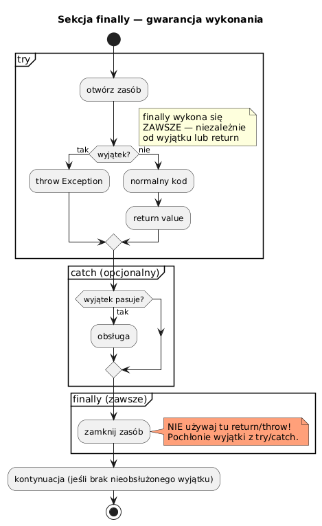

# 07 — Sekcja finally

## Cel modułu

Zrozumienie gwarancji sekcji `finally`, jej interakcji z `return`, `throw` i `System.exit()`. Poznanie wzorca try-with-resources jako nowoczesnej alternatywy.

---

## 1. Diagram przepływu finally



---

## 2. finally — gwarancja wykonania

```java
try {
    System.out.println("try: start");
    if (condition) throw new RuntimeException("test");
    System.out.println("try: koniec");
} catch (RuntimeException e) {
    System.out.println("catch: " + e.getMessage());
} finally {
    System.out.println("finally: ZAWSZE się wykona");
    // Niezależnie od: wyjątku, normalnego zakończenia, return
}
```

**finally wykonuje się zawsze, z jednym wyjątkiem:**
- `System.exit()` — JVM zakańcza proces natychmiast
- Nieskończona pętla w `try` — finally nigdy nie zostanie osiągnięte
- Zabity wątek (`Thread.stop()` — przestarzałe)

---

## 3. Interakcja finally z return ⚠️

```java
static int methodWithReturn() {
    try {
        return 1;           // ← wartość 1 jest "zapamiętana"
    } finally {
        System.out.println("finally: wykona się PRZED faktycznym powrotem");
        // return 1 stanie się efektywne DOPIERO po finally
    }
}
System.out.println(methodWithReturn());   // wypisze: 1
```

### Anty-wzorzec: return w finally nadpisuje wartość z try

```java
// ✗ BARDZO NIEBEZPIECZNE — return w finally
static int dangerousReturn() {
    try {
        return 1;    // wartość 1 "zapamiętana"
    } finally {
        return 99;   // NADPISUJE! Metoda zwróci 99, nie 1
    }
}
```

```java
// ✗ JESZCZE GROŹNIEJSZE — return w finally pochłania wyjątek
static String swallowsException() {
    try {
        throw new RuntimeException("wyjątek z try");
    } finally {
        return "finally-return";  // wyjątek z try znika bez śladu!
    }
}
String result = swallowsException();  // "finally-return" — wyjątek pochłonięty cicho!
```

**Zasada: Nigdy nie umieszczaj `return` ani `throw` w bloku `finally`.**

---

## 4. Klasyczny wzorzec zwalniania zasobów

Przed Java 7 `finally` było jedynym sposobem na gwarantowane zamknięcie zasobów:

```java
Connection conn   = null;
Statement  stmt   = null;
ResultSet  rs     = null;

try {
    conn = DriverManager.getConnection(url);
    stmt = conn.createStatement();
    rs   = stmt.executeQuery("SELECT * FROM users");
    while (rs.next()) { /* przetwarzanie */ }

} catch (SQLException e) {
    logger.error("Błąd SQL", e);
} finally {
    // Zamknięcie w odwrotnej kolejności otwarcia!
    if (rs   != null) try { rs.close();   } catch (SQLException e) { /* loguj */ }
    if (stmt != null) try { stmt.close(); } catch (SQLException e) { /* loguj */ }
    if (conn != null) try { conn.close(); } catch (SQLException e) { /* loguj */ }
}
```

Ten kod jest **verbose** i podatny na błędy — stąd Java 7 wprowadza try-with-resources.

---

## 5. Try-with-resources (Java 7+) — nowoczesna alternatywa

```java
// Interfejs AutoCloseable — wystarczy zaimplementować close()
try (Connection conn = DriverManager.getConnection(url);
     Statement stmt  = conn.createStatement();
     ResultSet rs    = stmt.executeQuery("SELECT * FROM users")) {

    while (rs.next()) { /* przetwarzanie */ }

}   // close() wywołane automatycznie: rs → stmt → conn (odwrotna kolejność)
    // nawet jeśli rzucono wyjątek!
```

**Zasada:** Każda klasa zarządzająca zewnętrznym zasobem powinna implementować `AutoCloseable`.

---

## 6. Suppressed exceptions

Gdy oba `try` i `close()` rzucają wyjątki, Java zachowuje **oba**:

```java
class FaultyResource implements AutoCloseable {
    void use() { throw new RuntimeException("Błąd użycia"); }

    @Override
    public void close() { throw new RuntimeException("Błąd zamknięcia"); }
}

try (FaultyResource r = new FaultyResource()) {
    r.use();               // rzuca RuntimeException
}   // close() też rzuca  → zostaje jako "suppressed"

catch (RuntimeException e) {
    System.out.println("Główny:     " + e.getMessage());       // "Błąd użycia"
    Throwable[] sup = e.getSuppressed();
    System.out.println("Suppressed: " + sup[0].getMessage()); // "Błąd zamknięcia"
}
```

W klasycznym `finally` drugi wyjątek **zastępował** pierwszy — traciliśmy informację. Try-with-resources to naprawia.

---

## 7. Kiedy używać każdego podejścia

| Potrzeba | Zalecenie |
|----------|-----------|
| Zamknięcie zasobu (IO, DB, sieć) | `try-with-resources` |
| Zwolnienie zamka / inny zasób bez `close()` | `try-finally` |
| Gwarantowane czyszczenie niezależnie od `return` | `try-finally` |
| Zamknięcie wielu zasobów | `try-with-resources` (wielokrotne deklaracje) |

---

## Kod demonstracyjny

📄 [`code/FinallyDemo.java`](code/FinallyDemo.java)

### Uruchomienie

```powershell
cd C:\home\gitHub\oop-concepts-java\02_OOP\src
javac -d out _06_wyjatki/_07_finally/code/FinallyDemo.java
java  -cp out _06_wyjatki._07_finally.code.FinallyDemo
```

---

## Literatura i źródła

- [The Java Tutorials — The finally Block](https://docs.oracle.com/javase/tutorial/essential/exceptions/finally.html)
- [The Java Tutorials — The try-with-resources Statement](https://docs.oracle.com/javase/tutorial/essential/exceptions/tryResourceClose.html)
- [JEP 334 / JLS §14.20.3 — try-with-resources](https://docs.oracle.com/javase/specs/jls/se21/html/jls-14.html#jls-14.20.3)
- Joshua Bloch, *Effective Java*, 3rd ed., Item 9: Prefer try-with-resources to try-finally

