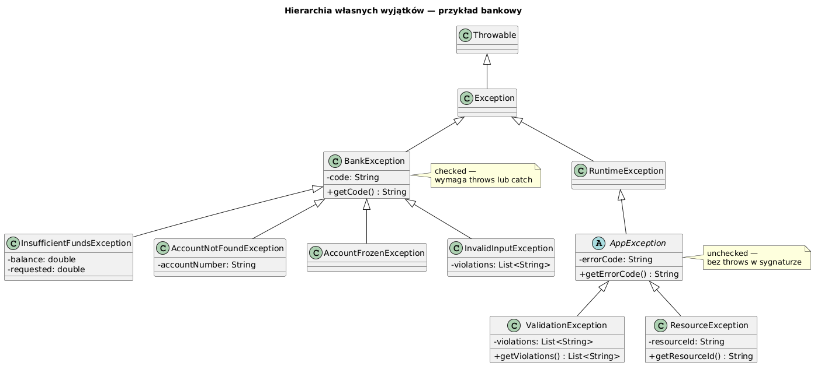

# 08 — Własne wyjątki

## Cel modułu

Nauka projektowania własnych klas wyjątków: kiedy je tworzyć, jakie API powinny oferować, jak budować hierarchię wyjątków domenowych i kiedy stosować checked vs unchecked.

---

## 1. Diagram hierarchii



---

## 2. Kiedy tworzyć własny wyjątek

| Powód | Przykład |
|-------|---------|
| Wyjątek niesie dane domenowe | `InsufficientFundsException(balance, requested)` |
| Potrzebujesz catch na poziomie domeny | `catch (BankException e)` — obsługuje wszystkie błędy bankowe |
| Standardowy wyjątek jest zbyt ogólny | `IllegalArgumentException` nie mówi co jest nie tak |
| API biblioteki wymaga konkretnego typu | Framework wie jak obsłużyć `ValidationException` |
| Chcesz ukryć szczegóły warstwy | `SQLException` → `RepositoryException` |

---

## 3. Minimalny własny wyjątek

```java
// Checked — wywołujący musi obsłużyć
class UserNotFoundException extends Exception {
    private final long userId;

    public UserNotFoundException(long userId) {
        super("Użytkownik nie znaleziony: id=" + userId);
        this.userId = userId;
    }

    public long getUserId() { return userId; }
}

// Unchecked — nie wymaga throws/catch
class UserNotFoundException extends RuntimeException {
    // ... (ta sama treść)
}
```

---

## 4. Kompletne API wyjątku domenowego

```java
class RangeException extends Exception {

    // Serializacja (zalecana dla Exception)
    private static final long serialVersionUID = 1L;

    // Pola z kontekstem — najważniejsza wartość własnego wyjątku
    private final double value;
    private final double min;
    private final double max;

    // Konstruktor główny
    public RangeException(double value, double min, double max) {
        super(String.format("Wartość %.2f wykracza poza zakres [%.2f, %.2f]",
                            value, min, max));
        this.value = value;
        this.min = min;
        this.max = max;
    }

    // Konstruktor z przyczyną (exception chaining)
    public RangeException(double value, double min, double max, Throwable cause) {
        super(String.format("Wartość %.2f wykracza poza zakres [%.2f, %.2f]",
                            value, min, max), cause);
        this.value = value;
        this.min   = min;
        this.max   = max;
    }

    // Gettery do dziedziny
    public double getValue() { return value; }
    public double getMin()   { return min; }
    public double getMax()   { return max; }
}
```

---

## 5. Hierarchia wyjątków domenowych

```java
// Bazowy wyjątek aplikacji — unchecked
abstract class AppException extends RuntimeException {
    private final String errorCode;

    protected AppException(String errorCode, String message) {
        super(message);
        this.errorCode = errorCode;
    }

    protected AppException(String errorCode, String message, Throwable cause) {
        super(message, cause);
        this.errorCode = errorCode;
    }

    public String getErrorCode() { return errorCode; }
}

// Podklasy dla różnych kategorii
class ValidationException extends AppException {
    private final List<String> violations;

    public ValidationException(List<String> violations) {
        super("VALIDATION_ERROR", "Nieprawidłowe dane: " + violations);
        this.violations = List.copyOf(violations);
    }

    public List<String> getViolations() { return violations; }
}

class ResourceException extends AppException {
    private final String resourceId;

    public ResourceException(String resourceId, String message, Throwable cause) {
        super("RESOURCE_ERROR", message, cause);
        this.resourceId = resourceId;
    }

    public String getResourceId() { return resourceId; }
}
```

### Użycie hierarchii:

```java
// Można łapać ogólnie lub konkretnie
try {
    validateUser(userData);
    saveUser(userData);
} catch (ValidationException e) {
    // Konkreten typ — dostęp do violations
    showErrors(e.getViolations());
} catch (ResourceException e) {
    // Konkretny typ — dostęp do resourceId
    logResourceFailure(e.getResourceId(), e);
} catch (AppException e) {
    // Ogólny — wszystkie błędy aplikacji
    showGenericError(e.getErrorCode(), e.getMessage());
}
```

---

## 6. Wyjątek z kodem błędu (wzorzec API)

```java
class HttpException extends RuntimeException {
    public enum Status { BAD_REQUEST, UNAUTHORIZED, NOT_FOUND, INTERNAL_ERROR }

    private final Status status;

    public HttpException(Status status, String message) {
        super(message);
        this.status = status;
    }

    public Status getStatus() { return status; }

    public int getStatusCode() {
        return switch (status) {
            case BAD_REQUEST    -> 400;
            case UNAUTHORIZED   -> 401;
            case NOT_FOUND      -> 404;
            case INTERNAL_ERROR -> 500;
        };
    }
}

// Użycie:
throw new HttpException(HttpException.Status.NOT_FOUND, "Strona nie istnieje: " + path);
```

---

## 7. Zawijanie checked w domenowy unchecked

```java
static String loadConfig(String filename) {
    try {
        return Files.readString(Path.of(filename));
    } catch (IOException e) {
        // Zawijamy — serwis nie zmusza wywołującego do obsługi IOException
        throw new ResourceException(filename, "Nie można wczytać: " + filename, e);
    }
}
```

---

## 8. Wyjątek z wieloma naruszeniami (walidacja)

```java
// Zamiast rzucać przy pierwszym błędzie — zbierz wszystkie
static UserDto validateUser(String name, int age) {
    List<String> errors = new ArrayList<>();

    if (name == null || name.isBlank()) errors.add("Imię jest wymagane");
    if (name != null && name.length() > 50) errors.add("Imię za długie");
    if (age < 0 || age > 150) errors.add("Wiek w zakresie [0, 150]: " + age);

    if (!errors.isEmpty()) throw new ValidationException(errors);
    return new UserDto(name, age);
}

// Wywołujący dostaje pełny obraz problemu
try {
    validateUser(null, -5);
} catch (ValidationException e) {
    e.getViolations().forEach(System.out::println);
    // "Imię jest wymagane"
    // "Wiek w zakresie [0, 150]: -5"
}
```

---

## 9. Dobre praktyki projektowania własnych wyjątków

| Zasada | Przykład |
|--------|---------|
| Komunikat zawiera wartości | `"salary=" + salary + " is negative"` |
| Pola domenowe z getterami | `getBalance()`, `getViolations()` |
| Zachowaj `cause` | `super(msg, cause)` |
| Zadeklaruj `serialVersionUID` | `private static final long serialVersionUID = 1L` |
| Hierarchia odzwierciedla domenę | `AppException > BankException > InsufficientFundsException` |
| Nie twórz dla każdego przypadku | Najpierw sprawdź wbudowane |

---

## Kod demonstracyjny

📄 [`code/CustomExceptionsDemo.java`](code/CustomExceptionsDemo.java)

### Uruchomienie

```powershell
cd C:\home\gitHub\oop-concepts-java\02_OOP\src
javac -d out _06_wyjatki/_08_wlasne_wyjatki/code/CustomExceptionsDemo.java
java  -cp out _06_wyjatki._08_wlasne_wyjatki.code.CustomExceptionsDemo
```

---

## Literatura i źródła

- Joshua Bloch, *Effective Java*, 3rd ed., Item 72: Favor the use of standard exceptions
- Joshua Bloch, *Effective Java*, 3rd ed., Item 73: Throw exceptions appropriate to the abstraction
- [Creating Custom Exceptions in Java — Baeldung](https://www.baeldung.com/java-new-custom-exception)
- [Java SE 21 API — java.lang.Exception](https://docs.oracle.com/en/java/docs/api/java.base/java/lang/Exception.html)

