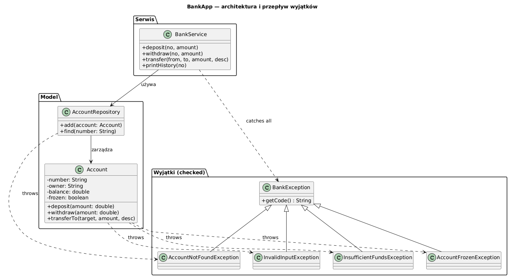

# 09 — Projekt: aplikacja bankowa

## Cel modułu

Większy przykład intensywnego wykorzystania wyjątków: pełna hierarchia wyjątków domenowych, walidacja przy tworzeniu obiektów, checked exceptions na warstwie dostępu do danych, obsługa błędów w serwisie z dziennikiem audytowym.

---

## 1. Architektura



---

## 2. Hierarchia wyjątków

```java
Exception
└── BankException (checked — kod błędu + komunikat)
    ├── InsufficientFundsException  (balance, requested)
    ├── AccountNotFoundException     (accountNumber)
    ├── AccountFrozenException
    └── InvalidInputException        (List<String> violations)
```

**Dlaczego checked?** Operacje bankowe są sytuacjami, gdzie wywołujący **może i powinien** coś zrobić: wyświetlić komunikat użytkownikowi, logować, ponowić próbę.

```java
/** Bazowy wyjątek bankowy. */
class BankException extends Exception {
    private final String code;   // np. "INSUF_FUNDS", "ACCT_FROZEN"

    BankException(String code, String message)              { ... }
    BankException(String code, String message, Throwable c) { ... }

    public String getCode() { return code; }
}

class InsufficientFundsException extends BankException {
    private final double balance;
    private final double requested;

    InsufficientFundsException(double balance, double requested) {
        super("INSUF_FUNDS",
              String.format("Saldo %.2f PLN; żądano %.2f PLN", balance, requested));
        this.balance   = balance;
        this.requested = requested;
    }
    // gettery
}
```

---

## 3. Walidacja przy tworzeniu obiektu (fail-fast)

```java
class Account {
    Account(String number, String owner, double initialBalance)
            throws InvalidInputException {

        List<String> errors = new ArrayList<>();
        if (number == null || !number.matches("[A-Z]{2}\\d{10}"))
            errors.add("Numer konta musi mieć format PL+10cyfr");
        if (owner == null || owner.isBlank())
            errors.add("Właściciel jest wymagany");
        if (initialBalance < 0)
            errors.add("Saldo początkowe nie może być ujemne");

        if (!errors.isEmpty()) throw new InvalidInputException(errors);
        // -- obiekt jest zawsze w spójnym stanie po konstruktorze --
        this.number  = number;
        this.owner   = owner;
        this.balance = initialBalance;
    }
}
```

---

## 4. Operacje z checked exceptions

```java
void withdraw(double amount) throws BankException {
    validateAmount(amount, "Wypłata");   // rzuca InvalidInputException
    checkNotFrozen();                    // rzuca AccountFrozenException
    if (amount > balance)
        throw new InsufficientFundsException(balance, amount);
    balance -= amount;
    history.add(new Transaction(WITHDRAWAL, amount, "Wypłata"));
}
```

---

## 5. Serwis — obsługa błędów i dziennik audytowy

```java
class BankService {
    void withdraw(String accountNo, double amount) {
        try {
            Account acct = repo.find(accountNo);   // AccountNotFoundException
            acct.withdraw(amount);                 // InsufficientFunds, Frozen, invalid
            audit("WITHDRAW", accountNo, amount, "OK");

        } catch (InsufficientFundsException e) {
            // Konkretny typ — dostęp do danych dziedzinowych
            audit("WITHDRAW", accountNo, amount, "FAILED: brak środków");
            System.out.printf("✗ Niewystarczające środki (saldo: %.2f, żądano: %.2f)%n",
                    e.getBalance(), e.getRequested());

        } catch (AccountFrozenException | AccountNotFoundException e) {
            // Multi-catch dla podobnie traktowanych błędów
            audit("WITHDRAW", accountNo, amount, "FAILED: " + e.getCode());
            System.out.println("✗ " + e);

        } catch (BankException e) {
            // Fallback — wszystkie inne błędy bankowe
            audit("WITHDRAW", accountNo, amount, "FAILED: " + e.getCode());
            System.out.println("✗ Nieoczekiwany błąd: " + e);
        }
    }
}
```

---

## 6. Przykładowe wyjście programu

```
=== Tworzenie kont ===
  Konta utworzone: PL0000000001, PL0000000002

=== Walidacja przy tworzeniu ===
  InvalidInputException: Nieprawidłowe dane: [Numer konta musi mieć format PL+10cyfr,
                                              Właściciel jest wymagany,
                                              Saldo początkowe nie może być ujemne]

=== Operacje bankowe ===
  Wpłata do Jana:
  Przelew Jan → Anna:
  Wypłata ponad saldo Jana (1200):
  ✗ INSUF_FUNDS (saldo: 1200.00, żądano: 1200.00... nie, to był 1200 dla bieżącego)
  Wpłata do nieistniejącego konta:
  ✗ [ACCT_NOT_FOUND] Konto nie znalezione: PL9999999999
  Operacja na zamrożonym koncie:
  ✗ [ACCT_FROZEN] Konto zablokowane: PL0000000002
  Kwota ujemna:
  ✗ [INVALID_INPUT] Nieprawidłowe dane: [Wpłata: kwota musi być dodatnia, podano: -50.0]

=== Dziennik audytowy ===
  DEPOSIT    PL0000000001         500,00 PLN  OK
  TRANSFER   PL0000000001→PL00…   300,00 PLN  OK
  WITHDRAW   PL0000000001        1200,00 PLN  FAILED: brak środków
  ...
```

---

## Kod demonstracyjny

📄 [`code/BankApp.java`](code/BankApp.java)

### Uruchomienie

```powershell
cd C:\home\gitHub\oop-concepts-java\02_OOP\src
javac -d out _06_wyjatki/_09_projekt/code/BankApp.java
java  -cp out _06_wyjatki._09_projekt.code.BankApp
```

---

## Lekcje wyniesione z projektu

| Temat | Zastosowanie w BankApp |
|-------|----------------------|
| Własne wyjątki | `BankException` i 4 podklasy |
| Checked exceptions | `Account.withdraw()` throws `BankException` |
| Fail-fast walidacja | Konstruktor `Account` rzuca `InvalidInputException` |
| Exception chaining | `ResourceException(resourceId, msg, cause)` |
| Multi-catch | `AccountFrozenException \| AccountNotFoundException` |
| Catch na poziomie serwisu | `BankService` obsługuje wszystkie typy |
| Dziennik audytowy | Każda operacja logowana niezależnie od wyniku |

---

## Literatura i źródła

- Martin Fowler, *Patterns of Enterprise Application Architecture*, rozdz. Exception handling
- [Exception Handling Best Practices — Baeldung](https://www.baeldung.com/java-exceptions)
- Joshua Bloch, *Effective Java*, 3rd ed., Items 69–77

