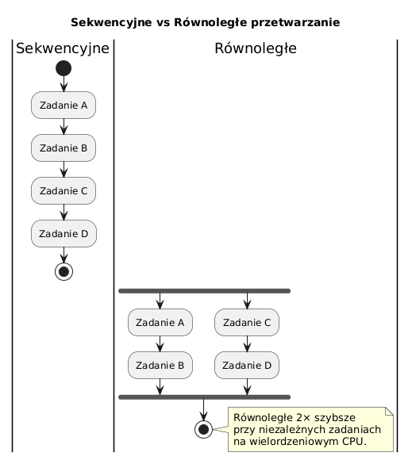

# 01 — Wprowadzenie do programowania wielowątkowego

## Cel modułu

Zrozumienie **po co** istnieje wielowątkowość, kiedy stosować wątki, a kiedy alternatywy. Pierwsza obserwacja korzyści z równoległości i kosztów, które za nią płacimy.

---

## 1. Problem: procesor czeka

Nowoczesne procesory mają wiele rdzeni (4, 8, 16, 32...). Program sekwencyjny używa tylko **jednego**. Reszta marnuje się na bezczynność.

Dodatkowo: operacje I/O (sieć, dysk, baza danych) trwają setki ms — procesor mógłby w tym czasie robić inne rzeczy.

```java
// Program sekwencyjny — jeden rdzeń, reszta bezczynna
long start = System.currentTimeMillis();
long r1 = heavyWork(0, N/2);            // ~500ms
long r2 = heavyWork(N/2, N);            // ~500ms (po r1!)
System.out.println("Czas: " + (System.currentTimeMillis() - start) + "ms");
// Czas: ~1000ms
```

---

## 2. Rozwiązanie: wątki



```java
// Program wielowątkowy — dwa rdzenie jednocześnie
long[] results = new long[2];
Thread t1 = new Thread(() -> results[0] = heavyWork(0, N/2));
Thread t2 = new Thread(() -> results[1] = heavyWork(N/2, N));

t1.start(); t2.start();
t1.join();  t2.join();

System.out.println("Czas: ~500ms zamiast ~1000ms");
// Przyspieszenie ~2× na 2 rdzeniach (prawo Amdahla)
```

---

## 3. Geneza wielowątkowości

| Era | Mechanizm | Charakterystyka |
|-----|-----------|-----------------|
| Lata 60. | Procesy (Unix fork) | Duża izolacja, duży koszt, IPC |
| Lata 80. | POSIX Threads (pthreads) | Lżejsze, wspólna pamięć |
| Java 1.0 (1995) | `java.lang.Thread` | Wbudowane w język |
| Java 5 (2004) | `java.util.concurrent` | `ExecutorService`, `Future`, `Lock` |
| Java 8 (2014) | `CompletableFuture`, Streams | Asynchroniczność funkcyjna |
| Java 21 (2023) | Wirtualne wątki (Loom) | Miliony "wątków" na kilku OS threads |

---

## 4. Po co wielowątkowość?

```
1. Wykorzystanie wielordzeniowości — zadania CPU-bound
2. Responsywność UI — wątek główny nie blokuje (GUI, serwery)
3. Ukrywanie latencji I/O — sieć/dysk nie blokuje logiki
4. Serwery HTTP — każde żądanie to osobne zadanie
```

---

## 5. Cena wielowątkowości

```java
// Koszty, które płacimy za równoległość:
// 1. Trudność poprawności — race condition, deadlock
int[] counter = {0};
Thread a = new Thread(() -> { for(int i=0;i<100_000;i++) counter[0]++; });
Thread b = new Thread(() -> { for(int i=0;i<100_000;i++) counter[0]++; });
a.start(); b.start(); a.join(); b.join();
// Wynik: np. 143_291 zamiast 200_000! (race condition)

// 2. Trudność debugowania — problemy niereprodukowalne
// 3. Koszt tworzenia wątku — ~µs, ale przy milionach zadań: istotne
// 4. Overhead synchronizacji — locki spowalniają dostęp do danych
```

---

## 6. Alternatywy dla "surowych" wątków

```java
// ✓ ExecutorService — pool wątków (Java 5+)
ExecutorService pool = Executors.newFixedThreadPool(4);
Future<Long> f = pool.submit(() -> heavyWork(0, N));
Long result = f.get();   // czeka na wynik
pool.shutdown();

// ✓ CompletableFuture — łańcuchowanie asynchroniczne (Java 8+)
CompletableFuture.supplyAsync(() -> fetchFromDB())
    .thenApply(data -> transform(data))
    .thenAccept(result -> save(result));

// ✓ Wirtualne wątki — Java 21, Project Loom
try (var executor = Executors.newVirtualThreadPerTaskExecutor()) {
    for (int i = 0; i < 100_000; i++) {
        executor.submit(() -> handleRequest(i));
    }
}
// 100_000 "wątków" — bez problemu z wirtualnymi
```

---

## 7. Prawo Amdahla — granica przyspieszenia

```
Przyspieszenie = 1 / (s + (1 - s) / N)
gdzie: s = udział sekwencyjny, N = liczba rdzeni

Przykład: 20% kodu sekwencyjne, 8 rdzeni:
Przyspieszenie = 1 / (0.2 + 0.8/8) = 1 / 0.3 = 3.33×
(nie 8×!)
```

Nawet przy nieskończonej liczbie rdzeni — jeśli 20% kodu sekwencyjne, maksymalne przyspieszenie to 5×.

---

## 8. Kod demonstracyjny

📄 [`code/ThreadingIntroDemo.java`](code/ThreadingIntroDemo.java)

Kluczowe sekcje:
- `part1_SequentialVsParallel()` — porównanie czasu sekwencyjnie vs równolegle
- `part2_SimpleThread()` — minimalny wątek na bazie lambdy (`Runnable`)
- `part3_Alternatives()` — `ExecutorService`, `Callable/Future`, `newVirtualThreadPerTaskExecutor()`

### Uruchomienie

```powershell
cd C:\home\gitHub\oop-concepts-java\02_OOP\src
javac -d _07_watki/out _07_watki/_01_wprowadzenie/code/ThreadingIntroDemo.java
java  -cp _07_watki/out _07_watki._01_wprowadzenie.code.ThreadingIntroDemo
```

---

## 9. Pytania kontrolne

1. Jakie są dwa główne powody używania wielowątkowości (CPU-bound vs I/O-bound)?
2. Dlaczego przyspieszenie przy 8 rdzeniach nie wynosi 8×? (prawo Amdahla)
3. Jaka jest różnica między `Runnable` a `Callable`?
4. Co to jest wątek wirtualny (Java 21) i jaką przewagę ma nad zwykłym wątkiem?

---

## 📚 Literatura i źródła

- Brian Goetz et al., *Java Concurrency in Practice*, Addison-Wesley, 2006 — rozdział 1
- [Oracle Tutorial — Concurrency](https://docs.oracle.com/javase/tutorial/essential/concurrency/)
- [JEP 444 — Virtual Threads (Java 21)](https://openjdk.org/jeps/444)
- Gene Amdahl, *Validity of the Single Processor Approach to Achieving Large-Scale Computing Capabilities*, 1967

