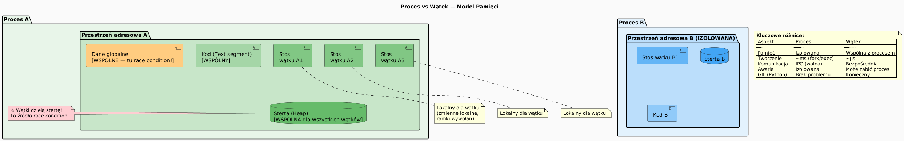

# 02 — Wątek a Proces — model wielozadaniowości

## Cel modułu

Zrozumienie różnicy między procesem a wątkiem na poziomie modelu pamięci, kosztu tworzenia i mechanizmu komunikacji. Decyzja kiedy wybrać wieloprocesowość, a kiedy wielowątkowość.

---

## 1. Model pamięci: Proces vs Wątek



---

## 2. Diagram konceptualny


---

## 3. Czym jest PROCES?

**Proces** to uruchomiona instancja programu, wyposażona w **izolowaną przestrzeń adresową**:
- własną stertę (heap)
- własny stos
- własne otwarte pliki i gniazda
- oddzielny PID (Process ID)

```bash
# Każdy java, notepad, firefox to osobny proces
# jps pokazuje procesy Java
PS> jps
12345 MyApp
67890 Jps
```

Procesy komunikują się przez **IPC** (Inter-Process Communication): pliki, potoki, gniazda, pamięć współdzielona OS. IPC jest wolne i skomplikowane — ale daje pełną izolację.

---

## 4. Czym jest WĄTEK?

**Wątek** (ang. thread) to jednostka wykonania **wewnątrz** procesu. Wszystkie wątki jednego procesu:
- dzielą tę samą stertę (heap) — dostęp do tych samych obiektów
- mają własny stos wywołań (stack)
- mają własny licznik programowy (PC — Program Counter)
- mają własne rejestry CPU

```java
// W jednym procesie JVM może mieć wiele wątków
Thread t1 = new Thread(() -> { /* działa w tym samym procesie */ });
Thread t2 = new Thread(() -> { /* ten sam heap, te same obiekty */ });
t1.start();
t2.start();
```

---

## 5. Tabela porównawcza

| Aspekt | Proces | Wątek |
|--------|--------|-------|
| Pamięć | Izolowana przestrzeń adresowa | Wspólna sterta procesu |
| Koszt tworzenia | Wysoki (~ms, fork/exec) | Niski (~µs, nowy stos) |
| Komunikacja | IPC (wolna, złożona) | Bezpośrednia (szybka) |
| Izolacja awarii | Silna (błąd w A nie zabija B) | Słaba (NPE może zabić cały JVM) |
| Przykłady OS | fork(), CreateProcess() | pthread_create(), Thread() |
| Java API | `ProcessBuilder`, `Runtime.exec()` | `new Thread()`, `ExecutorService` |

---

## 6. Wielozadaniowość na poziomie procesów

```java
// Uruchomienie zewnętrznego procesu z Java
ProcessBuilder pb = new ProcessBuilder("java", "-version");
pb.redirectErrorStream(true);          // łączy stderr z stdout
Process p = pb.start();

// Odczyt wyjścia procesu
String output = new String(p.getInputStream().readAllBytes());
int exitCode = p.waitFor();            // czeka na zakończenie (join dla procesów)
System.out.println("Output: " + output);
System.out.println("Exit: " + exitCode);
```

---

## 7. Wielozadaniowość na poziomie wątków — race condition

```java
// Zagrożenie: dwa wątki modyfikują wspólny stan
int[] sharedCounter = {0};             // WSPÓLNY

Thread t1 = new Thread(() -> {
    for (int i = 0; i < 100_000; i++) sharedCounter[0]++;   // race condition!
});
Thread t2 = new Thread(() -> {
    for (int i = 0; i < 100_000; i++) sharedCounter[0]++;   // race condition!
});

t1.start(); t2.start();
t1.join();  t2.join();

// Wynik: np. 137_892 zamiast 200_000!
// Procesy tego problemu by nie miały — każdy miałby SWOJĄ tablicę
System.out.println(sharedCounter[0]);
```

---

## 8. Wątki demonów JVM

```java
Thread gc = new Thread(() -> {
    while (true) collectGarbage();   // działaj w tle
});
gc.setDaemon(true);    // JVM może go zabić przy wyjściu
gc.start();

// Przykłady prawdziwych wątków demonów JVM:
// - GC Thread
// - JIT Compiler Thread
// - Finalizer Thread
```

---

## 9. Kod demonstracyjny

📄 [`code/ProcessVsThreadDemo.java`](code/ProcessVsThreadDemo.java)

Sekcje:
- `part1_SharedMemory()` — race condition na `sharedCounter`
- `part2_ProcessMultitasking()` — uruchomienie zewnętrznego procesu (`java -version`)
- `part3_ThreadMultitasking()` — wiele wątków w jednej JVM
- `part4_DaemonVsUser()` — różnica daemon/user thread

### Uruchomienie

```powershell
cd C:\home\gitHub\oop-concepts-java\02_OOP\src
javac -d _07_watki/out _07_watki/_02_watek_vs_proces/code/ProcessVsThreadDemo.java
java  -cp _07_watki/out _07_watki._02_watek_vs_proces.code.ProcessVsThreadDemo
```

---

## 10. Pytania kontrolne

1. Co jest wspólne, a co odrębne dla wątków tego samego procesu?
2. Dlaczego IPC jest wolniejsze niż komunikacja wątkowa? Co jest ceną za tę szybkość?
3. Jaka jest różnica w izolacji awarii między procesem a wątkiem?
4. Kiedy byś wybrał architekturę wieloprocesową zamiast wielowątkowej?

---

## 📚 Literatura i źródła

- [Oracle API — ProcessBuilder](https://docs.oracle.com/en/java/javase/21/docs/api/java.base/java/lang/ProcessBuilder.html)
- Brian Goetz et al., *Java Concurrency in Practice*, rozdział 1 (Introduction)
- [Oracle Tutorial — Processes and Threads](https://docs.oracle.com/javase/tutorial/essential/concurrency/procthread.html)

