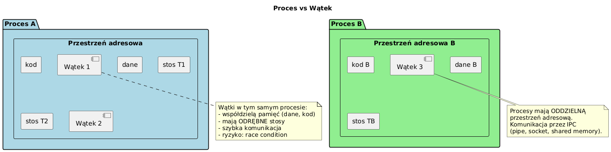

# _02_watek_vs_proces - Watek a proces

## Cel
Pokazac roznice miedzy modelem procesowym i watkowym oraz konsekwencje wspoldzielenia pamieci.

## Kluczowe idee
- Proces: osobna przestrzen adresowa, mocna izolacja, wyzszy koszt.
- Watek: wspolna pamiec procesu, nizszy koszt, ale ryzyko konfliktow danych.
- Wielozadaniowosc mozna realizowac na poziomie procesow lub watkow - wybor zalezy od izolacji, kosztu i modelu awarii.

## Kod
Plik: `code/ProcessVsThreadDemo.java`

Sekcje:
- `part1_SharedMemory()` - race condition na `sharedCounter`.
- `part2_ProcessMultitasking()` - uruchomienie zewnetrznego procesu (`java -version`).
- `part3_ThreadMultitasking()` - wiele watkow w jednej JVM.
- `part4_DaemonVsUser()` - roznica daemon/user thread.

Fragment:
```java
ProcessBuilder pb = new ProcessBuilder("java", "-version");
Process p = pb.start();
int exit = p.waitFor();
```

## Diagram


Zrodlo: `diagrams/process_vs_thread.puml`

## Uruchomienie
```powershell
cd C:\home\gitHub\oop-concepts-java\02_OOP\src
javac -d _07_watki/out _07_watki/_02_watek_vs_proces/code/ProcessVsThreadDemo.java
java -cp _07_watki/out _07_watki._02_watek_vs_proces.code.ProcessVsThreadDemo
```

## Literatura
- https://docs.oracle.com/en/java/javase/21/docs/api/java.base/java/lang/ProcessBuilder.html
- https://docs.oracle.com/javase/tutorial/essential/concurrency/

