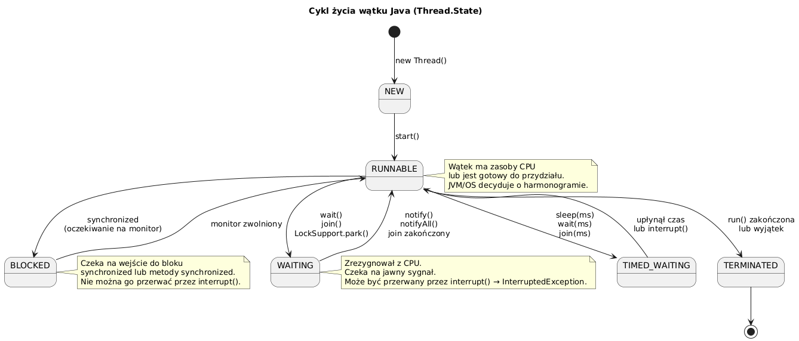

# _03_cykl_zycia - Cykl zycia watku

## Cel
Zrozumiec stany `Thread.State` i scenariusze przejsc miedzy nimi.

## Stany watku
- `NEW`
- `RUNNABLE`
- `BLOCKED`
- `WAITING`
- `TIMED_WAITING`
- `TERMINATED`

## Kod
Plik: `code/ThreadLifecycleDemo.java`

Sekcje praktyczne:
- `part1_BasicLifecycle()` - NEW -> RUNNABLE -> TERMINATED.
- `part2_TimedWaiting()` - `sleep()` i `interrupt()`.
- `part3_Blocked()` - wejscie do `synchronized` gdy lock zajety.
- `part4_Waiting()` - `wait()/notify()`.
- `part5_Summary()` - mapowanie stanow na znaczenie praktyczne.

Fragment:
```java
waiting.start();
Thread.sleep(50);
printState(waiting, "Podczas wait()");
synchronized (monitor) { monitor.notify(); }
```

## Diagram


Zrodlo: `diagrams/thread_lifecycle.puml`

## Uruchomienie
```powershell
cd C:\home\gitHub\oop-concepts-java\02_OOP\src
javac -d _07_watki/out _07_watki/_03_cykl_zycia/code/ThreadLifecycleDemo.java
java -cp _07_watki/out _07_watki._03_cykl_zycia.code.ThreadLifecycleDemo
```

## Literatura
- https://docs.oracle.com/en/java/javase/21/docs/api/java.base/java/lang/Thread.State.html

