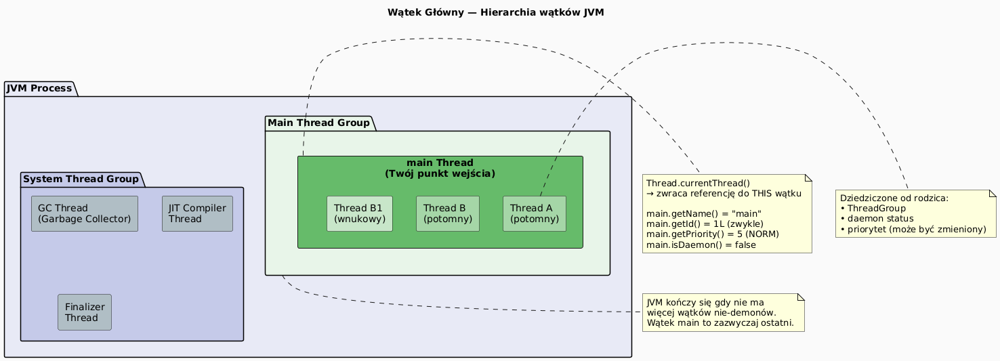

# 04 — Wątek główny i `Thread.currentThread()`

## Cel modułu

Zrozumienie roli wątku głównego (`main`) jako punktu startowego JVM, poznanie metody `Thread.currentThread()` do diagnostyki i rozróżniania wątków w kodzie wielowątkowym.

---

## 1. Hierarchia wątków w JVM



Kiedy uruchamiasz program Java, JVM tworzy **wątek główny** (`main`). To od niego wszystko się zaczyna. Jednocześnie JVM uruchamia własne wątki systemowe (Garbage Collector, JIT compiler, Finalizer).

---

## 2. Diagram wątku głównego


---

## 3. `Thread.currentThread()` — samodiagnostyka

```java
Thread main = Thread.currentThread();

System.out.println("Nazwa:       " + main.getName());          // "main"
System.out.println("ID:          " + main.getId());            // 1 (zwykle)
System.out.println("Priorytet:   " + main.getPriority());      // 5 (NORM)
System.out.println("Demon?       " + main.isDaemon());         // false
System.out.println("Stan:        " + main.getState());         // RUNNABLE
System.out.println("Grupa:       " + main.getThreadGroup());   // main

// Zmiana nazwy — pomocne przy debugowaniu
main.setName("WatekGlowny");
System.out.println("Nowa nazwa:  " + Thread.currentThread().getName());
```

---

## 4. Ta sama metoda, różne wątki

```java
// Metoda może być wywołana z różnych kontekstów
static void whoAmI() {
    Thread t = Thread.currentThread();
    System.out.printf("[%s] ID=%d, priorytet=%d%n",
        t.getName(), t.getId(), t.getPriority());
}

public static void main(String[] args) {
    whoAmI();    // [main] ID=1, priorytet=5

    Thread worker = new Thread(() -> whoAmI(), "Worker-1");
    worker.setPriority(Thread.MIN_PRIORITY);
    worker.start();
    // [Worker-1] ID=15, priorytet=1

    // Ten sam kod, różne informacje!
}
```

---

## 5. Wątki demoniczne vs użytkownika

```java
Thread daemon = new Thread(() -> {
    while (true) {
        System.out.println("Demon działa...");
        Thread.sleep(100);
    }
}, "demon-thread");

daemon.setDaemon(true);    // ← MUSI być przed start()!
daemon.start();

// JVM zamknie się gdy nie ma wątków NIEBĘDĄCYCH demonami
// Demon zostanie uśmiercony automatycznie
Thread.sleep(300);
System.out.println("Main kończy — demon zostanie zabity.");
```

**Demoniczne wątki:** praca w tle (GC, timery, monitoring). Nie blokują JVM przed zakończeniem. Nie powinny zarządzać zasobami wymagającymi `finally` (może nie zostać wywołany).

---

## 6. Przerwanie wątku głównego

```java
Thread main = Thread.currentThread();

// Wątek zewnętrzny może przerwać main
Thread interrupter = new Thread(() -> {
    Thread.sleep(500);
    main.interrupt();
}, "interrupter");
interrupter.start();

try {
    Thread.sleep(2000);    // ← zostanie przerwany po 500ms
} catch (InterruptedException e) {
    System.out.println("Main przerwany! Flaga: " + Thread.interrupted());
    // Thread.interrupted() → true i zeruje flagę
    // main.isInterrupted() → tylko sprawdza, nie zeruje
}
```

---

## 7. Kod demonstracyjny

📄 [`code/MainThreadDemo.java`](code/MainThreadDemo.java)

Sekcje:
- `part1_CurrentThread()` — atrybuty wątku głównego
- `part2_CalledFromDifferentThreads()` — ta sama metoda z dwóch wątków
- `part3_Interrupt()` — przerwanie wątku głównego
- `part4_ThreadGroups()` — podstawowe grupowanie wątków

### Uruchomienie

```powershell
cd C:\home\gitHub\oop-concepts-java\02_OOP\src
javac -d _07_watki/out _07_watki/_04_watek_glowny/code/MainThreadDemo.java
java  -cp _07_watki/out _07_watki._04_watek_glowny.code.MainThreadDemo
```

---

## 8. Pytania kontrolne

1. Jaki jest ID i priorytet wątku `main`? Skąd bierze te wartości?
2. Czym różni się wątek demoniczny od wątku użytkownika?
3. Jaka jest różnica między `Thread.interrupted()` a `thread.isInterrupted()`?
4. Dlaczego `setDaemon(true)` musi być wywołane **przed** `start()`?

---

## 📚 Literatura i źródła

- [Oracle API — Thread.currentThread()](https://docs.oracle.com/en/java/javase/21/docs/api/java.base/java/lang/Thread.html#currentThread())
- [Oracle API — Thread.isDaemon()](https://docs.oracle.com/en/java/javase/21/docs/api/java.base/java/lang/Thread.html#isDaemon())
- Brian Goetz et al., *Java Concurrency in Practice*, rozdział 7 (Cancellation and Shutdown)

