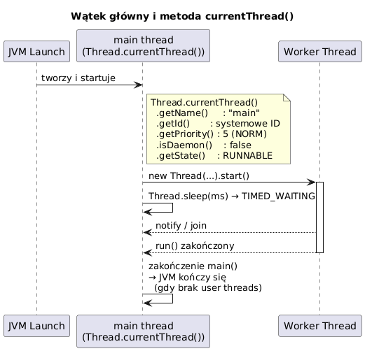

# _04_watek_glowny - Watek glowny i `currentThread()`

## Cel
Pokazac role watku glownego (`main`) i diagnostyke watku przez `Thread.currentThread()`.

## Co warto zapamietac
- Kazda aplikacja Java startuje od watku `main`.
- `Thread.currentThread()` zwraca referencje do aktualnie wykonujacego sie watku.
- Ten sam kod moze dzialac na roznych watkach - dlatego warto logowac nazwe i id watku.

## Kod
Plik: `code/MainThreadDemo.java`

Sekcje:
- `part1_CurrentThread()` - atrybuty watku glownego.
- `part2_CalledFromDifferentThreads()` - ta sama metoda uruchomiona z dwoch watkow.
- `part3_Interrupt()` - przerwanie watku glownego.
- `part4_ThreadGroups()` - podstawowe grupowanie watkow.

Fragment:
```java
Thread main = Thread.currentThread();
System.out.println(main.getName());
main.setName("WatekGlowny");
```

## Diagram


Zrodlo: `diagrams/main_thread.puml`

## Uruchomienie
```powershell
cd C:\home\gitHub\oop-concepts-java\02_OOP\src
javac -d _07_watki/out _07_watki/_04_watek_glowny/code/MainThreadDemo.java
java -cp _07_watki/out _07_watki._04_watek_glowny.code.MainThreadDemo
```

## Literatura
- https://docs.oracle.com/en/java/javase/21/docs/api/java.base/java/lang/Thread.html#currentThread()

